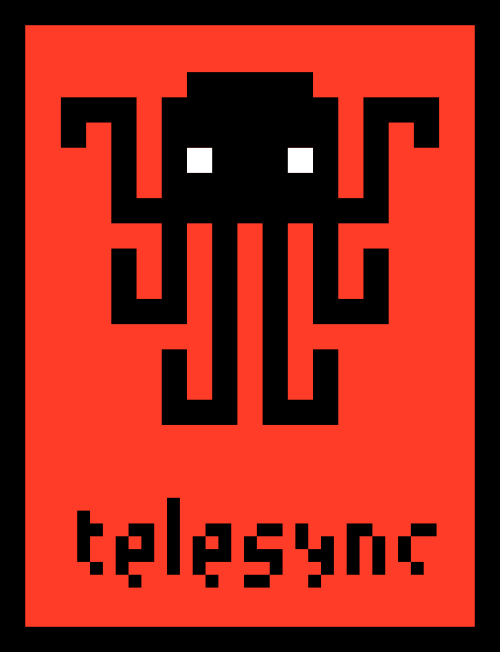

<div></div><br/>

**Q Realtime App Development Server and SDK**

- [Getting Started](#getting-started)
- [Roadmap](https://github.com/h2oai/qd/wiki/Roadmap)
- [Migration Guide](#migration-guide)
- [Examples](https://github.com/h2oai/qd/tree/master/py/examples)
- [Report an issue](https://github.com/h2oai/q/issues)

## Getting Started

To build apps using Q, you need the `h2o_q` development server and the `h2o_q` pip package.

1. [Download](https://github.com/h2oai/qd/releases) a release. The release contains everything you need, including the SDK, documentation and examples.
2. See `readme.txt` included with your release.

## Migration Guide

Before you begin, it is highly recommended that you [download](https://github.com/h2oai/qd/releases) a release and run the interactive `tour.py` that ships with the release to get a feel for what Q programs look like in practice.

### What has changed?

From an app-development perspective, the most important change is that Q is more of a library rather than a framework.

With the previous framework, the only way to execute an app was via Q. There is no such limitation with Q.

The script/app you author is just a regular Python program in which you `import h2o_q` and execute via:
1. The command line: `python3 foo.py`.
2. In the Python REPL `python3`.
3. In a Jupyter notebook.
4. In your favorite IDE (PyCharm, VSCode, etc.).

This also means that you can apply breakpoints and debug or step-through your program in your debugger of choice.

From an information architecture perspective, control has been inverted: instead of your app being an extension to Q's data/prep/search features, Q's features are now optional additions to your app, and your app takes center stage. Implementation-wise, instead of your app running in a sidebar inside of Q's UI, your app now occupies the entire UI.

### Breaking changes

#### Removed: `@Q.app`, `@Q.ui` annotations.

Instead, define a `async` request-handling function, say `main()`, and pass that function to `listen()`, like this:

```py
from h2o_q import Q, listen

async def main(q: Q):
  pass

listen('/my/app/route', main)
```

#### Removed: `q.wait()`, `q.show()`, `q.fail()`, `q.exit()`.

The above four methods were the primary mechanism to make changes to your app's UI. They have all been replaced with a single `.save()` method.

The new technique is:
1. Access the page or card you want to modify.
1. Modify the page or card.
1. Call `page.save()` to save your changes and update the browser page.

Before:
```py
q.wait(
  callback_function,
  ui.text('Step 1'),
  ui.button(name='next', 'Next'),
)
```

After:
```py
q.page['my_card'] = ui.form_card(
  # A card with its top-left corner at column 1, row 5; 2 columns wide and 4 rows high.
  box='1 5 2 4',
  items=[
    ui.text('Step 1'),
    ui.button(name='next', 'Next'),
  ],
)
await q.page.save()
```

Note that the *After* example requires a `box` that specifies where to draw your form. This is because you are not limited to using a sidebar, and can use the entire width/length of the page.

The same technique can be used to update the UI again (or display intermediate results):

Before:
```py
q.wait(
  callback_function,
  ui.text('Step 2'),
  ui.button(name='next', 'Next'),
)
```

After:
```py
# Don't have to recreate the entire form again; simply replace its items and save the page.
q.page['my_card'].items = [
  ui.text('Step 2'),
  ui.button(name='next', 'Next'),
]
await q.page.save()
```

#### Removed: callback functions for request-handling.

Q apps are 100% push-based, using duplex communication instead of a request/reply paradigm. There is no need to have a tangled mess of callbacks to define application logic.

Instead, all requests are routed to a single function, and you can decide how to organize your application logic by branching on `q.args.*`.

Before:
```py
def step1(q: Q):
  q.wait(
    step2,
    ui.text('Step 1'),
    ui.button(name='next', label='Next'),
  )

def step2(q: Q):
  q.wait(
    step3,
    ui.text('Step 2'),
    ui.button(name='next', label='Next'),
  )

def step3(q: Q):
  q.wait(
    step4,
    ui.text('Step 3'),
    ui.button(name='next', label='Next'),
  )
```

After:
```py
async def main(q: Q):
  if q.args.step2:
    items = [
      ui.text('Step 2'),
      ui.button(name='step3', label='Next'),
    ]
  elif q.args.step3:
    items = [
      ui.text('Step 3'),
      ui.button(name='step4', label='Next'),
    ]
  else:
    items = [
      ui.text('Step 1'),
      ui.button(name='step2', label='Next'),
    ]

  q.page['my_card'].items = items
  await q.page.save()

listen('/my/app/route', main)
```

#### Removed: `q.dashboard()` and `q.notebook()`.

Every page in Q is a dashboard page. Instead of creating a separate dashboard or notebook, simply add cards to a page and arrange it the way you want. Cards can be created by using one of the several `ui.*_card()` APIs. Also see the [dashboard](py/examples/dashboard.py), [layout](py/examples/layout.py) and [sizing](py/examples/layout_size.py) examples to learn how to lay out several cards on a page.

#### Changed: `ui.buttons()`, `ui.expander()` and `ui.tabs()` accept a `list` of items instead of var args `*args`

Before:
```py
ui.buttons(ui.button(...), ui.button(...), ui.button(...))
```

After:
```py
ui.buttons([ui.button(...), ui.button(...), ui.button(...)]) # Note enclosing [ ]
```

#### Changed: `q.upload()` changed to `q.site.upload()`

The `upload()` method has been moved to the `Site` instance, since each `Site` represents a distinct server, and makes it possible to control multiple sites from a single Python script.

#### Changed: `q.args.foo=` changed to `q.client.foo=`

Setting attributes on `q.args` (e.g. `q.args.foo = 'bar'`) is no longer preserved between requests. This was the primary mechanism employed previously to preserve data between requests.

Instead, Q provides 4 mechanisms for preserving data between requests:

1. **Process-level**: Use global variables.
1. **App-level**: Use `q.app.foo = 'bar'` to save; access `q.app.foo` to read it back again.
1. **User-level**: Use `q.user.foo = 'bar'` to save; access `q.user.foo` to read it back again.
1. **Client-level**: Use `q.client.foo = 'bar'` to save; access `q.client.foo` to read it back again.

Here, *Client* refers to a distinct tab in a browser.

#### Changed: No need to JSON-serialize values to preserve them between requests.

`q.args.foo=` only supported JSON-serialized values. No such restrictions exist for the `q.app`, `q.user` and `q.client` containers. You could, for example, load a Pandas dataframe and set `q.user.df = my_df`, and the dataframe will be accessible across requests for the lifetime of the app.


