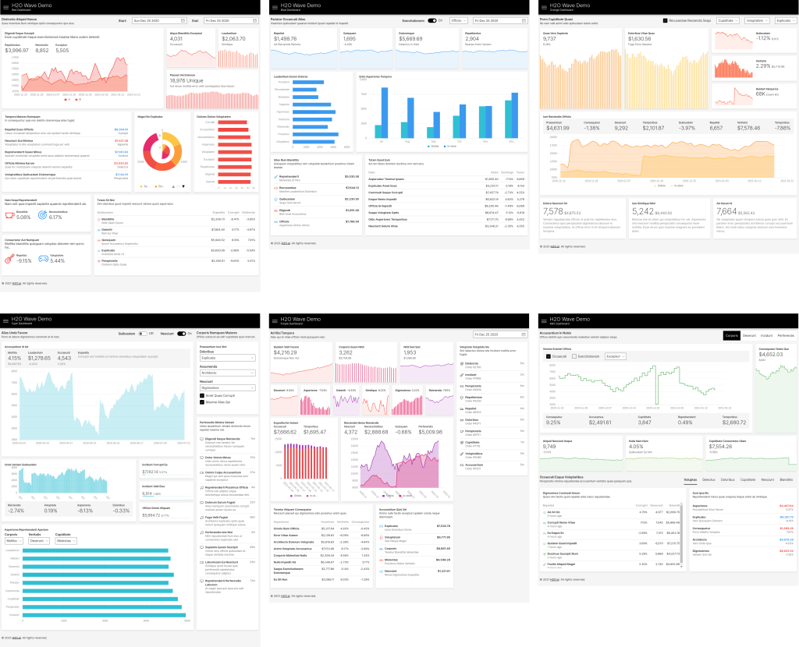
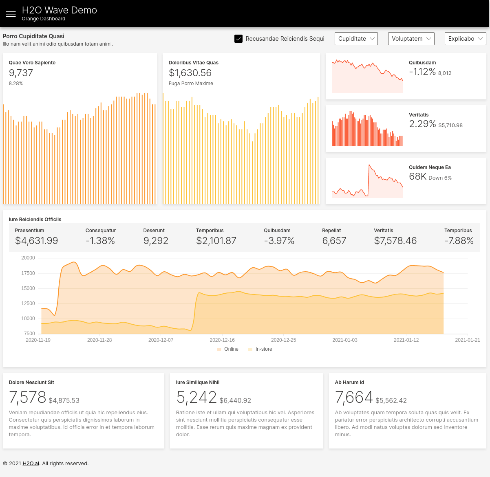
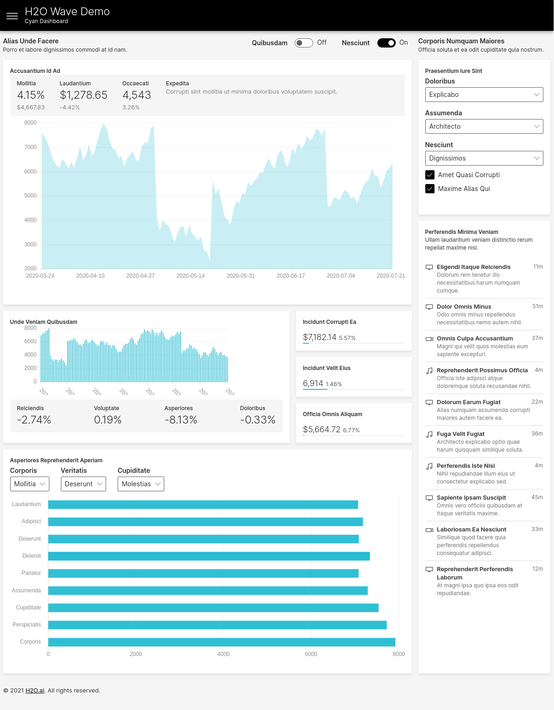
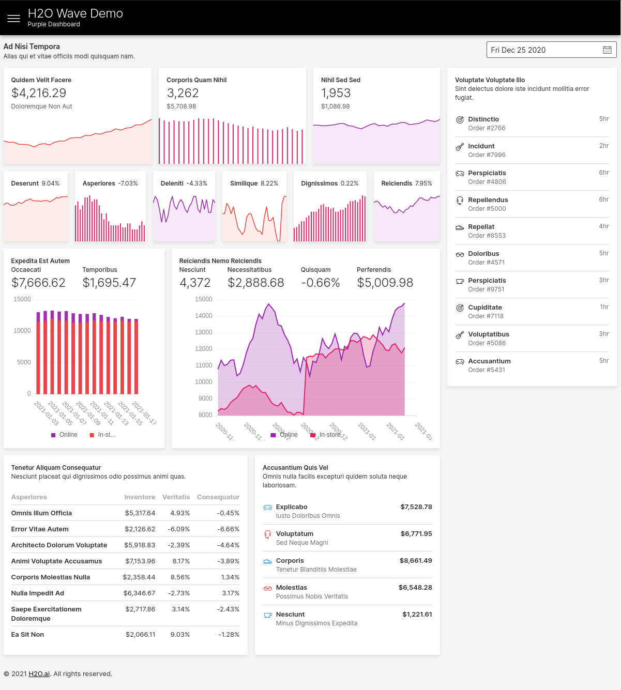
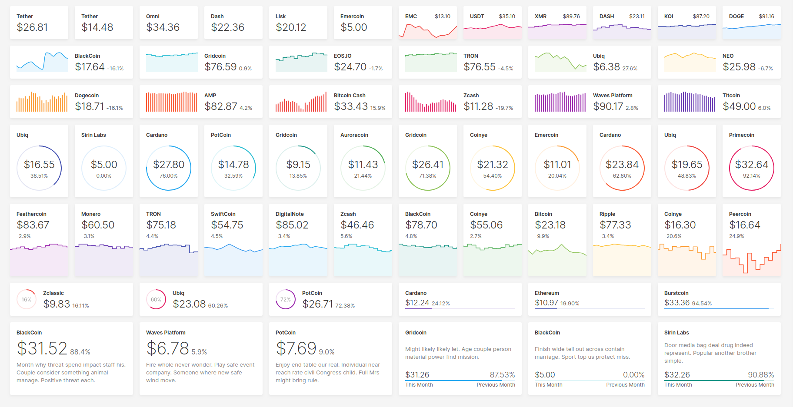
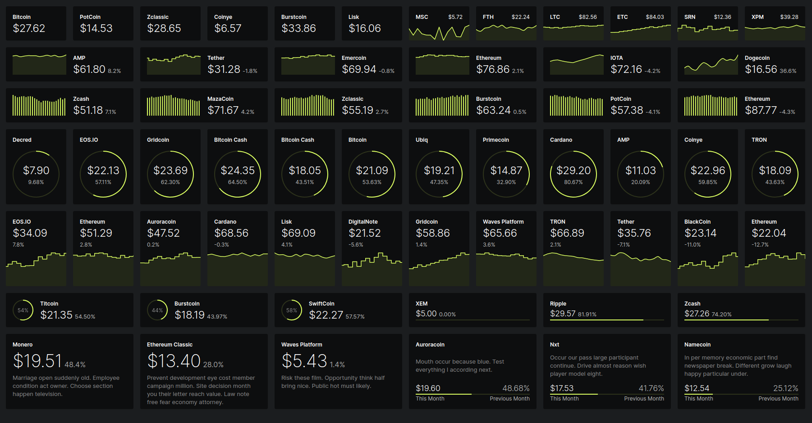
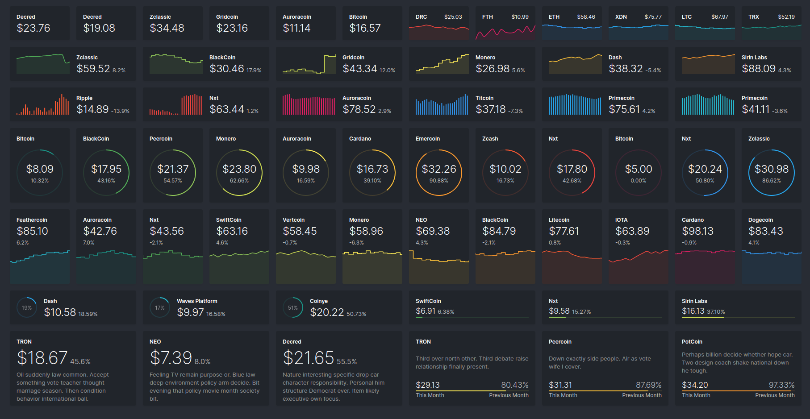
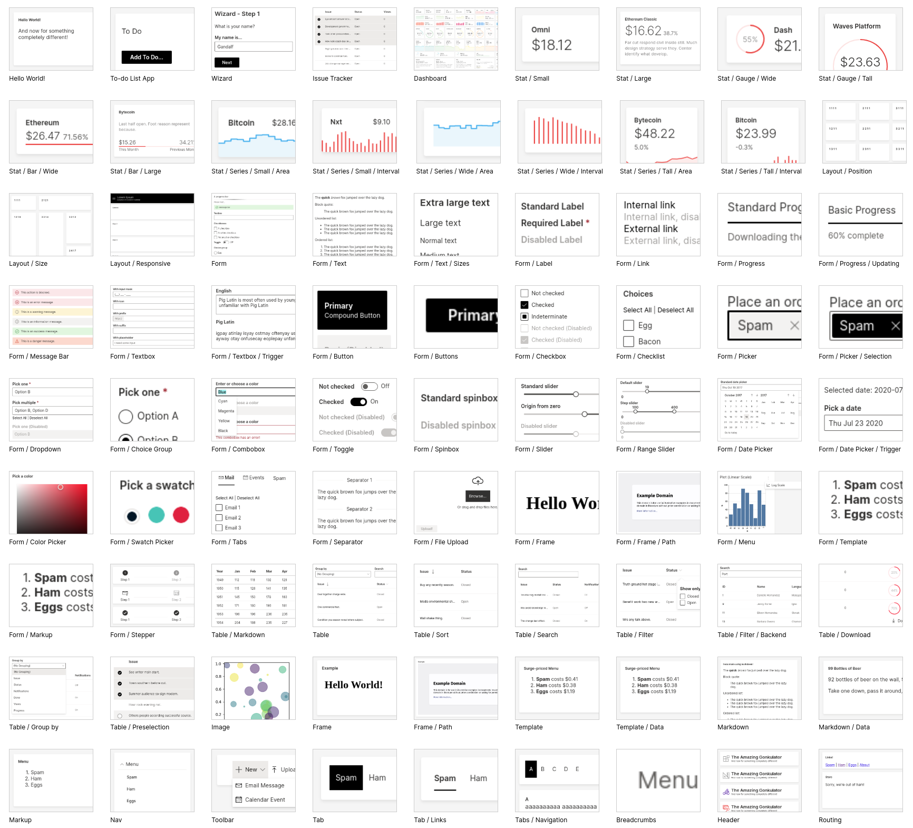
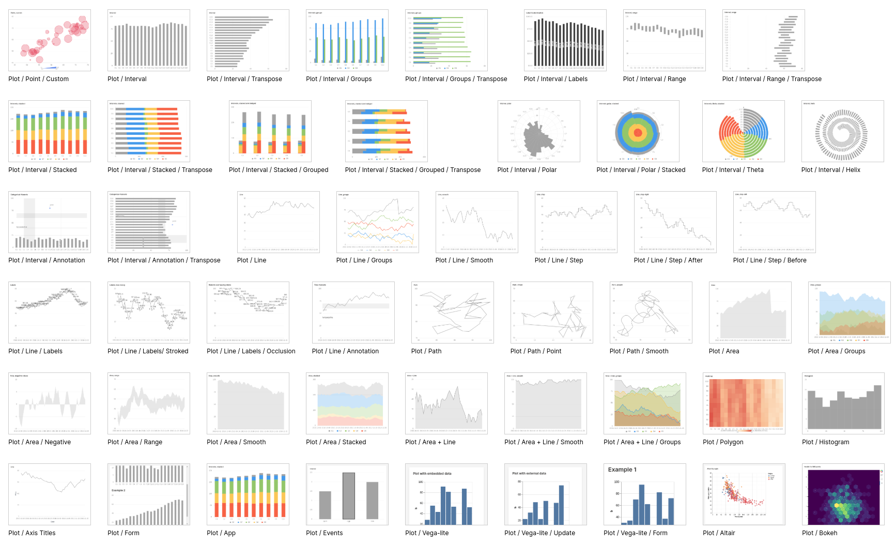

## H2O Wave

  
  
  
  
  
  

### Realtime Web Apps and Dashboards for Python and R

**New!** *[R Language API](https://wave.h2o.ai/blog/r-api-preview) Build and control Wave dashboards using R!*

**New!** *Easily integrate AI/ML models into your apps using [Wave ML](https://github.com/h2oai/wave-ml) for automatic machine learning.*

H2O Wave is a software stack for building beautiful, low-latency, realtime, browser-based applications and dashboards entirely in Python/R without using HTML, Javascript, or CSS.

H2O Wave excels at capturing information from multiple sources and broadcasting them live over the web, letting you build and deploy realtime analytics with dramatically less effort.

- [Download](https://github.com/h2oai/wave/releases) / [How to install](https://wave.h2o.ai/docs/installation/)
- [Documentation](https://wave.h2o.ai/): [Getting Started](https://wave.h2o.ai/docs/getting-started/) / [Gallery and Examples](https://wave.h2o.ai/docs/examples/) / [Python API](https://wave.h2o.ai/docs/api/index/)
- [Roadmap 2021](https://github.com/h2oai/wave/issues/693)
- [Developing](https://github.com/h2oai/wave/blob/main/.github/CONTRIBUTING.md#development-setup)
- [Discuss / Support / Q&A / Ideas](https://github.com/h2oai/wave/discussions)
- [Report a problem](https://github.com/h2oai/wave/issues/new/choose)
- [Blog](https://wave.h2o.ai/blog/) / [@h2o_wave](https://twitter.com/h2o_wave)

### Responsive Layouts

Code: <https://github.com/h2oai/wave/tree/main/py/demo>

### Themes

(Coming soon!)

### 80+ components, 175+ examples

More at <https://wave.h2o.ai/docs/examples>

### License

H2O Wave is licensed under the Apache License 2.0. See [LICENSE](LICENSE) for more information.
