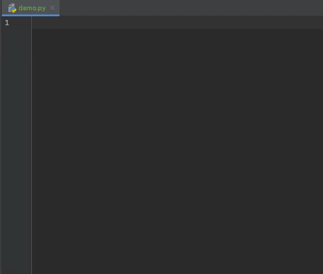

# Wave Intellij Plugin

Makes H2O Wave App development easier by providing:
* Custom code snippets (templates).
  * Component snippets
    * Minimal snippets - prefixed with `w_`, e.g. `w_button` provides snippet with required attrs only.
    * Full snippets - prefixed with `w_full_`, e.g. `w_full_button` provides snippet with all attrs.
  * Code snippets - useful code blocks, e.g. `w_base_app` provides boilerplate for a wave app.
* Advanced autocomplete for Wave-specific features.
  * Autocomplete includes only string literal expressions from `name` or `events` attrs (will not work for string concatenations (
`'a' + 'b'`) or fstrings (`f'{variable}'`).
  * Autocomplete works cross files, packages specified in requirements.txt and files not under source root are omitted
from scanning.
  * Autocomplete does not incorporate semantics, meaning it can suggest a value that is to be initialized
later in the code execution.
  * Icon autocomplete includes all the icons from https://uifabricicons.azurewebsites.net/.
However, some may not work with current Fluent Wave version.

Tips:
* See all snippets in Preferences -> Editor -> Live Templates -> Wave.
* Autocomplete can be manually invoked by hitting `<ctrl> + <space>`.
* Use `<Tab>` to move between template parts (e.g. attrs for `w_full_button`).