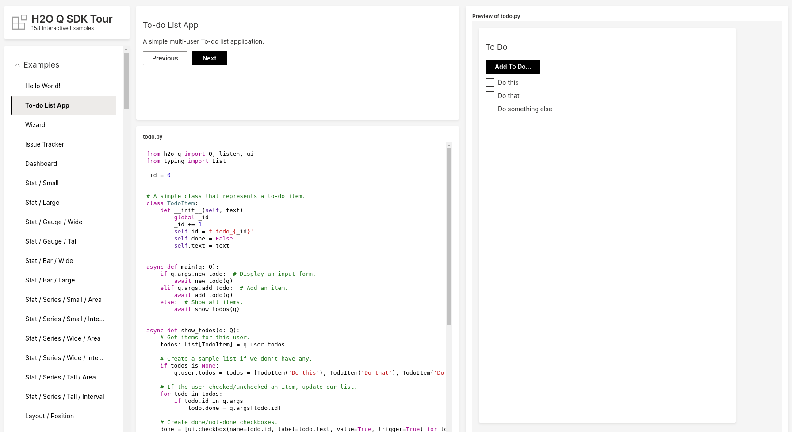

Today, we're excited to announce H2O Wave v0.9.0, with a new `wave` CLI, live-reload, improved performance, background tasks and ASGI compatibility.

<!--truncate-->

<video autoPlay='autoplay' loop='loop' muted='muted'><source src={require('./assets/2020-10-28/livereload.mp4').default} type='video/mp4'/></video>
<br/>
<br/>

Among other changes, the Wave server executable `wave` is now called `waved` (as in `wave` daemon), and the [h2o-wave](https://pypi.org/project/h2o-wave/) Python package ships with a new CLI named `wave`.

## No more listening

`listen()` has been deprecated in favor of `@app`. Wave apps are now one line shorter.

### Old way

In versions = v0.8.0, a skeleton app looked like this:

```python title="foo.py"
from h2o_wave import listen, Q

async def serve(q: Q):
    pass

listen('/demo', serve)
```

The above app could be run like this:

```shell
(venv) $ python foo.py
```

### New way

In versions v0.9.0+, a skeleton app looks like this:

```python {1,3} title="foo.py"
from h2o_wave import main, app, Q

@app('/demo')
async def serve(q: Q):
    pass
```

Notably:

1. `listen(route)` has been replaced by an `@app(route)` decorator on the `serve()` function.
2. `main` needs to be imported into the file (but you don't have to do anything with the symbol `main` other than simply `import` it).

The above app can be run using `wave run`, built into the new `wave` command line interface.

```shell
(venv) $ wave run foo
```

## Live reload

The `wave run` command runs your app using live-reload, which means you can view your changes live as you code, without having to refresh your browser manually.

```shell
(venv) $ wave run foo
```

To run your app without live-reload, simply pass `--no-reload`:

```shell
(venv) $ wave run --no-reload foo
```

## Improved performance

Both the Wave server and application communication architecture has undergone significant performance and concurrency improvements across the board. Apps should now feel lighter, quicker, and more responsive under concurrent or increased load.

The changes in v0.9 brings us closer to a v1.0 release. v1.0 will include the ability to increase the number of worker processes to scale apps, while preserving the simplicity of the Wave API.

The Wave Tour (`tour.py`) is now quicker and more reliable:



## Background tasks

The API now provides the ability to run blocking calls in the background to improve app responsiveness. The query context `q` now has  two lightweight wrappers over [asyncio.run_in_executor()](https://docs.python.org/3/library/asyncio-eventloop.html#asyncio.loop.run_in_executor): `q.run()` and `q.exec()`

Here is an example of a function that blocks:

```python {1,4}
import time

def blocking_function(seconds) -> str:
    time.sleep(seconds)  # Blocks!
    return f'Done!'
```

To call the above function from an app, don't do this:

```python {4}
@app('/demo')
async def serve(q: Q):
    # ...
    message = blocking_function(42)
    # ...
```

Instead, do this:

```python {4}
@app('/demo')
async def serve(q: Q):
    # ...
    message = await q.run(blocking_function, 42)
    # ...
```

`q.run()` runs the blocking function in the background, in-process.

Depending on your use case, you might want to use a separate process pool or thread pool from Python's [multiprocessing](https://docs.python.org/3/library/multiprocessing.html) library, like this:

```python {1,6-7}
import concurrent.futures

@app('/demo')
async def serve(q: Q):
    # ...
    with concurrent.futures.ThreadPoolExecutor() as pool:
        message = await q.exec(pool, blocking_function, 42)
    # ...
```

`q.exec()` accepts a custom process pool or thread pool to run the blocking function.

## ASGI compatibility

Wave apps are now [ASGI](https://asgi.readthedocs.io/en/latest/)-compatible, based on [Uvicorn](https://www.uvicorn.org) / [Starlette](https://www.starlette.io/), a [high-performance](https://www.techempower.com/benchmarks/#section=data-r17&hw=ph&test=fortune&l=zijzen-1) Python server.

You can run Wave apps behind any ASGI server, like [uvicorn](https://www.uvicorn.org), [gunicorn](https://gunicorn.org/), [daphne](https://github.com/django/daphne/), [hypercorn](https://pgjones.gitlab.io/hypercorn/), etc.

To run your app using an ASGI server like uvicorn, append `:main` to the `app` argument:

```shell
(venv) $ uvicorn foo:main
```

## Download

Get the release [here](https://github.com/h2oai/wave/releases/latest). Check out the release notes for more details.

We look forward to continuing our collaboration with the community and hearing your feedback as we further improve and expand the H2O Wave platform.

We’d like to thank the entire Wave team and the community for all of the contributions to this work!
