Today, we're excited to announce H2O Wave v0.11.0, with support for responsive layouts, inline form components, new cards for organizing content, and lots more.

<!--truncate-->

The Wave release now ships with a `demo` directory containing examples showing how you can combine various Wave cards and components to form complete applications. Over 2021, we plan to add many more cards and components, and this demo app can be used as a design guide for inspiration and reference for building your apps.


You can explore this demo application (and dashboards) by running `demo.app` (see `demo/app.py` in the 0.11 release):

```shell
(venv) $ wave run demo.app
```

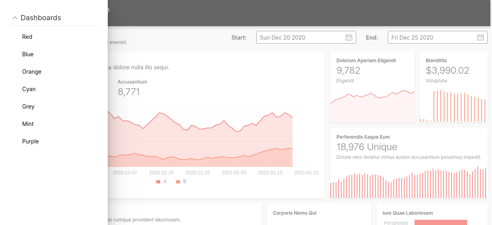

## Responsive Layouts

You can now build apps having responsive layouts (layouts that adapt to varying viewport sizes). See [Layout](../docs/layout) in the guide.

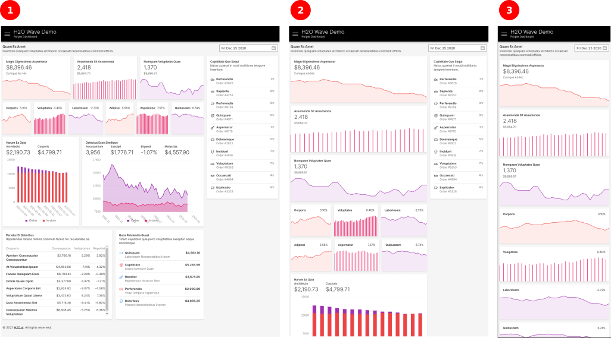

Here are a few examples of what's possible in Wave 0.11+:


## Resizable Components

We've reworked all existing components to dynamically resize when the layout is resized, especially for flex layouts. Although these card do resize or expand their contents to fit available size, it's best to use them at sizes they were originally intended for - this is especially true of the sparkline-style stats cards. At larger sizes, plot cards are more appropriate.


## Section Card

A section card (`ui.section_card()`) allows you to visually divide your page into various sub-sections, and provide components and controls specific to those sub-sections.

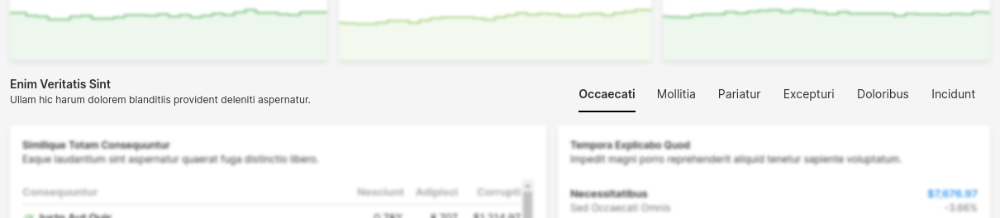

Sections can contain nested components, just like a form card, but displayed horizontally to the right of the card.


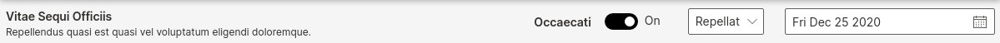

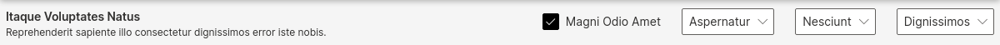


Sections are also a good way to display tabs on a page (similar to a tab card).


## Inline Components

Forms (and, in general, any card that supported nested components) can now display inline components using `ui.inline()`.

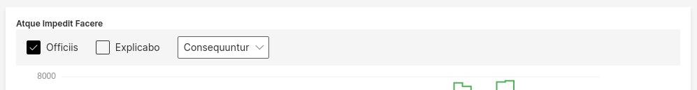

When used judiciously, inline components help design compact layouts, especially when grouping related fields together.


## Inline Stats

Stats or metrics can now be displayed inside forms, laid out horizontally from left to right. Each stat is created using `ui.stat()`, and grouped together using `ui.stats()`.


Stats can be used to display various scalar values/metrics associated with plots.

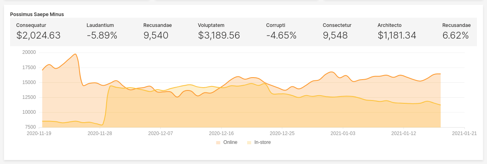

Stats can optionally contain icons as well.

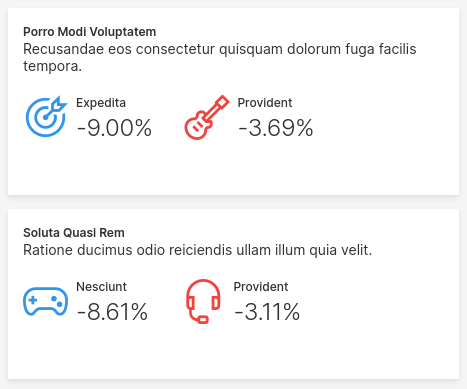

## Stat Lists

Stat lists (`ui.stat_list_card()`) offer a simple way to display two-column lists with optional links, icons, subtitles, values and auxiliary values. They provide a simpler way to display lists of things compared to the more heavyweight `ui.table()`.


Icons can be colored differently.

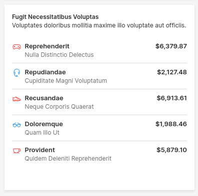

Values can be colored differently as well.

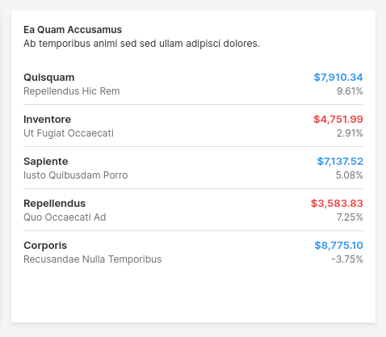


## Stat Tables

Stat tables (`ui.stat_table_card()`) offer a simple way to display a table of metrics with optional links, icons and subtitles. They provide a simpler way to display tabular data compared to the more heavyweight `ui.table()`.

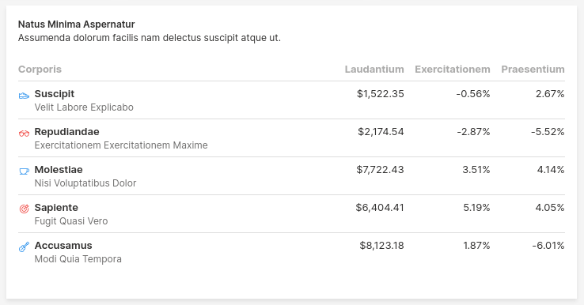

## Improved Documentation

We have a long way to go improving our documentation, but hopefully these small changes help for now.

Most importantly, the Wave documentation now sports a search bar, thanks to [Algolia](https://www.algolia.com/).

## Download

Get the release [here](https://github.com/h2oai/wave/releases/latest). Check out the release notes for more details.

We look forward to continuing our collaboration with the community and hearing your feedback as we further improve and expand the H2O Wave platform.

We’d like to thank the entire Wave team and the community for all of the contributions to this work!
