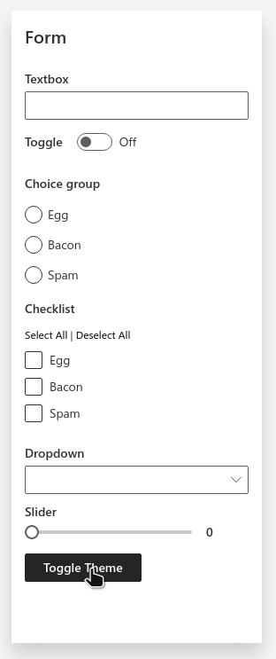

Wave v0.12 shipped last week, with support for handling queries and routes using decorators and experimental support for switching themes. Here's a rundown of the major features. 

<!--truncate-->

## Routing

In most Wave applications, queries are typically handled using `if/elif/else` conditionals that in turn call other functions:


```py {23,25,27}
from h2o_wave import Q, main, app, ui

async def on_heads(q: Q):
    q.page['sides'].items = [ui.message_bar(text='Heads!')]

async def on_tails(q: Q):
    q.page['sides'].items = [ui.message_bar(text='Tails!')]

async def setup_page(q: Q):
    q.page['sides'] = ui.form_card(
        box='1 1 4 4',
        items=[
            ui.button(name='#heads', label='Heads'),
            ui.button(name='#tails', label='Tails'),
        ],
    )

@app('/toss')
async def serve(q: Q):
    hash = q.args['#']

    if hash == 'heads':
        await on_heads(q)
    elif hash == 'tails':
        await on_tails(q)
    else:
        await setup_page(q)

    await q.page.save()
```

As your application gets larger, using `if/elif/else` for routing can seem tedious or repetitive. Starting with Wave 0.12, you can use the new `@on()` and `handle_on()` functions to reduce boilerplate:


```py {3,7,22}
from h2o_wave import Q, main, app, ui, on, handle_on

@on('#heads')
async def on_heads(q: Q):
    q.page['sides'].items = [ui.message_bar(text='Heads!')]

@on('#tails')
async def on_tails(q: Q):
    q.page['sides'].items = [ui.message_bar(text='Tails!')]

async def setup_page(q: Q):
    q.page['sides'] = ui.form_card(
        box='1 1 4 4',
        items=[
            ui.button(name='#heads', label='Heads'),
            ui.button(name='#tails', label='Tails'),
        ],
    )

@app('/toss')
async def serve(q: Q):
    if not await handle_on(q):
        await setup_page(q)

    await q.page.save()
```

The `handle_on()` function analyzes the incoming query and calls the matching `@on()` function. There's also support for specifying patterns (`@on('#menu/donuts/{donut_name}')`) and matching query arguments (`@on('buy_donut')`).

Using `@on()` and `handle_on()` functions are entirely optional.

Learn how to use routes in the guide: [Routing](../docs/routing) and [Query Arguments](../docs/arguments).

See example: [Routing](../docs/examples/routing)

## Themes

Wave v0.12 also ships with experimental support for switching themes, and includes a new `neon` dark theme. To switch your app's theme, simply set the `theme` attribute of your app's `meta_card`.

```py {3}
q.page['meta'] = ui.meta_card(
  ..., 
  theme='neon', 
  ...,
)
```



See example: [Theme](../docs/examples/meta-theme)

## Web Analytics

You can now configure your app to send basic usage information to Google Analytics. You can use this feature to measure analyze how users are interacting with various parts of your app.

To enable usage tracking, use the new `ui.tracker()` API to set the `tracker` attribute of your app's `meta_card`.

```py {2}
q.page['meta'] = ui.meta_card(
  ..., 
  tracker=ui.tracker(type=ui.TrackerType.GA, id='G-XXXXXXXXXX'),
  ...,
)
```

Read more about configuring analytics: [Configuration](../docs/configuration#web-analytics)

See example: [Tracking](../docs/examples/meta-tracking)

## Download

Get the release [here](https://github.com/h2oai/wave/releases/latest). Check out the release notes for more details.

We look forward to continuing our collaboration with the community and hearing your feedback as we further improve and expand the H2O Wave platform.

We’d like to thank the entire Wave team and the community for all of the contributions to this work!


