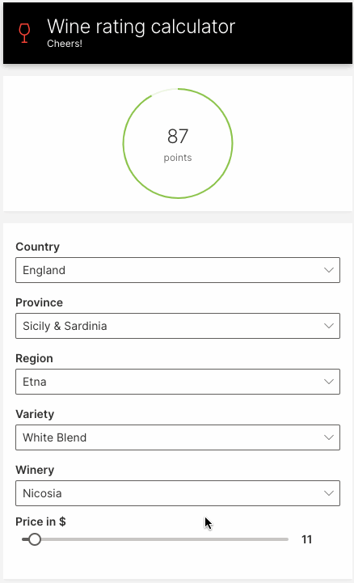
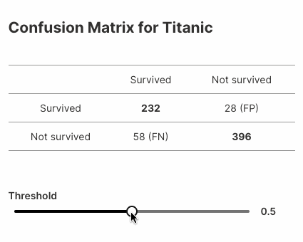

import useBaseUrl from '@docusaurus/useBaseUrl';

Today, we're excited to announce H2O Wave ML, an open-source extension to Wave that makes it easy to use automatic machine learning in your Wave apps.

```
$ pip install h2o-wave[ml]
```

In this article, we look at what Wave ML can do for you, how to get started, and what predictive applications look like in practice.

<!--truncate-->

## Introduction

H2O Wave ML makes it quick and easy to build and integrate predictive (AI/ML) models into your Wave apps.  It provides a simple, high-level API for training, deploying, scoring and explaining machine learning models, letting you rapidly build and deploy  interactive predictive and decision-support applications over the web.

Wave ML uses the open-source [H2O AutoML](https://www.h2o.ai/products/h2o/) under the hood, and is designed to (optionally) transparently switch over to [Driverless AI](https://www.h2o.ai/products/h2o-driverless-ai/) when deployed on [H2O.ai Hybrid Cloud](https://www.h2o.ai/hybrid-cloud/).

[Wave](https://github.com/h2oai/wave), [Wave ML](https://github.com/h2oai/wave-ml) and [H2O AutoML](https://github.com/h2oai/h2o-3) are all 100% open source under Apache v2, so you can build and deploy predictive apps on your own, in your preferred deployment environment. 

## Why Wave ML?

Even as the number of data scientists worldwide is increasing by leaps and bounds, there are even more developers who are building applications for various business needs. There are anywhere from 7M to 23M Python developers in the world currently, of which many are not proficient with data science. With H2O Wave ML, we abstract away the complexity of machine learning and empower developers to solve business needs in their applications with the power of AutoML.

## Installation

[H2O Wave ML](https://pypi.org/project/h2o-wave-ml/) is a companion Python package to [H2O Wave](https://pypi.org/project/h2o-wave/) (both available on PyPI). Both Wave and Wave ML can be installed in tandem using `pip`: 

```shell
(venv) $ pip install h2o-wave[ml]
```

To use the package, simply import `h2o_wave_ml`:

```py
import h2o_wave_ml
```

## API Overview

Wave ML provides four high-level functions:

- `build_model()`: Train a model on a dataset, given the column to be predicted.
- `Model.predict()`: Make a prediction.
- `save_model()`: Save your model.
- `load_model()`: Load your previously saved model.

Use [`build_model()`](https://github.com/h2oai/wave-ml#build_model) to train a model. The function accepts a dataset and a *target column* (the column to be predicted):

```py {3}
from h2o_wave_ml import build_model

model = build_model('./train.csv', target_column='depth')
```

The call to `build_model()` automatically determines if the prediction task is *classification* (predict a category or class) or *regression* (predict a real value, often a quantity).

Once the model is built, we can get the model's predictions using its [`predict()`](https://github.com/h2oai/wave-ml#modelpredict) method:

```py {4}
from h2o_wave_ml import build_model

model = build_model('./train.csv', target_column='depth')
predictions = model.predict(file_path='./test.csv')
```

You can aso get the model's predictions by directly passing in the test rows:

```py {2-4}
predictions = model.predict([
    ['width', 'height'], 
    [width1, height1], 
    [width2, height2], 
    ...
])
```

To save this model locally, use [`save_model()`](https://github.com/h2oai/wave-ml#save_model):

```py {4}
from h2o_wave_ml import build_model, save_model

model = build_model('./train.csv', target_column='depth')
model_path = save_model(model, output_dir_path='./')
```

To load a saved model, use [`load_model()`](https://github.com/h2oai/wave-ml#load_model):

```py {1}
model = load_model(model_path)
predictions = model.predict(file_path='./test.csv')
```

See [API](https://github.com/h2oai/wave-ml#api) for more information. 

## Predicting Wine Ratings

Let's build a simple web app for predicting wine ratings. The app will prompt for the wine's features, and display the predicted rating.



### Train the model

We use the [Kaggle wine dataset](https://www.kaggle.com/christopheiv/winemagdata130k) with just the `country`, `points`, `price`, `province`, `region_1`, `variety` and `winery` columns. The preprocessing steps can be found [here](https://github.com/h2oai/wave-ml/blob/main/examples/wine.py).

First, we train the model to predict the `points` (ratings) column.

```py {3}
from h2o_wave_ml import build_model

model = build_model('./winemag_edit.csv', target_column='points')
```

### Build the UI

Next, we build a user interface that prompts the user for a wine's features. We'll use dropdowns to prompt for the all of wine's features, except for the `price`, which we'll display as a slider.

To display unique values in the UI's dropdowns, load up the dataset in `datatable`, then use `unique()` to compute the unique values in each column.

```py {6}
import datatable as dt

df = dt.fread('./winemag_edit.csv')

features = ['country', 'price', 'province', 'region_1', 'variety', 'winery']
columns = {f: dt.unique(df[f]).to_list()[0] for f in features}
```

Next, use Wave's `ui.choice()` function to build up dropdown choices from the unique values:

```py {1}
choices = {key: [ui.choice(str(item)) for item in columns[key] if item] for key in columns}
```

Finally, we display all the inputs in a form: 
```py
q.page['wine'] = ui.form_card(box='body', items=[
    ui.dropdown(name='country', label='Country', value=country, trigger=True, choices=choices['country']),
    ui.dropdown(name='province', label='Province', value=province, trigger=True, choices=choices['province']),
    ui.dropdown(name='region', label='Region', value=region, trigger=True, choices=choices['region_1']),
    ui.dropdown(name='variety', label='Variety', value=variety, trigger=True, choices=choices['variety']),
    ui.dropdown(name='winery', label='Winery', value=winery, trigger=True, choices=choices['winery']),
    ui.slider(name='price', label='Price in $', min=4, max=150, step=1, value=price, trigger=True),
])
```

### Compute and show predictions

To compute the wine's rating, we read all the inputs from `q.args` and call `predict()` on our model:


```py {11}
@app('/demo')
async def serve(q: Q):
    country = q.args.country or default_value['country']
    price = float(q.args.price) if q.args.price else default_value['price']
    province = q.args.province or default_value['province']
    region = q.args.region or default_value['region_1']
    variety = q.args.variety or default_value['variety']
    winery = q.args.winery or default_value['winery']

    input_data = [features, [country, price, province, region, variety, winery]]
    rating = model.predict(input_data)
    rating = rating[0][0]
```

Finally, we use a stat card from the Wave component library to display the predicted wine rating:

```py {4}
q.page['result'] = ui.tall_gauge_stat_card(
    box=ui.box('body', height='180px'),
    title='',
    value=str(rating),
    aux_value='points',
    plot_color='$red' if rating < 90 else '$green',
    progress=rating/100,
)
```

See the full example [here](https://github.com/h2oai/wave-ml/blob/main/examples/wine.py).

## Another Example

Here's another example that displays variations in [confusion matrices](https://en.wikipedia.org/wiki/Confusion_matrix) for a model built on the popular Titanic dataset.



Here's the complete example (~25 lines of code!):

```py
import datatable as dt
from h2o_wave import main, app, Q, ui
from h2o_wave_ml import build_model, save_model, load_model
from sklearn.metrics import confusion_matrix

dataset = './titanic.csv'
target_column = 'Survived'

model = build_model(dataset, target_column=target_column)
prediction = model.predict(file_path=dataset)

# Prepare the actual values from target_column
df = dt.fread(dataset)
y_true = df[target_column].to_list()[0]

template = '''
## Confusion Matrix for Titanic
|              |           |              |
| :-:          |:-:        |:-:           |
|              | Survived  | Not survived |
| Survived     | **{tp}**  | {fp} (FP)    |
| Not survived | {fn} (FN) | **{tn}**     |
'''

@app('/demo')
async def serve(q: Q):

    # Get a threshold value if available or 0.5 by default
    threshold = q.args.slider if 'slider' in q.args else 0.5

    # Compute confusion matrix
    y_pred = [p[1] < threshold for p in prediction]
    tn, fp, fn, tp = confusion_matrix(y_true, y_pred).ravel()

    # Handle interaction
    if not q.client.initialized:  # First visit, create a card for the matrix
        q.page['matrix'] = ui.form_card(box='1 1 3 4', items=[
            ui.text(template.format(tn=tn, fp=fp, fn=fn, tp=tp)),
            ui.slider(name='slider', label='Threshold', min=0, max=1, step=0.01, value=0.5, trigger=True),
        ])
        q.client.initialized = True
    else:
        q.page['matrix'].items[0].text.content = template.format(tn=tn, fp=fp, fn=fn, tp=tp)
        q.page['matrix'].items[1].slider.value = threshold

    await q.page.save()
```

[Source](https://github.com/h2oai/wave-ml/blob/main/examples/quickstart.py).

## Conclusion

With just a couple of lines of code, you can now harness the power of the H2O platform and integrate predictive models into your Wave apps. In an upcoming release, we'll be automating this even further, letting you code-generate complete, interactive apps like the examples above with a single command. Stay tuned!

Follow updates to Wave ML on Github: https://github.com/h2oai/wave-ml. Let us know what you think, and how we can improve it.

We look forward to continuing our collaboration with the community and hearing your feedback as we further improve and expand the H2O Wave platform.