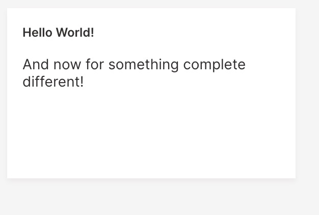
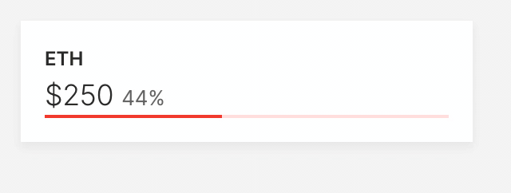

import useBaseUrl from '@docusaurus/useBaseUrl';

Today, we are happy to announce the release of `h2owave` R library for Wave. 

## Introduction

Wave has enabled many data scientists and programmers to author enterprise-scale interactive applications and informational dashboards with an easy/low-code Python programming framework. A user need not have any prior knowledge of web front-end, html or css and could still build a dashboard or application easily.  Wave has also simplified the integration of applications and dashboards with model building, scoring, and explainability through [Drivereless AI](https://www.h2o.ai/products/h2o-driverless-ai). Additionally, these applications and dashboards can be completely hosted and scaled-as-needed via [H2O.ai Hybrid Cloud](https://h2o.ai/hybrid-cloud). 

From today, R users too will be able to harness the same capabilities of H2O Wave that was exclusively available to Python users. We start off with the ability to build informational dashboards in R, and soon will be adding capabilities to build interative applications. 


## Why R Wave Library?

R community boasts of a large number of data scientists, programmers and enthusiasts. Much of the work by these incredible people has gone towards using R to analyse and model data, and build applications. We recognise that Wave has enabled Python data scientists and programmers to build end-to-end, scalable, low/minimal-code AI applications. By extending Wave to the R community we will be bringing the same capabilities and enabling the R community to build valuable end-to-end, scalable dashboards and applications.

## Requirements

These are the libraries that are needed to run the R `h2owave` library. 

1. `jsonlite`
2. `devtools`
3. `httr`
4. `R6`
5. `stringr`

## Installation

1. The required libraries need to be installed.
```
> install.packages(c("R6","devtools","jsonlite","stringr","httr"))
```
2. Next, the `h2owave` library needs to be download. [Download Link](https://github.com/h2oai/wave/)

3. There are two ways to install `h2owave`

From command line:

```
$ R CMD INSTALL h2owave_0.0.14.tar.gz
```

From R interactive environment:

```
> install.packages(“h2owave_0.0.14.tar.gz",repos=NULL,type="source")
```

## Hello World Example

To be able to use the `h2owave` library it must first be loaded to the R environment. 
Once the library is loaded we follow that up by creating a `page` object. 

```
library(h2owave)
page <- Site("/demo")
```

Once the `page` object is created we add a card on to the page. 

```
page$add_card("hello",ui_markdown_card(box="1 1 2 2",
                    title="Hello World!"
                    ,content='And now for something complete different!'
                    ))
```

Finally, we save the page. 
```
page$save()
```

Here is the entire code for the `Hello World` example. 
```
library(h2owave)

page <- Site("/demo")

page$add_card("hello",ui_markdown_card(box="1 1 2 2",
                    title="Hello World!"
                    ,content='And now for something complete different!'
                    ))

page$save()
```

Here is the output. 



## Design and API Overview

Firstly, lets go over the hiearchy of the basic components. 

```
[Site] -> [Page] -> [card]
```
A `Site` can contain multiple `Pages`. Each `Page` can have multiple _cards_. Each `Page` is uniquely identified by a `route` on a `Site`. 

```
library(h2owave)

page <- Site("/demo")

page$add_card("hello",ui_markdown_card(box="1 1 2 2",
                    title="Hello World!"
                    ,content='And now for something complete different!'
                    ))

page$save()
```
### Site

The `Site()` function takes in a `route` string and returns a `Page` object. In the above example `/demo` is the `route` on `Site` that points to the `Page` object - _page_. 
```
page <- Site("/demo")
```

### Page

A `Page` object has four methods:

* `page$add_card()` : Adds a card to the page. 

    The `add_card()` method takes in two parameters as follows: `add_card(card_name,*_card(...))`.
    In the above example, `card_name` is `"hello"` and `*_card()` function is `ui_markdown_card()`.

* `page$set()` : Modify a variable on a card (already on a page).

    The `set()` method takes in variable number of parameters - `set("card_name","parameter_name","new_parameter_value")`. 
    The first parameter is the `card_name` followed by the `parameter_name` which needs to be modified. And finally the `new_parameter_value`.

    When modifying an element in a nested list, the first parameter is the `card_name`, followed by the `parameter_list_name`,`nested_element_name`, and the
    `new_element_value` - `set("card_name","parameter_list_name","nested_element_name","new_element_value")`. If the element is nested within multiple nested parameter lists
    then the _parameter list names_ preceed the `nested_element_name`.

* `page$save()` : The `save()` method does not take in any variable. It saves or updates a page and pushes 
    the changes to the `wave` server. 
* `page$drop()` : Similar to the `save()`, the `drop()` method does not take any parameter. It plainly removes a page from the `Site`. 


### Card

The `*_card()` function takes in variable number of parameters. The number of parameters are dependent on the type of `*_card()`. 

```
ui_markdown_card(box="1 1 2 2"
                ,title="Hello World!"
                ,content='And now for something complete different!'
                ))
```

The above example `ui_markdown_card()` accepts three parameters. 

* `box` : The box defines the position and the size of the card. The four integers represent: starting column and row number, and 
    the number of columns and rows occupied by the card. 
* `title`: The title of the markdown card. 
* `content`: The message of the markdown card. 

*Note:* While going through the above _Hello World_ example you would have noticed that we created a 
`Page` _object_ - `page`. This is because we have used the `R6` library to create objects and their respective
methods. The ability to create these objects and methods helps manage each instance of a `Page` object.


## Advanced Example: ui_wide_bar_stat

### Initial Card Setup

Let's take an advanced example and introduce a few more variables within the `*_card()` function. In this example, we will also dynamically update a few variables in the card. The card that we will use here is the `ui_wide_bar_stat_card()`. 

First, we load the library and create a `Page` object. 
```
library(h2owave)

page <- Site("/demo")
```

Following the creation of the `Page` object, we add the card `ui_wide_bar_stat` to the page. 
```
crypto_price <- runif(1,1,500)
crypto_price_change <- runif(1,0,1)

page$add_card("wide_bar",ui_wide_bar_stat_card(box="1 1 2 1"
              ,title="ETH"
              ,value='=${{intl price minimum_fraction_digits=2 maximum_fraction_digits=2}}'
              ,aux_value='={{intl change style="percent" minimum_fraction_digits=2 maximum_fraction_digits=2}}'
              ,plot_color='$red'
              ,data=list(price=crypto_price,change=crypto_price_change)
              ,progress = crypto_price_change
))
```
Here,
* The card is named `"wide_bar"`. 
* The card function is `ui_wide_bar_stat_card()`. The following are the parameters of the `*_card()` function:
    * `box` : Defines the position and the size of the card. The four integers represent: starting column and row number, and 
    the number of columns and rows occupied by the card. In this example, the card starts from the 1st column and 1st row, and spans 2 columns and 1 row. 
    * `title`: The main title that appears on the card, here it is "ETH".
    * `value`: Displays the primary value on the card. The value is of type numeric, and holds a maximum and minimum of 2 decimal places. The variable that will populate `value` is `price`. This value is fed through the parameter `data` which is a list. 
    * `aux_value`: Displays the secondary value on the card. The value is also of type numeric, and holds a maximum and minimum of 2 decimal places. The name of the `aux_value` on the card is `change`. This value is fed through the parameter `data` which is a list. 
    * `plot_color`: This is a parameter that takes in the name of a color. In this case it is `$red`
    * `data`: Specifies a list of parameters that populate `value` and `aux_value`. Here `price` is fed by `crypto_price`, and `change` is fed by `crypto_price_change` variables, respectively. 
    * `progress`: This card paramter displays a visual that show progress. In this example, the variable `crypto_price_change` (between 0 - 1) populates `progress`.

Once the card is populated with all the parameters, the page is saved and sent to the `wave` server. 
```
page$save()
```
Here is the entire code for setting up the card. 
```
library(h2owave)

page <- Site("/demo")
crypto_price <- runif(1,1,500)
crypto_price_change <- runif(1,0,1)

page$add_card("wide_bar",ui_wide_bar_stat_card(box="1 1 2 1"
              ,title="ETH"
              ,value='=${{intl price minimum_fraction_digits=2 maximum_fraction_digits=2}}'
              ,aux_value='={{intl change style="percent" minimum_fraction_digits=2 maximum_fraction_digits=2}}'
              ,plot_color='$red'
              ,data=list(price=crypto_price,change=crypto_price_change)
              ,progress = crypto_price_change
))
page$save()
```

### Dynamically Updating the Card

Once the `ui_wide_bar_stat_card` is setup we now add code to the same example which will dynamically update few parameters. 

In the example, we will update three parameters:
* `price`: This is a parameter in the `data` list, and is fed by `crypto_price`.
* `change`: This is the second parameter in the `data` list, and is fed by `crypto_price_change`.
* `progress`: Provided by the variable `crypto_price_change`.

```
while(TRUE){
  Sys.sleep(3)
  crypto_price <- runif(1,1,500)
  crypto_price_change <- runif(1,0,1)
```
We simulate the dynamic behaviour by placing the entire dynamic-card-update code in a `while(TRUE)` loop, with a interval of 3 seconds, `Sys.sleep(3)`.
Following the while loop, we set a value for `crypto_price` and `crypto_price_change`. 

```
  page$set("wide_bar","data","price",crypto_price)
  page$set("wide_bar","data","change",crypto_price_change)
  page$set("wide_bar","progress",crypto_price_change)
  page$save()
}
```
Next, we use the `page$set()` method to dynamically update the values. The order of parameters that go into `set()` is, `"card_name"`,`"parameter_name"`, or `"parameter_list_name"` and `"nested_element_name"`, and finally, the `new_parameter_value` or `nested_element_value`.

In the example, the below two set-values are elements in the parameter `data`. 
```
  page$set("wide_bar","data","price",crypto_price)
  page$set("wide_bar","data","change",crypto_price_change)
```

Here, `page$set("wide_bar","progress",crypto_price_change)` sets the parameter `progress`. And is followed by saving/updating the page. 

Here is the entire code for dynamically updating the card. 
```
library(h2owave)

page <- Site("/demo")
crypto_price <- runif(1,1,500)
crypto_price_change <- runif(1,0,1)

page$add_card("wide_bar",ui_wide_bar_stat_card(box="1 1 2 1"
              ,title="ETH"
              ,value='=${{intl price minimum_fraction_digits=2 maximum_fraction_digits=2}}'
              ,aux_value='={{intl change style="percent" minimum_fraction_digits=2 maximum_fraction_digits=2}}'
              ,plot_color='$red'
              ,data=list(price=crypto_price,change=crypto_price_change)
              ,progress = crypto_price_change
))
page$save()

while(TRUE){
  Sys.sleep(3)
  crypto_price <- runif(1,1,500)
  crypto_price_change <- runif(1,0,1)
  page$set("wide_bar","data","price",crypto_price)
  page$set("wide_bar","data","change",crypto_price_change)
  page$set("wide_bar","progress",crypto_price_change)
  page$save()
}
```
Here is the Output



## Conclusion

The above examples illustrate the possibility of building dynamic, informative dashboards using the `h2owave` R library. In the upcoming release we will be adding the ability to build full-fledged applications. 

In the R `h2owave` library we have tried to keep programming easy, simple, and idiomatic, we understand that there is always room for improvement and would love to hear from you in case you have comments, and suggestions. [Link](https://github.com/h2oai/wave/discussions/761)

We look forward to continuing our collaboration with the community. Follow updates to Wave on Github: https://github.com/h2oai/wave

