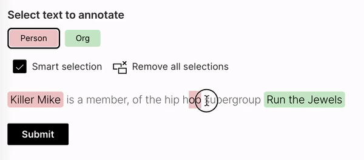

With the latest release, we are excited to announce Wave becoming more colorful! In addition to existing color themes (`default`, `neon`) we added `h2o-dark` and plan on expanding the list to at least a dozen, so stay tuned. If interested, you can track the progress [here](https://github.com/h2oai/wave/issues/696). However, having only predefined color palettes keeps you from matching your Wave app to your specific color brand, so we have added custom, user-defined palettes.

<!--truncate-->

## How it works?

Firstly, a new `ui.theme` needs to be registered within the `themes` attribute in `ui.meta_card`. It takes the name of the theme and 4 main colors as arguments:

* `primary` - Accent color for primary buttons, checkboxes etc.
* `text` - Default text color.
* `card` - Card background color.
* `page` - Base background color behind cards.

After the theme is successfully registered, you can use it in the same fashion as predefined themes, by setting `ui.meta_card`'s `theme` attribute.

```py
q.page['meta'] = ui.meta_card(
    box='',
    themes=[
        ui.theme(
            name='my-awesome-theme',
            primary='#13ebe7',
            text='#e8e1e1',
            card='#12123b',
            page='#070b1a',
        )
    ],
    theme='my-awesome-theme'
)
```

:::tip
You can register multiple themes, which might be handy for switching between the light / dark mode of your app.
:::

## Theme generator

Wave ships with a simple app that allows you to pick colors and see how they work together instantly.

This Wave app provides:

* Immediate visual feedback.
* Color contrast warnings when a particular contrast ratio is less than [4.5](https://www.w3.org/TR/UNDERSTANDING-WCAG20/visual-audio-contrast-contrast.html).
* Quick theme copy-pasting.

Simply run:

```sh
./venv/bin/wave run examples.theme_generator
```

Then visit http://localhost:10101/demo.


We would love to see all the beautiful themes our community came up with so don't hesitate and post the screenshots into our [show and tell](https://github.com/h2oai/wave/discussions/categories/show-and-tell) Github Discussions section! The best ones might even be included as predefined themes within Wave itself in the future.

## Can individual colors be changed?

In general, the answer is no. Wave tries to be smart and do all the minor decisions for you, e.g. picking a color for primary/secondary buttons, checkboxes, etc. This way, a consistent UX is ensured and you can focus solely on the product itself rather than wasting time on nitpicking small stuff.

However, some cards allow changing colors of particular parts, for example, icons, but this is more of an exception rather than a strict rule.

If full control over colors/typography etc. is needed, going with regular HTML/CSS/JS is probably a better choice.

## New cards added

To improve the look of Wave apps in general, Wave 0.19.0 ships with about a dozen of new cards and components.

The following section includes some of the latest release highlights. For a full list, refer to [CHANGELOG](https://github.com/h2oai/wave/releases/tag/v0.19.0).

### Text annotator

As the name suggests, this is a component to be used for text annotation purposes, this is very handy for NLP-related needs. See [example](/docs/widgets/form/text_annotator/).



### Copyable text

A simple component to provide a way to quickly copy text into the user's clipboard without the need for doing a manual selection. See [example](/docs/widgets/form/copyable_text/).


### Table redesign + table tags

The table component underwent a significant redesign. New tags were introduced that can be used for emphasizing certain states within a table column. See [example](/docs/widgets/form/table#tags).


### Facepile

Used when you need to show who has access or who is included within a specified workflow. See [example](/docs/widgets/form/facepile/).


### Compact file upload

A more space-efficient version of file upload, best used when you expect a single file to be uploaded and need to conserve space. See [example](/docs/widgets/form/file_upload#compact).


### Profile card

As the name suggests, use for user profile pages. See [example](/docs/widgets/content/profile).


### Article card

Use for long-form articles. See [example](/docs/widgets/content/article).


### Tall article preview card

As the name suggests, use for article previews. See [example](/docs/widgets/content/tall_article_preview).


### Tall info card

The intended use of this card is to "lead into" another page. See [example](/docs/widgets/content/tall_info).


### Wide pie stat card

Need a pie chart? We've got you covered. See [example](/docs/widgets/stat/wide_pie_stat).


### Wide plot

Used when a title and a short caption with further explanation are needed for a plot. See [example](/docs/examples/wide-plot).


