It's been a long time since the last `0.19` release, but the wait was worth it. The newest Wave includes plenty of extremely useful features that aim to ease the development process and make your Wave apps more appealing. Let's explore the biggest of them.

<!--truncate-->

## Bundled Wave server

Until the `0.20` version, developers were required to manually download Wave server (waved) from [our Github releases page](https://github.com/h2oai/wave/releases), extract and run before running the app. This step is now eliminated and all you need is to run `pip install h2o_wave`. After successful install, run `wave run your-app` and the Wave server should be started automatically.

Note that this simplification is aimed for development only. For production deployments, you might want to pass additional configuration options to waved (not possible with `wave run`) or even switch your python ASGI server (see [deployment docs](/docs/deployment#deploying-wave-apps)).

If you for, some reason, do not want to start `waved` during `wave run`, you can turn it off via `H2O_WAVE_NO_AUTOSTART` env variable.

## Base URL support

By default, Wave apps are all registered on `/` root path. The location your app listens on depends on the route you specify in `@app` or `site['']`. However, if you want to namespace apps or just facing complex deployment, you might want to configure it from a single place rather than on per-app basis.

Launch `waved` with `-base-url` or launch `waved` with `$H2O_WAVE_BASE_URL` to set a base URL. Setting base URL to `/foo/` will allow serving an app with route `/` at `/foo/`, or an app with route `/bar` at `/foo/bar/`. Accessing `/foo/`'s parent(s) from browser/API will return 404. If a base URL is set, an app must be launched with `$H2O_WAVE_BASE_URL` set to the same base URL value.

## Improved docs

For the sake of time, our documentation was mostly made up of plain code examples without any extra explanations/descriptions. The [newest version](/docs/components/overview), although not yet fully complete, tries to fix that by organizing the available components according to their usecase and providing all the possible component variations with guidance on when and how they should be used. Additionally, all the documented components include accompanying screenshots so that developers know exactly how is the particular component going to render.

## Component additions/improvements

This release contains a lot of bugfixes and small features that are not worth mentioning from a general overview point of view. Instead, here is a list of the most significant component changes and additions.

### Header

The header received 3 new attributes:

* `items` - Components that should be displayed on the right side of the header.
* `secondary_items` - Items that should be displayed in the center of the header
* `color` - Header background color. Available colors are 'card' | 'transparent' | 'primary'. Defaults to 'primary'.

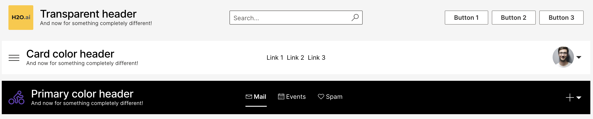

### Sidebar

Sidebar (`ui.nav`) got 4 new attributes:

* `image` - The logo displayed at the top.
* `persona` - The user avatar displayed at the top.
* `secondary_items` - Items that should be displayed at the bottom of the card if items are not empty, otherwise displayed under subtitle.
* `color` - Card background color. Available colors are `'card'` and `'primary'`. Defaults to `'card'`.

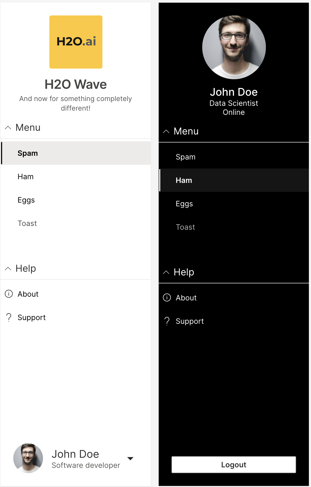

### Footer

A new `items` attribute was added to allow displaying of components (preferably `ui.links`) to the right side of the caption.

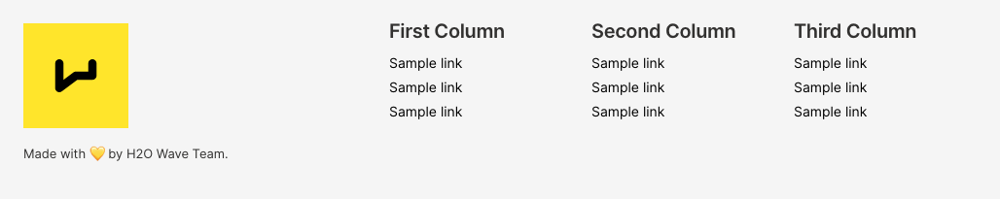

### Tall stats card

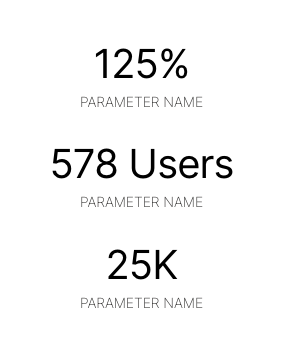

### Postcard card

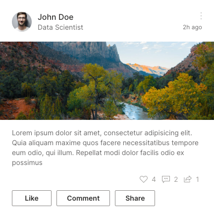

### Preview card

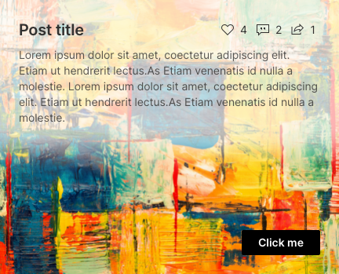

### Wide article preview

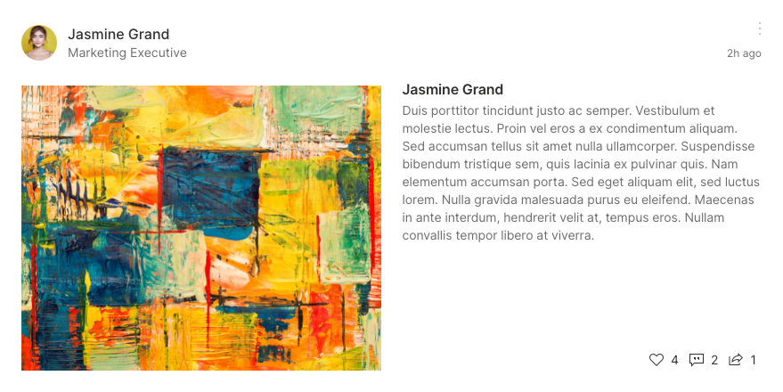

## More built-in themes

If you find choosing the right colors for your Wave app troublesome due to lack of artistic feelings, we have good news! This release introduces 12 new built-in themes to choose from. The inspiration for every theme was taken from some of the most popular code editor/IDE themes.

If you are unsure how to use these, checkout the [docs](/docs/color-theming).

### Winter is coming

Credit: <https://marketplace.visualstudio.com/items?itemName=johnpapa.winteriscoming>.

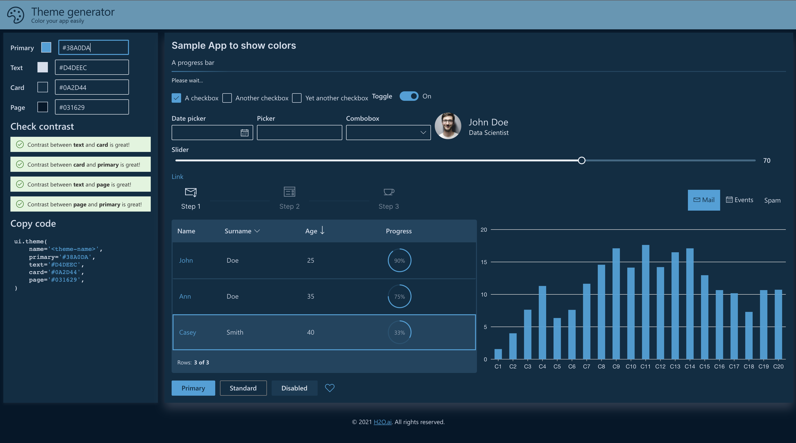

### Fuchasia

Credit: <https://github.com/thvardhan/Gradianto>.

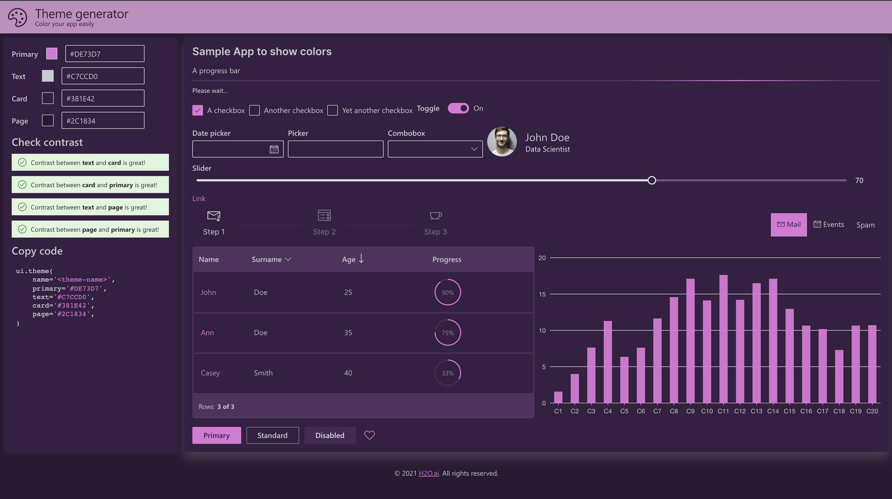

### Monokai

Credit: <https://monokai.pro/>.

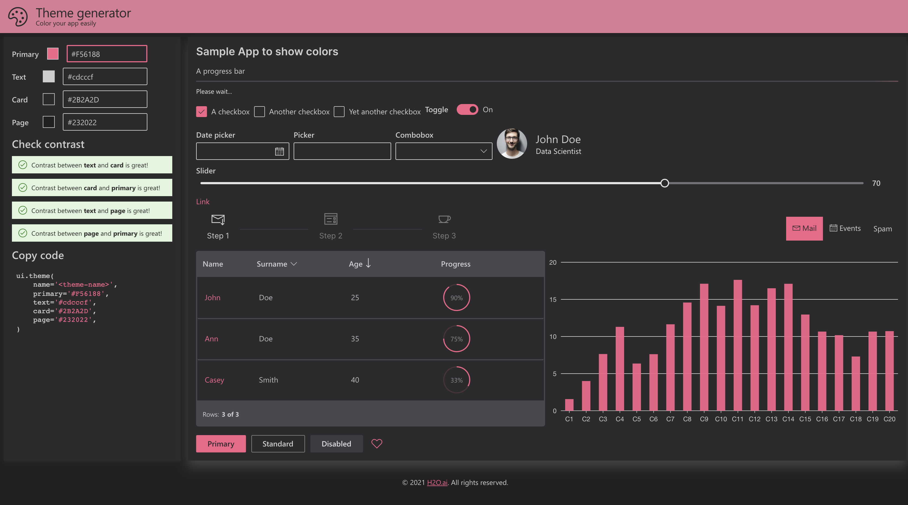

### Nature

Credit: <https://github.com/thvardhan/Gradianto>.

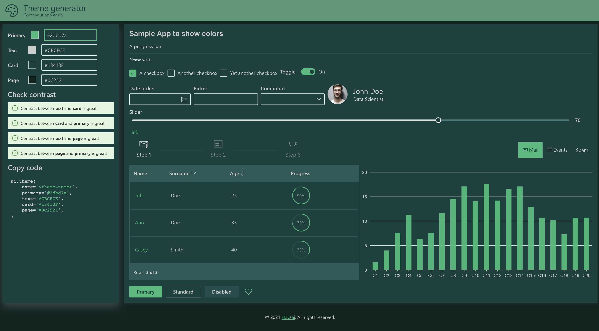

### Nord

Credit: <https://www.nordtheme.com/>.

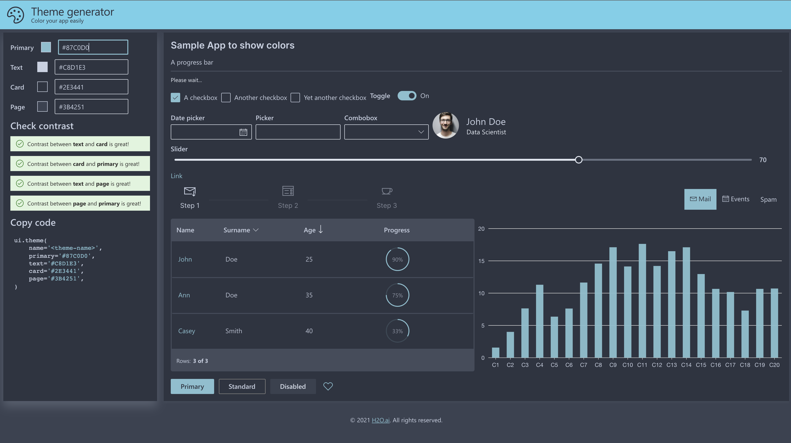

### Oceanic

Credit: <https://material-theme.com/>.

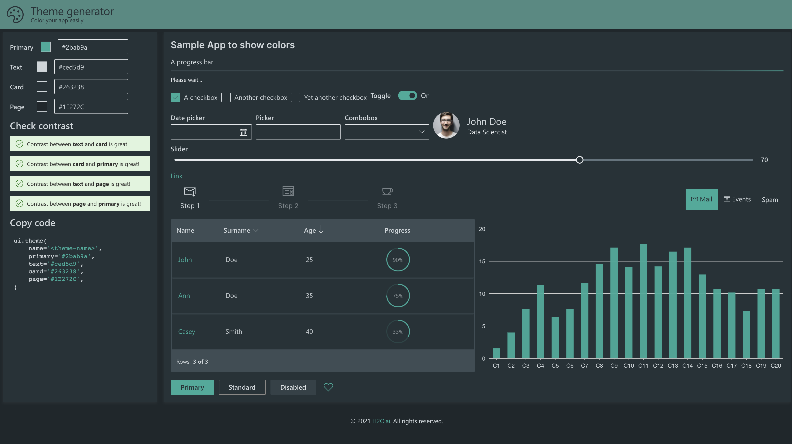

### One dark pro

Credit: <https://marketplace.visualstudio.com/items?itemName=zhuangtongfa.Material-theme>.

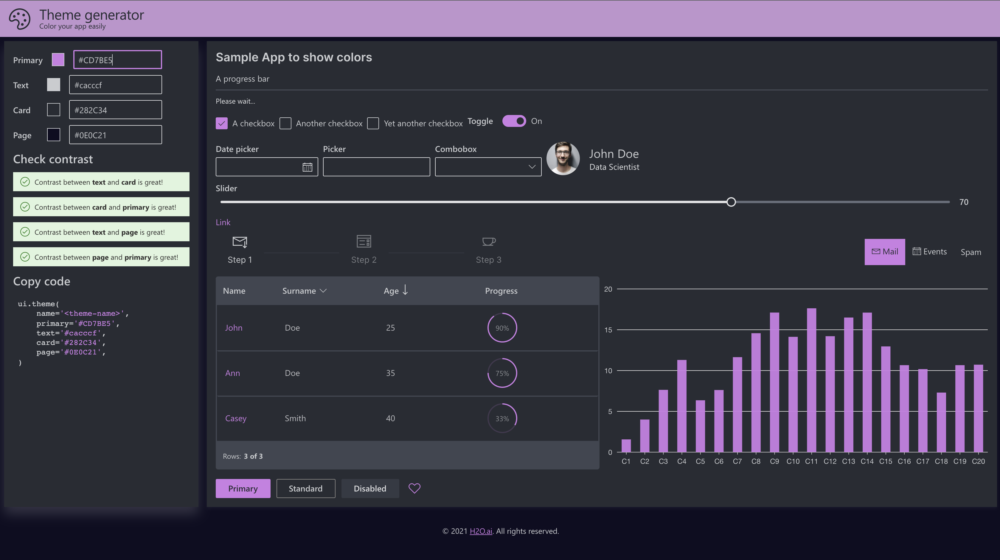

### Benext

Credit: <https://slackthemes.net/#/benext>.

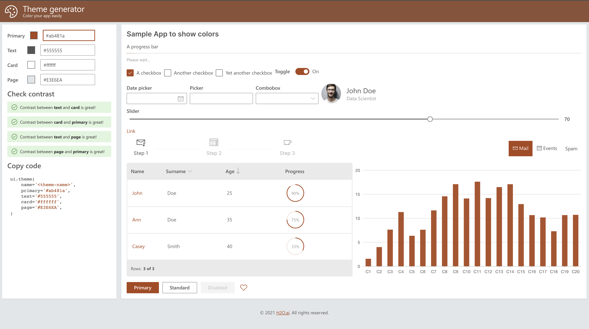

### Ember

Credit: <https://emberjs.com/>.

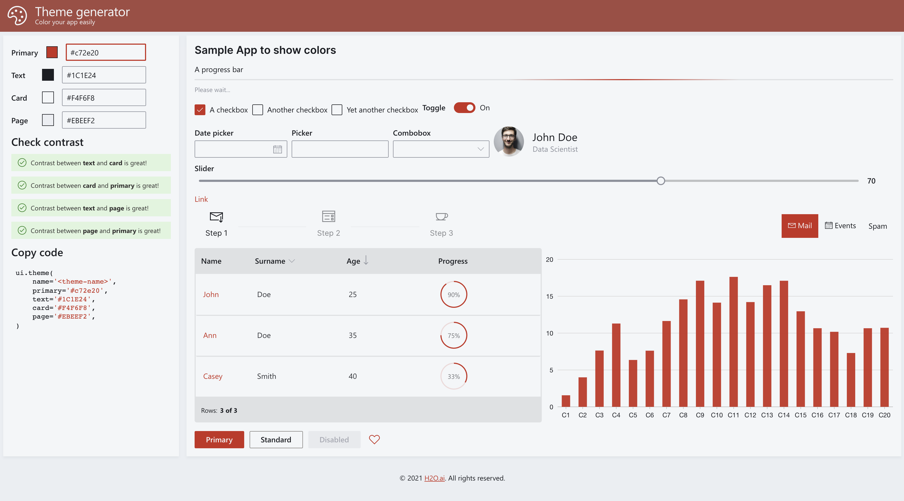

### Kiwi

Credit: <https://rainglow.io/>.

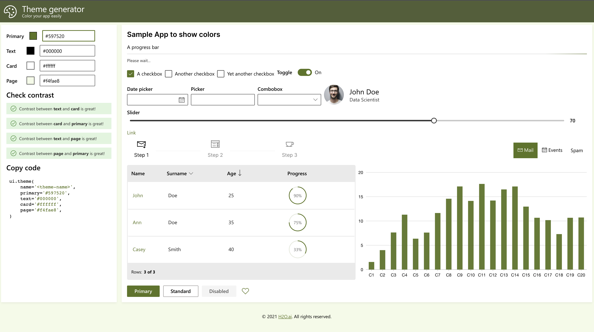

### Lighting

Credit: <https://slackthemes.net/#/lightning>.

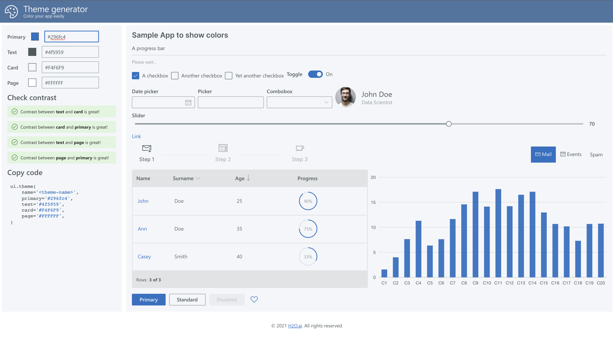

### Solarized

Credit: <https://ethanschoonover.com/solarized/>.

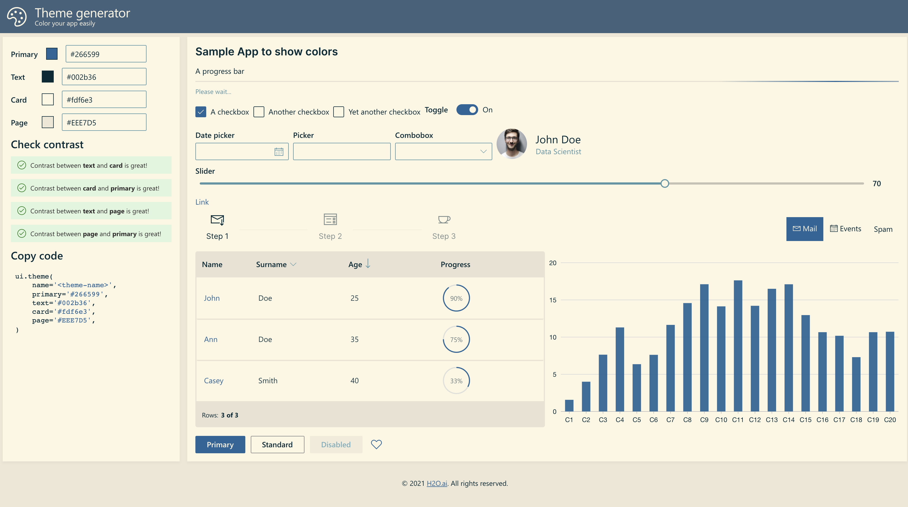

Have an idea for a good-looking theme that others might like? Don't hesitate, [start a discussion](https://github.com/h2oai/wave/discussions) with us and it may appear in the next Wave release!
