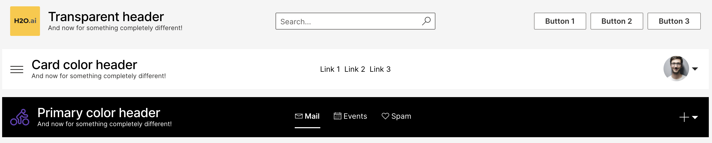
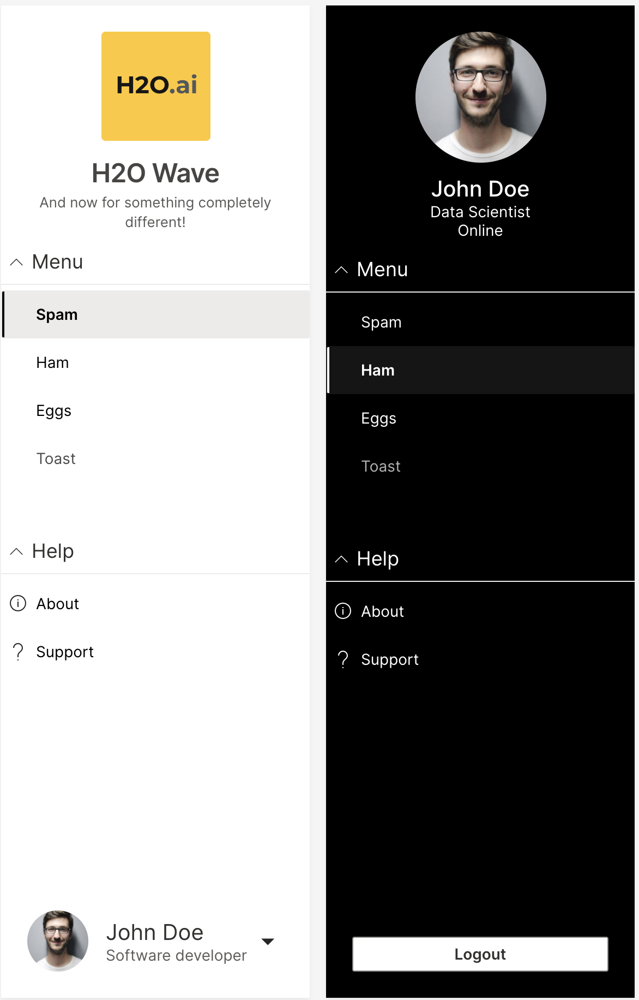
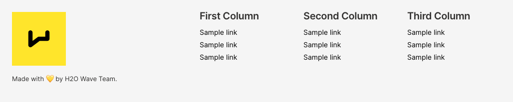
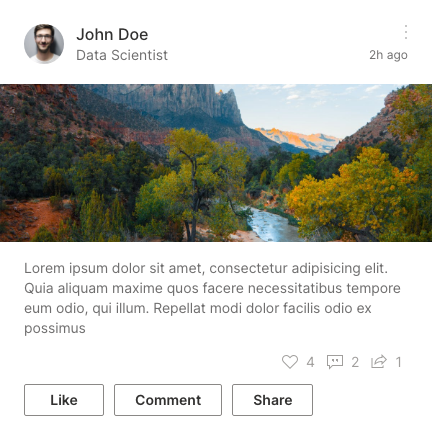
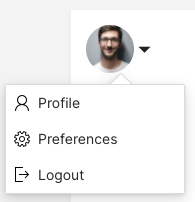
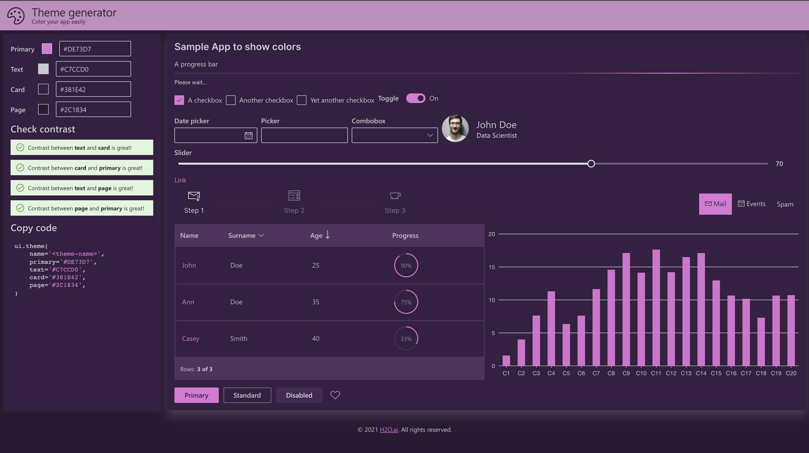
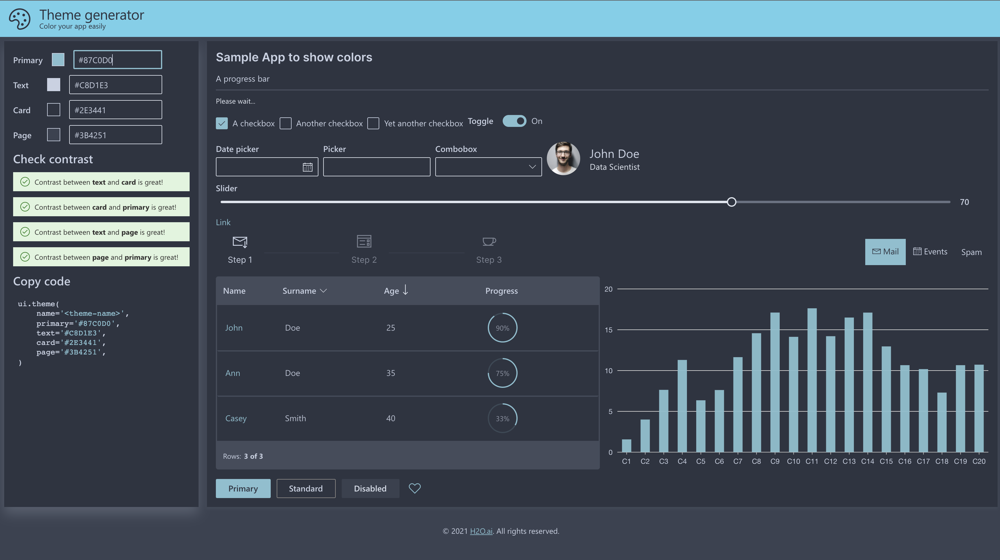
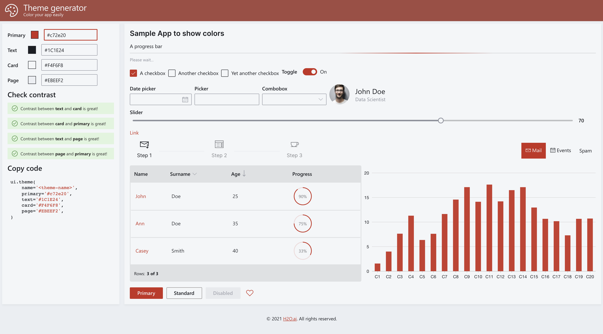
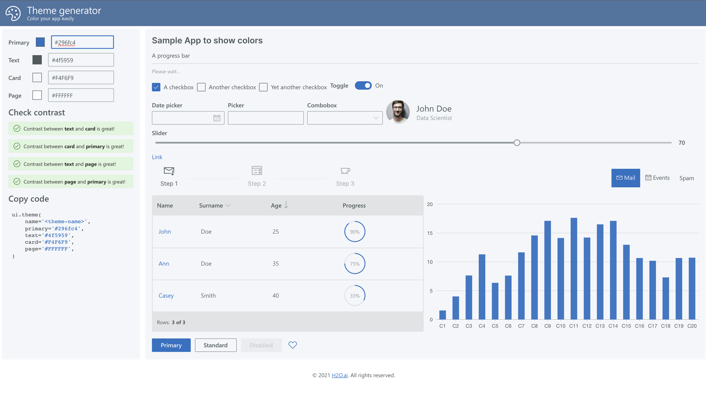

The newest Wave release includes plenty of useful features that aim to ease the development process and make your Wave apps more appealing. In this post, we explore the most important features that shipped with v0.20.

!--truncate--

## Simpler, quicker installation experience

Prior to v0.20, it was necessary to manually download and run the Wave server (`waved` or `waved.exe`) from [Github](https://github.com/h2oai/wave/releases) prior to running your app. This step is no longer necessary.

Starting with v0.20, all you need to do is `pip install h2o_wave` and then `wave run app.py`. The Wave server is automatically started for you.

```shell
# Automatically starts the Wave server!
(venv) $ wave run app.py
```

This behavior makes it simpler to get started with Wave app development. For production deployments, you might want to pass additional configuration options to `waved` or even switch your python ASGI server (see [deployment docs](/docs/deployment#deploying-wave-apps)).

If you do not want to start `waved` during `wave run`, you can turn it off by passing `--no-autostart to `wave run`, e.g. `wave run --no-autostart app.py`, or setting the `H2O_WAVE_NO_AUTOSTART` environment variable, e.g. `H2O_WAVE_NO_AUTOSTART=1 wave run app.py`.

To download Wave app examples, demos, and the interactive tour locally, simply run `wave fetch`. 

```shell
(venv) $ wave fetch

Fetching examples and related files. Please wait...
Downloading https://github.com/h2oai/wave/releases/download/v0.19.0/wave-0.19.0-linux-amd64.tar.gz
Extracting...

All additional files downloaded and extracted successfully!
Examples and tour............. /home/wave/examples
Demos and layout samples...... /home/wave/demo
Automated test harness........ /home/wave/test
Wave daemon for deployments... /home/wave
```

You should now have access to 200+ examples locally.

## Base URL support

By default, Wave apps are all hosted at the root path `/`. This path can be customized by specifying a route via, say, `@app('/foo')` or `site['/foo']`. Starting with v0.20, you can additionally specify a base URL, so that all the apps or sites hosted by a Wave server are served at a path other than `/`. 

Using this feature, specifying a base URL, say `/my/apps`, will make your apps available at `/my/apps/app1`, `/my/apps/app2`, and so on.

To enable a base URL, launch `waved` with `-base-url` or launch `waved` with `$H2O_WAVE_BASE_URL`. Setting base URL to `/foo/` will allow serving an app with route `/` at `/foo/`, or an app with route `/bar` at `/foo/bar/`. Accessing `/foo/`'s parent(s) from either a browser or API call will return a 404 error. If a base URL is set, an app must be launched with `$H2O_WAVE_BASE_URL` set to the same base URL value.

## Card and component documentation

The documentation now includes a whole new section on [Widgets](/docs/widgets/overview), which includes explanations and examples on how to best use each of the cards and components available in Wave. This is a work in progress, and will be improved over time. We've tried to include screenshots of each example wherever possible, which should make it easier for you to browse, copy and adapt the sample code for your apps.

## New cards, components, and improvements

v0.20 ships with more new cards and improvements. Here's an overview of the most important changes.

### Header

The header received 3 new attributes:

* `items` - Components that should be displayed on the right side of the header.
* `secondary_items` - Items that should be displayed in the center of the header
* `color` - Header background color. Available colors are 'card' | 'transparent' | 'primary'. Defaults to 'primary'.



See [header](/docs/widgets/content/header) for more info.

### Sidebar

Sidebar (`ui.nav`) got 4 new attributes:

* `image` - The logo displayed at the top.
* `persona` - The user avatar displayed at the top.


* `secondary_items` - Items that should be displayed at the bottom of the card if items are not empty, otherwise displayed under subtitle.
* `color` - Card background color. Available colors are `'card'` and `'primary'`. Defaults to `'card'`.



See [navigation](/docs/widgets/content/navigation) for more info.

### Footer

A new `items` attribute was added to allow displaying of components (preferably `ui.links`) to the right side of the caption.



See [footer](/docs/widgets/content/footer) for more info.

### Tall stats card


See [tall stats](/docs/widgets/stat/tall_stats) for more info.

### Post card



See [post card](/docs/widgets/content/post) for more info.

### Preview card


See [preview card](/docs/widgets/content/preview) for more info.

### Wide article preview


See [wide article preview card](/docs/widgets/content/wide_article_preview) for more info.

### Menu



See [menu](/docs/widgets/form/menu) for more info.

## New Themes

v0.20 includes a dozen new built-in themes to choose from. Most of the themes were inspired by popular editor/IDE themes of the same name. If you have ideas for other themes that would be useful to have in Wave, please [let us know](https://github.com/h2oai/wave/discussions)!

If you are unsure how to use these, checkout the [docs](/docs/color-theming).

### Winter is coming

Credit: [https://marketplace.visualstudio.com/items?itemName=johnpapa.winteriscoming](https://marketplace.visualstudio.com/items?itemName=johnpapa.winteriscoming).


### Fuchasia

Credit: https://github.com/thvardhan/Gradianto.



### Monokai

Credit: https://monokai.pro/.


### Nature

Credit: https://github.com/thvardhan/Gradianto.


### Nord

Credit: https://www.nordtheme.com/.



### Oceanic

Credit: https://material-theme.com/.


### One dark pro

Credit: https://marketplace.visualstudio.com/items?itemName=zhuangtongfa.Material-theme.


### Benext

Credit: https://slackthemes.net/#/benext.


### Ember

Credit: https://emberjs.com/.



### Kiwi

Credit: https://rainglow.io/.


### Lighting

Credit: https://slackthemes.net/#/lightning.



### Solarized

Credit: https://ethanschoonover.com/solarized/.


## Feedback

We look forward to continuing our collaboration with the community and hearing your feedback as we further improve and expand the H2O Wave platform.

We'd like to thank the entire Wave team and the community for all of the contributions to this work!
