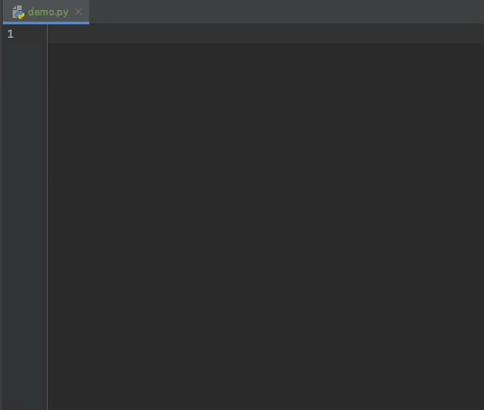
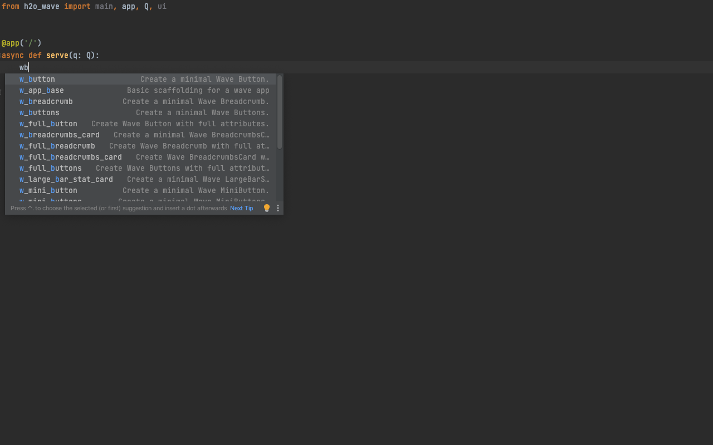
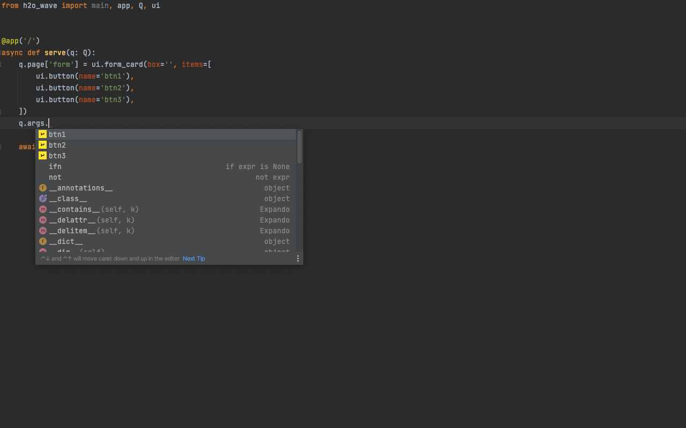
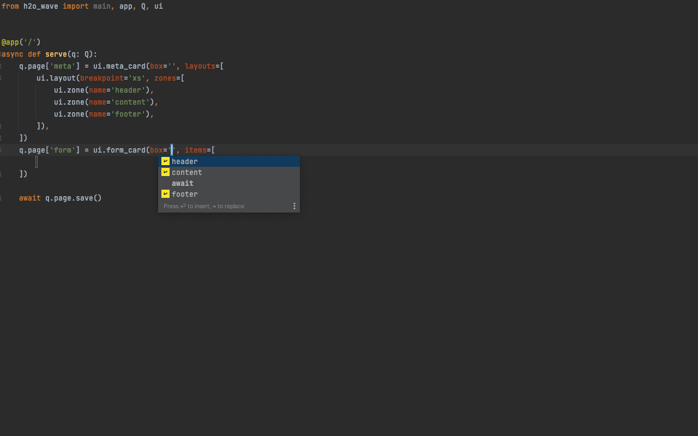
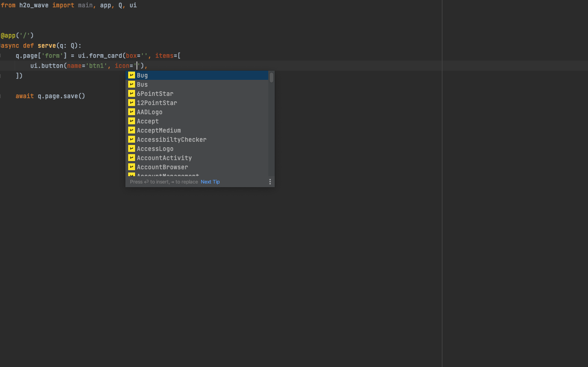

In addition to the most recent [0.20 release](https://wave.h2o.ai/blog/release-0.20), we also published a Pycharm plugin that aims to ease the Wave app development even more. The plugin adds plenty of code snippets and extra autocomplete for wave-specific features.

<!--truncate-->

## Code snippets

Code snippets are reusable blocks of code that release the burden of writing out the whole code yourself, saving you time and mental energy. Thus they allow writing Wave code somewhat declaratively - dev needs to only focus on the big picture. Let's take the following scenario: I want to create a new Wave app, but I do not remember the base boilerplate needed. In this case, you can simply use `wave_app_base` snippet and you are good to go! See it in action:

The plugin supports the following types of code snippets:

* Code blocks - useful code blocks, e.g. `w_init_client` provides boilerplate for a client initialization.
* App templates - prebuilt Wave apps using the most common layouts and patterns, e.g. `w_app_header` provides an app with a body and header.
* Component snippets
  * Minimal snippets - prefixed with `w_`, e.g. `w_button` provides snippet with required attrs only.
  * Full snippets - prefixed with `w_full_`, e.g. `w_full_button` provides snippet with all attrs.

## Autocomplete

Have you ever wanted to handle that button click in Wave, but didn't really remember the `name` attribute you used? If the answer is yes, we have some good news for you. This plugin will offer you all the available options for:

* q.args
* q.client
* q.user
* q.app
* zone attribute
* icon attribute
* theme attribute

## Installation

The plugin is part of public [Jetbrains marketplace](https://plugins.jetbrains.com/plugin/18530-h2o-wave) and can be installed directly from the web (if you have you Pycharm currently open) or within Pycharm directly via `Preferences -> Plugins`.

## Feedback

We are eager to hear your feature requests, bugfixes or just general feedback in our [discussions](https://github.com/h2oai/wave/discussions) and [issues](https://github.com/h2oai/wave/issues) sections.
