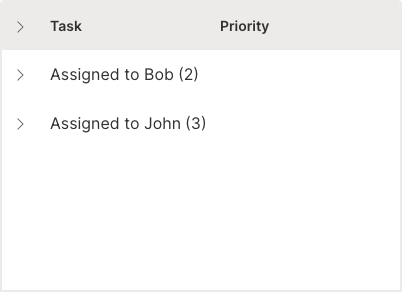
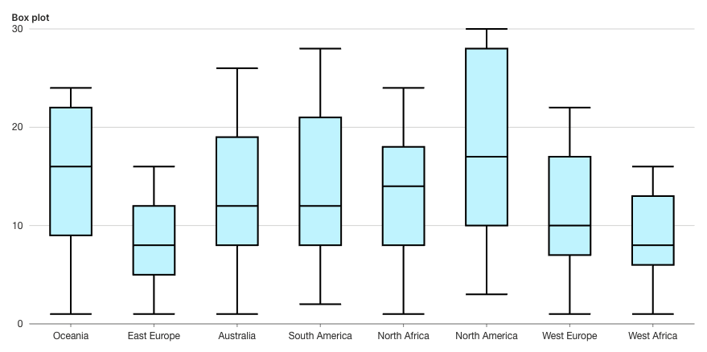
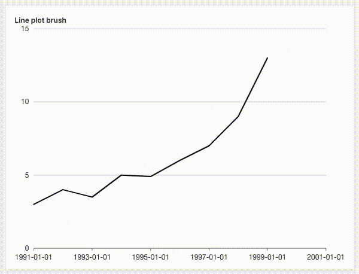

Today, we are proud to announce a new Wave version - `0.21.0` with support for server-side tables, Apple M1 chip, plot interactions and plenty of new widgets.

<!--truncate-->

## Let your table handle any data size

In previous versions, all the data passed to `ui.table` as rows were sent at once to the browser. All operations (sorting, filtering etc.) were happening in the browser, which has its limits. These were approximately around 100k rows with 10 cols to keep the UX smooth. However, if a developer needed to display larger data, let's say in order of millions, there was no way to make it happen.

This release adds support for pagination and lets developers handle all the operations in form of events: `'search'`, `'sort'`, `'filter'`, `'download'`, `'page_change'`, `'reset'`. See [complete example](/docs/examples/table-pagination) for a comprehensive example. Also note that you can use any arbitrary data source like SQL, [pandas dataframe](/docs/examples/table-pagination-pandas) or [H2OFrame](/docs/examples/table-pagination-h2o3).

## Grouped tabular data

In previous versions, app developers could only specify the `groupable` attribute which adds a group by dropdown that lets users pick a column to group by on. However, if app developers wanted to present their tabular data organized into groups, that was a problem - until now. We introduced a new `groups` attribute which takes a list of `ui.table_group`.

It is even possible to control whether the groups should be expanded or collapsed initially.



```py
q.page['form'] = ui.form_card(box='1 1 -1 6', items=[
    ui.table(
        name='issues',
        columns=[ui.table_column(name='text', label='Issues reported by')],
        groups=[
            ui.table_group("Bob", [
                ui.table_row(name='row1', cells=['Issue1']),
                ui.table_row(name='row2', cells=['Issue2'])
            ]),
            ui.table_group("John", [
                ui.table_row(name='row3', cells=['Issue3']),
                ui.table_row(name='row4', cells=['Issue4']),
                ui.table_row(name='row5', cells=['Issue5']),
            ])],
        height='500px'
    )
])
```

## M1 chip? No problem

If you own Apple's newest Macbooks with M1 chips, you no longer need [Rosetta](https://en.wikipedia.org/wiki/Rosetta_(software)) to be running under the hood to run the Wave server binary. We are now building a binary for M1 as well.

:::tip
Make sure to keep your [pip](https://pypi.org/project/pip/) up to date so that it can correctly identify what system you are using and provide the correct python wheel file during `pip install`.
:::

## Box plots

Wave now supports [box plots](https://en.wikipedia.org/wiki/Box_plot).



```py
q.page['example'] = ui.plot_card(
    box='1 1 6 5',
    title='Box plot',
    data=data(
        fields=['region', 'low', 'q1', 'q2', 'q3', 'high'],
        rows=[
            ['Oceania', 1, 9, 16, 22, 24],
            ['East Europe', 1, 5, 8, 12, 16],
            ['Australia', 1, 8, 12, 19, 26],
            ['South America', 2, 8, 12, 21, 28],
            ['North Africa', 1, 8, 14, 18, 24],
            ['North America', 3, 10, 17, 28, 30],
            ['West Europe', 1, 7, 10, 17, 22],
            ['West Africa', 1, 6, 8, 13, 16],
        ],
        pack=True,
    ),
    plot=ui.plot([ui.mark(
        type='schema',
        x='=region',
        y1='=low',  # min
        y_q1='=q1',  # lower quartile
        y_q2='=q2',  # median
        y_q3='=q3',  # upper quartile
        y2='=high',  # max
        fill_color='#ccf5ff',
    )])
))
```

## Let your plots come to life

We enabled plot [interactions](docs/widgets/plots/interactions) like zoom, brush, and drag so that your users can poke around your plot data easily.



```py
q.page['example'] = ui.plot_card(
    box='1 1 4 5',
    title='Line plot brush',
    data=data('year value', 8, rows=[
        ('1991', 3),
        ('1992', 4),
        ('1993', 3.5),
        ('1994', 5),
        ('1995', 4.9),
        ('1996', 6),
        ('1997', 7),
        ('1998', 9),
        ('1999', 13),
    ]),
    plot=ui.plot([ui.mark(type='line', x_scale='time', x='=year', y='=value', y_min=0)]),
    # Register an interaction.
    interactions=['brush']
)
```

:::warning
Due to limitations of our plotting library, `zoom` is currently not available in Firefox. It is recommended to use `brush` instead.
:::

## Notification bar

Need a slick way of informing your users about something? Use `ui.notification_bar`!


```py
if not q.client.initialized:
    q.page['form'] = ui.form_card(box='1 1 2 4', items=[
        ui.button(name='top_right', label='Success top-right'),
    ])
    q.client.initialized = True
if q.args.top_right:
    q.page['meta'] = ui.meta_card(
        box='',
        notification_bar=ui.notification_bar(
            text='Success notification',
            type='success',
            position='top-right',
            buttons=[ui.button(name='btn', label='Link button', link=True)]
    ))
```

## Icons gone missing?

We had to replace our original icon set with a new one which means it is very likely that some of the icons used will turn invisible. The solution is to [search](/docs/icons) for new ones.

## Improved docs

Check out the new [plot](/docs/widgets/plots/overview) and [overlays](/docs/widgets/overlays/dialog) widget sections.

## Feedback

We look forward to continuing our collaboration with the community and hearing your feedback as we further improve and expand the H2O Wave platform.

We'd like to thank the entire Wave team and the community for all of the contributions to this work!
