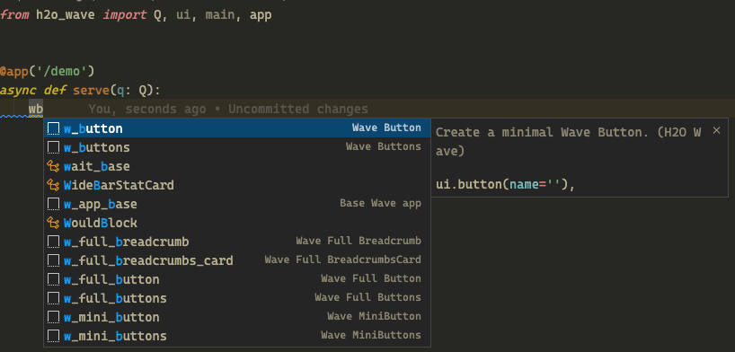
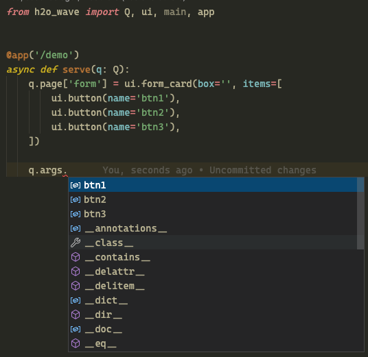
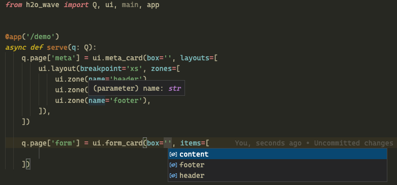
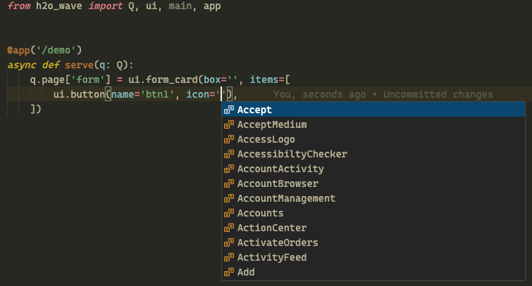

In addition to the most recent [0.21 release](https://wave.h2o.ai/blog/release-0.21), we also published a [VSCode extension](https://marketplace.visualstudio.com/items?itemName=h2oai.h2o-wave) that aims to ease the Wave app development even more. This extension adds plenty of code snippets and autocomplete functionality for wave-specific code.

<!--truncate-->

## Code snippets

Code snippets are reusable blocks of code that save you from writing out the whole code yourself, saving you time and mental energy. They also give you easy access to Wave code best practices. Thus they allow writing Wave code somewhat declaratively - the developer needs to only focus on the big picture. Let's take the following scenario: I want to create a new Wave app, but I do not remember the base boilerplate needed. In this case, you can simply use the `w_app_base` snippet and you are good to go!

The plugin supports the following types of code snippets:

* Code blocks - useful code blocks, e.g. `w_init_client` provides boilerplate for a client initialization.
* App templates - prebuilt Wave apps using the most common layouts and patterns, e.g. `w_app_header` provides an app with a body and header.
* Component snippets
  * Minimal snippets - prefixed with `w_`, e.g. `w_button` provides snippet with required attributes only.
  * Full snippets - prefixed with `w_full_`, e.g. `w_full_button` provides snippet with all attributes so you can easily see and learn all customizing options.

## Autocomplete

Have you ever wanted to handle that button click in Wave, but didn't remember the `name` attribute you used? If the answer is yes, we have some good news for you! This plugin will offer you all the available options for:

* q.args
* q.client
* q.user
* q.app
* zone attributes
* icon attributes
* theme attributes

## Installation

The plugin is part of public [VScode marketplace](https://marketplace.visualstudio.com/items?itemName=h2oai.h2o-wave) and can be installed directly from the web (if you have your VSCode currently open) or within VSCode via `Extensions` pane.

## Not a VSCode user?

If you do not use VSCode, but still would like to enjoy an improved dev experience we also support [PyCharm plugin](https://plugins.jetbrains.com/plugin/18530-h2o-wave). See [blog post](https://wave.h2o.ai/blog/h2o-wave-pycharm-plugin) to learn more.

## Feedback

We are eager to hear your feature requests, bugfixes or just general feedback in our [discussions](https://github.com/h2oai/wave/discussions) and [issues](https://github.com/h2oai/wave/issues) sections.
