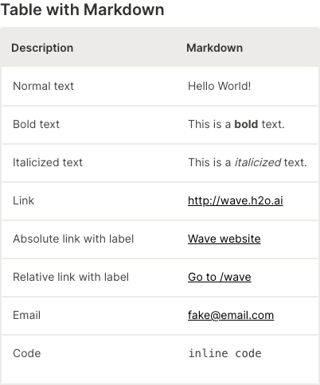
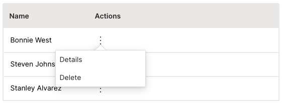
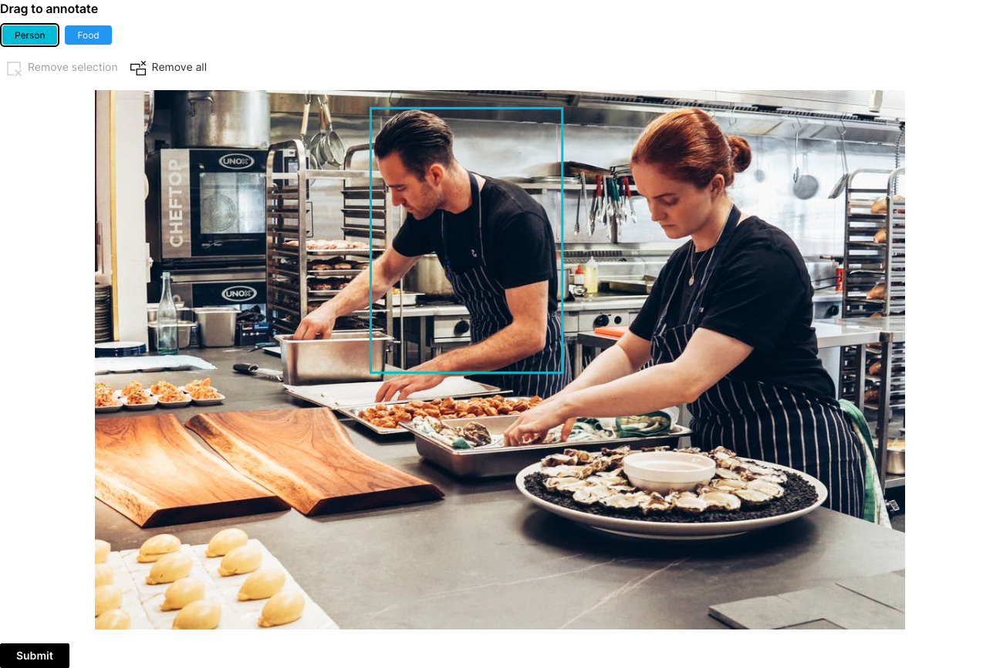
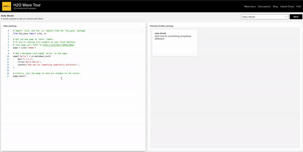

Another Wave release is here! `0.22.0` brings some exciting features like more R support, improved tables, image annotator, development in browser and much more.

<!--truncate-->

## R support

Python is the most dominant programming language when it comes to Data Science community. That's why we started with it. However, we did not forget about R community and thanks to awesome work of [Ashrith Barthur](https://github.com/ashrith), Wave supports R apps and dashboards as well. See the [R examples](https://github.com/h2oai/wave/tree/main/r/R/examples) and let us know what you think in [discussions](https://github.com/h2oai/wave/discussions).

Example R h2o_wave app

```r
library(h2owave)
serve <- function(qo)
{
    qo$client$test <- ifelse(is.null(qo$client$test),0, qo$client$test)
        ifelse(qo$args$increment == TRUE,qo$client$test <- qo$client$test + 1,qo$client$test <- 0)
        if(length(qo$args) == 0 || qo$args$increment == FALSE){
            qo$page$add_card("button_entry",ui_form_card(
                        box='1 1 12 10'
                        ,items = list(
                            ui_button(
                                name='increment'
                                ,label=paste0('Count= ',qo$client$test)
                                ,primary = TRUE
                                )
                            )
                        ))
        }
        else {
            qo$page$set("button_entry","items","0","button","label",paste0("Count=",qo$client$test))
        }
    qo$page$save()
}
app("/")

```

Example R h2o_wave dashbaord

```r
library(h2owave)

page <- Site("/demo")
page$drop()

page$add_card("hello", ui_markdown_card(
    box="1 1 2 2",
    title="Hello World!",
    content='And now for something completely different!'
))

page$save()
```

## Improved tables

Since most of the apps display tabular data, extra formatting might come in handy.

### Markdown support

Leverage the power and versatility of [Markdown](https://www.markdownguide.org/) by setting `cell_type` to `markdown_cell_type`.
To open links in a new tab use `target='_blank'`.



```py
q.page['example'] = ui.form_card(box='1 1 3 6', items=[
    ui.text_xl(content='Table with Markdown'),
    ui.table(
        name='table',
        columns=[
            ui.table_column(name='description', label='Description', min_width='200',
                            cell_type=ui.markdown_table_cell_type(target='_blank')),
            ui.table_column(name='markdown', label='Markdown',
                            cell_type=ui.markdown_table_cell_type(target='_blank')),
        ],
        height='450px',
        rows=[
            ui.table_row(name='row1', cells=['Normal text', 'Hello World!']),
            ui.table_row(name='row2', cells=['Bold text', 'This is a **bold** text.']),
            ui.table_row(name='row3', cells=['Italicized text', 'This is a _italicized_ text.']),
            ui.table_row(name='row4', cells=['Link', '<http://wave.h2o.ai>']),
            ui.table_row(name='row5', cells=['Absolute link with label', '[Wave website](http://wave.h2o.ai/)']),
            ui.table_row(name='row6', cells=['Relative link with label', '[Go to /wave](/wave)']),
            ui.table_row(name='row7', cells=['Email', '<fake@email.com>']),
            ui.table_row(name='row8', cells=['Code', '``inline code``']),  # change to monospaced font
        ]
    )
])
```

### Commands

You can group multiple actions in a context menu for each row by setting `cell_type` to `ui.menu_table_cell_type` and providing the commands you want. Use `q.args.<command_name>` to identify which command was clicked. Since every cell in the actions column will have the same content (an icon that opens a menu) you can simply specify an empty string as a placeholder so that the cells are provided in the correct order.



```py
commands = [
    ui.command(name='details', label='Details', icon='Info'),
    ui.command(name='delete', label='Delete', icon='Delete'),
]

q.page['example'] = ui.form_card(box='1 1 3 3', items=[
    ui.table(
        name='table',
        columns=[ui.table_column(name='actions', label='Actions', cell_type=ui.menu_table_cell_type(name='commands', commands=commands))],
        rows=[ui.table_row(name='first_row', cells=[''])] 
    )
])
```

## Let your users draw

Do you work with computer vision and need to show your users the resulting annotations or even let them draw their own? The `ui.image_annotator` component is there for you.



```py
q.page['example'] = ui.form_card(box='1 1 9 -1', items=[
    ui.image_annotator(
        name='annotator',
        title='Drag to annotate',
        image='https://images.pexels.com/photos/2696064/pexels-photo-2696064.jpeg?auto=compress&cs=tinysrgb&w=1260&h=750&dpr=1',
        image_height='700px',
        tags=[
            ui.image_annotator_tag(name='p', label='Person', color='$cyan'),
            ui.image_annotator_tag(name='f', label='Food', color='$blue'),
        ],
        items=[
            ui.image_annotator_item(shape=ui.image_annotator_rect(x1=649, y1=393, x2=383, y2=25), tag='p'),
        ],
    ),
    ui.button(name='submit', label='Submit', primary=True)
])
```

## Develop directly in your browser

If you are not new to Wave, the chances are you have stumbled upon our Tour app that provides a lot of examples showing different Wave aspects. In order to allow even better exploration experience, we made the examples editable via browser VSCode-like editor called [Monaco](https://microsoft.github.io/monaco-editor/).



## Feedback

We look forward to continuing our collaboration with the community and hearing your feedback as we further improve and expand the H2O Wave platform.

We'd like to thank the entire Wave team and the community for all of the contributions to this work!
