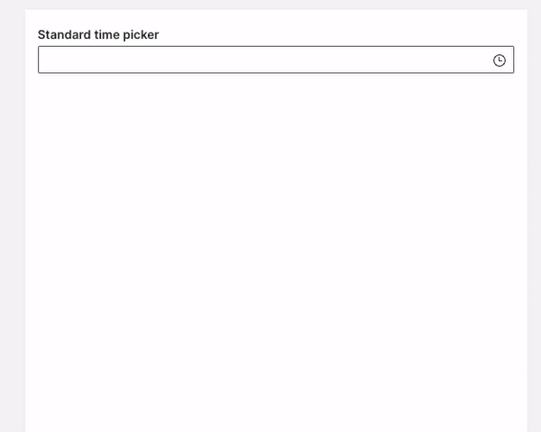
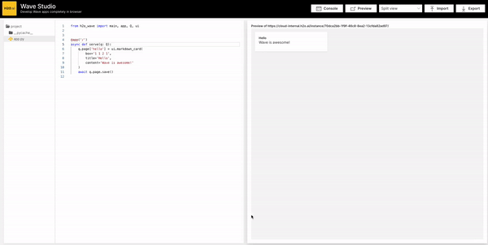

Summertime is over, but you do not need to worry, a new `0.23` Wave release is here with a few big new features and plenty of bugfixes, docs improvements and better performance. Let's dive in!

<!--truncate-->

## Time picker

It took us some time to bring this component (pun intended), but the result is well worth it. Times of gathering time data in textbox and running regex validations are over.

## Wave Studio

We are experimenting with bringing Wave development experience to the browser with literally zero installation necessary for our [cloud users](https://h2oai.github.io/h2o-ai-cloud/). The result is a Wave app called Wave Studio with features like:

* Auto reload.
* Autocomplete.
* File system.
* Logging output.
* App export/import.
* Editor actions like find/replace etc.

The complexity of this app confirms that there are almost no limitations of what's possible with Wave.

Although the app is originally intended for our [cloud platform](https://h2oai.github.io/h2o-ai-cloud/), we have made it fully [open-source](https://github.com/h2oai/wave/tree/main/studio) so feel free to try it out or even deploy it to your own environment.

Note that the app is very alpha currently and not suited for production use. If you spot a bug, don't hesitate and try to fix it yourself. PRs are always more than welcome.

## Feedback

We look forward to continuing our collaboration with the community and hearing your feedback as we further improve and expand the H2O Wave platform.

We'd like to thank the entire Wave team and the community for all of the contributions to this work!
