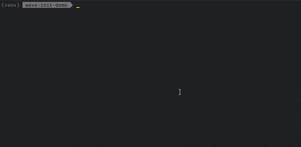
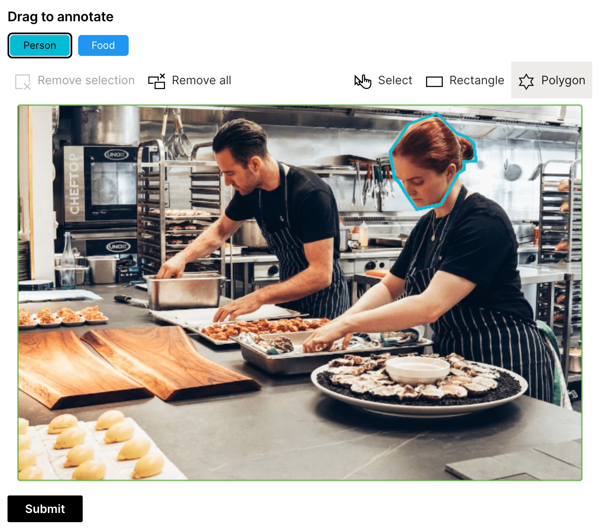

Another Wave release has arrived with quite a few exciting new features. Let's quickly go over the biggest ones.

<!--truncate-->

## Wave init CLI

How many times you wanted to build a Wave app fast, but then you realized you need to start from scratch, copy over the skeleton of your app and work up from there? For these exact reasons, we introduced a new `wave init` CLI that allows you to pick an app template and give you a head start when developing. All the templates are the ones already available in IDE extensions under `w_app_` prefix.

## Polygon support for image annotator

Although rectangles are good, they will never be as precise as polygons.

## Image detail

Some apps need to display a lot of images at the same time. This means that the images must be smaller in order to fit into the screen. However, if you wanted to allow your users to see the image in it's full dimensions, there was no simple way that wouldn't require jumping through hoops.

That's where the `path_popup` attribute comes into play. If specified, your `ui.image` or `ui.image_card` will have clickable image that can open a fullscreen popup with a high resolution version of the original image.

:::tip
We recommend using smaller-sized images for the `path` attribute since it serves as a preview and bigger images (high resolution) for the `path_popup` attribute. This would improve your app's initial loading performance drastically.
:::

## Feedback

We look forward to continuing our collaboration with the community and hearing your feedback as we further improve and expand the H2O Wave platform.

We'd like to thank the entire Wave team and the community for all of the contributions to this work!
