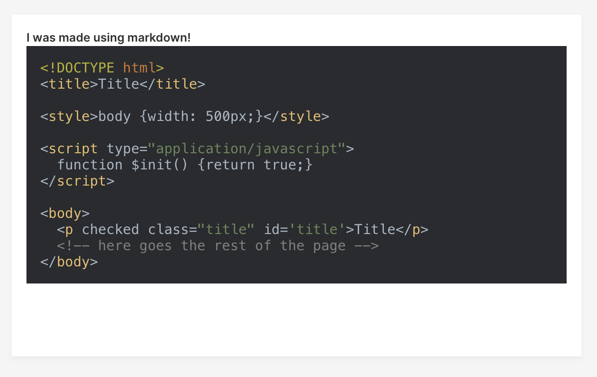

Another Wave release arrived! This time, with a main focus on LLMs. See the [full changelog](https://github.com/h2oai/wave/releases/tag/v0.26.0) to learn more.

<!--truncate-->

## Chatbot

Large language models are all the rage nowadays, the race is on. Wave aims to help with showing the results of the LLMs and what can be better than an interactive chatbot widget?

As with most things in Wave, we try our best to make the code as simple and straightforward as possible:

```py
from h2o_wave import main, app, Q, ui, data


@app('/')
async def serve(q: Q):
    if not q.client.initialized:
        # List buffer is a dynamic array. Cyclic buffer can also be used. Must have exactly 2 fields - content and from_user.
        q.page['example'] = ui.chatbot_card(
            box='1 1 5 5',
            data=data('content from_user', t='list'),
            name='chatbot_name'
        )
        q.client.initialized = True

    # A new message arrived.
    if q.args.chatbot_name:
        # Append user message.
        q.page['example'].data += [q.args.chatbot, True]
        # Append bot response.
        q.page['example'].data += ['I am a fake chatbot. Sorry, I cannot help you.', False]

    await q.page.save()
```

The `chatbot_card` requires a new type of buffer called `list buffer` to be used. It acts as a dynamic array, providing a simple append operation (`+=`) and indexing (negative indexing is supported as well).

The widget supports features like:

* [Streaming](/docs/examples/chatbot-stream).
* [Stream stop](/docs/examples/chatbot-events-stop).
* [Infinite scroll](/docs/examples/chatbot-events-stop) for performant loading of history.

Stay tuned for a Github repo with a sample ChatGPT-like Wave app.

## By-name component access

Wave allows for updating component attributes like `label`, `content`, `value` etc.:

```py {7}
@app('/')
async def serve(q: Q):
    q.page['example'] = ui.form_card(box='1 1 4 4', items=[
        ui.button(name='step_button', label='Step 1'),
    ])
    # Update button label.
    q.page['example'].items[0].button.label = 'Step 2'
    await q.page.save()
```

The problem is that this code is not very flexible as it depends on the order of `items`, which can easily change. Wave `0.26.0` comes with a better mechanism - use component `name` as index.

```py
q.page['example'] = ui.form_card(box='1 1 4 4', items=[
    ui.button(name='step_button', label='Step 1'),
])

# ❌ Pre Wave 0.26.
q.page['example'].items[0].button.label = 'Step 2'
# ✅ Use the "name" attribute to access to component.
q.page['example'].step_button.label = 'Step 2'
```

## File configuration

Waved can now be configured via `.env` files in addition to command-line arguments and environment variables. The priority goes: `cmd arg > env var > config > default`. By default, waved looks for a file called `.env` in the same directory. The configuration file location can also be specified by `-conf` argument or `H2O_WAVE_CONF` env variable.

The app can be also configured by `.env` file - `uvicorn foo:main --nv file`. See [deplyoment docs](/docs/deployment/#deploying-wave-apps) for more info.

## Live demos

In order to bring Wave closer to the AI community without the need for any installation, we decided to put some of our core Wave apps to [Hugging Face spaces](https://huggingface.co/h2oai)!

* [Wave Tour](https://huggingface.co/spaces/h2oai/wave-tour) - 200+ interactive examples.
* [Theme generator](https://huggingface.co/spaces/h2oai/theme-generator) - Interactive Wave theme picker.
* [Wave University](https://huggingface.co/spaces/h2oai/wave-university) - Interactive introduction to Wave.

## Sprinkle code blocks with colors

From now on, Wave supports markdown code syntax highlighting natively.

* See [supported languages and aliases](https://github.com/highlightjs/highlight.js/blob/main/SUPPORTED_LANGUAGES.md).
* See [supported themes](https://highlightjs.org/static/demo/). To learn how to change the default theme, see [the docs](/docs/widgets/content/markdown#code-syntax-highlighting).

```py
sample_markdown = '''=
```html
<!DOCTYPE html>
<title>Title</title>

<style>body {width: 500px;}</style>

<script type="application/javascript">
  function $init() {return true;}
</script>

<body>
  <p checked class="title" id='title'>Title</p>
  <!-- here goes the rest of the page -->
</body>
'''

q.page['example'] = ui.markdown_card(
    box='1 1 4 4',
    title='I was made using markdown!',
    content=sample_markdown
)
```



## Feedback

We look forward to continuing our collaboration with the community and hearing your feedback as we further improve and expand the H2O Wave platform.

We'd like to thank the entire Wave team and the community for all of the contributions to this work!
