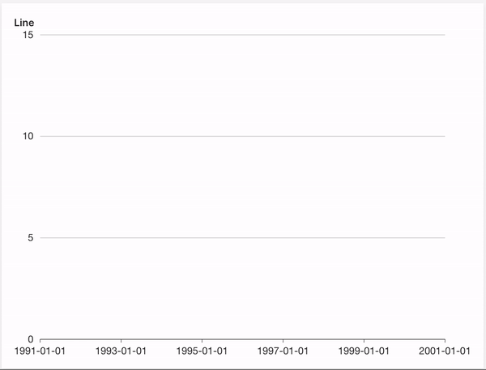
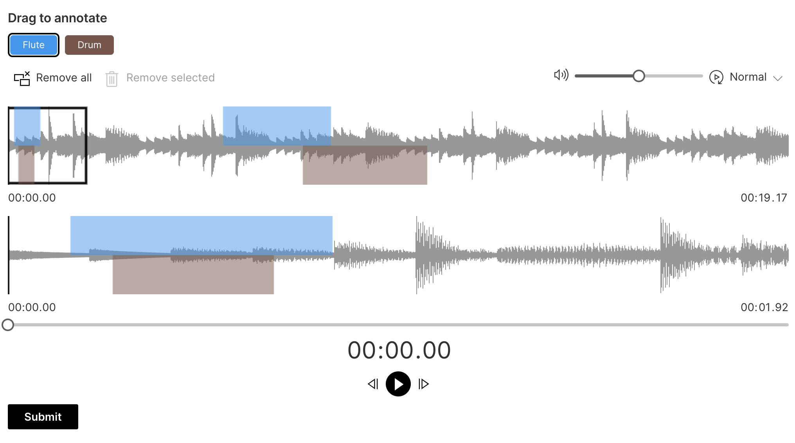

Despite Wave being used in production for quite some time already, we thought it would be nice to cut an official `1.0` version, which includes a few big features and minor breaking changes. See the [full changelog](https://github.com/h2oai/wave/releases/tag/v1.0.0) to learn more.

<!--truncate-->

## Wave share

If you have ever developed a Wave app and wanted to show it to your colleagues to play around, but didn't feel like deploying so you just fired up a quick screen sharing call, we have a good news for you. The latest version of Wave CLI includes a `wave share` command which exposes your locally running app to the public world by tunneling your `localhost` to <https://some-id.h2oai.app> which your colleagues can then just paste into their browser and play around immediately.

Wanna choose your own subdomain that is easily remembered? No problem!

```sh
wave share --subdomain foo                 
 _       _____ _    ________   _____ __  _____    ____  ______
| |     / /   | |  / / ____/  / ___// / / /   |  / __ \/ ____/
| | /| / / /| | | / / __/     \__ \/ /_/ / /| | / /_/ / __/
| |/ |/ / ___ | |/ / /___    ___/ / __  / ___ |/ _, _/ /___
|__/|__/_/  |_|___/_____/   /____/_/ /_/_/  |_/_/ |_/_____/
    
┌────────────────────────────────────────────────────────────┐
│  Sharing http://localhost:10101 ==> https://foo.h2oai.app  │
└────────────────────────────────────────────────────────────┘

DO NOT SHARE IF YOUR APP CONTAINS SENSITIVE INFO
```

See [CLI docs](/docs/cli/) or `wave share --help` for the list of available options.

:::info
This feature allows for at most 10 concurrent browser tabs of your Wave app open. For real deployments that can serve 1000s of users, see [our enterprise offering](https://h2oai.github.io/h2o-ai-cloud/) or [deployment docs](/docs/deployment/).
:::

## Improved routing

Wave strives to be as simple and as flexible as possible and allows for coming up with any routing mechanism one wants. Even plain `if` statements are enough in most cases. However, as time went by, the community voiced a need for official mechanism that would reduce the necessary boilerplate - `handle_on` was born. Unfortunately, it had a few design flaws that couldn't be easily fixed without breaking changes:

* The decision about which handler would be called was based on the order of `q.args`, which is not guaranteed. That led to unexpected behavior.
* Bug causing that handlers handling boolean values would not fire on `False` values.
* No pattern matching beyond `# routing`.

All of the points above were addressed by a new mechanism called `run_on` which always calls a handler associated with the user action that caused the `serve` function to run. Let's consider a simple example app to understand what that actually means.

Our app has a textbox and a button.

```py
from h2o_wave import app, main, Q, ui, handle_on, on


@app("/")
async def serve(q: Q) -> None:
    if not q.client.initialized:
        q.page['example'] = ui.form_card(box='1 1 2 2', items=[
            ui.textbox(name='textbox', label='Textbox', value='Hello!'),
            ui.button(name='button', label='Click me')
        ])
        q.client.initialized = True

    await handle_on(q)
    await q.page.save()


@on()
async def textbox(q: Q):
    q.page['example'] = ui.form_card(box='1 1 2 2', items=[
        ui.text('Textbox triggered.'),
    ])


@on()
async def button(q: Q):
    q.page['example'] = ui.form_card(box='1 1 2 2', items=[
        ui.text('Button triggered.'),
    ])
```

Since textbox has value set, it will be added to `q.args` during render first. Then, we click the button, which sets its name to `q.args` as second. Since `handle_on` looks at order only, despite clicking button, `textbox` handler is called, which is unexpected.

Let's now consider the `run_on`. Whole migration consists of replacing `handle_on` with `run_on` - simple.

```py
from h2o_wave import app, main, Q, ui, on, run_on


@app("/")
async def serve(q: Q) -> None:
    if not q.client.initialized:
        q.page['example'] = ui.form_card(box='1 1 2 2', items=[
            ui.textbox(name='textbox', label='Textbox', value='Hello!'),
            ui.button(name='button', label='Click me')
        ])
        q.client.initialized = True

    await run_on(q)
    await q.page.save()


@on()
async def textbox(q: Q):
    q.page['example'] = ui.form_card(box='1 1 2 2', items=[
        ui.text('Textbox triggered.'),
    ])


@on()
async def button(q: Q):
    q.page['example'] = ui.form_card(box='1 1 2 2', items=[
        ui.text('Button triggered.'),
    ])
```

Once the button is clicked, the expected (button) handler is invoked.

## Animations

We got a feedback that the Wave apps work fine, but are boring UI-wise. Although we consider boring, fast and reliable better than fancy, we heard our community out and introduced an experimental API for animations.

### Card animations

Cards can be animated during their creation by setting `animate=True` on the `ui.meta_card`.

```py
page['meta'] = ui.meta_card(box='', animate=True)
```

<video autoPlay='autoplay' loop='loop' muted='muted'>
    <source src={require('./assets/2023-10-09/animation.mp4').default} type='video/mp4'/>
</video>

:::warning
An animation is considered fluid when it is able to reach `60fps` (frames per second). To achieve such fps, one needs to make sure the browser has enough resources to paint the animation at such rate. Loading too many data or doing too much browser work may result in janky animations so use at your own risk.
:::

Default animation is a simple `fade in` animation (opacity 0 => 1) lasting for `0.5s`. The default values can be overriden via [custom CSS](/docs/custom-css/).

```css
:root {
  /* Custom CSS properties to configure duration and animation. */
  --wave-animation-duration: 0.5s;
  --wave-card-animation: wave-fade-in
}

/* Override this class to get full control over animations. */
.wave-animate-card {
  animation: var(--wave-card-animation);
  animation-duration: var(--wave-animation-duration);
}

@keyframes wave-fade-in {
  from {
    opacity: 0;
  }

  to {
    opacity: 1;
  }
}
```

### Plot animations

Plots support basic animations when `animate=True`.



```py {6}
from h2o_wave import data

q.page['example'] = ui.plot_card(
    box='1 1 4 5',
    title='Line',
    animate=True,
    data=data('year value', 8, rows=[
        ('1991', 3),
        ('1992', 4),
        ('1993', 3.5),
        ('1994', 5),
        ('1995', 4.9),
        ('1996', 6),
        ('1997', 7),
        ('1998', 9),
        ('1999', 13),
    ]),
    plot=ui.plot([ui.mark(type='line', x_scale='time', x='=year', y='=value', y_min=0)])
)
```

:::warning
An animation is considered fluid when it is able to reach `60fps` (frames per second). To achieve such fps, one needs to make sure the browser has enough resources to paint the animation at such rate. Loading too many data or doing too much browser work may result in janky animations so use at your own risk.
:::

## Audio annotator

Wave can build UI for audio annotaion in addtion to images now. See the [list](https://caniuse.com/?search=audio%20format) of supported audio formats based on your target browser.



## Feedback

We look forward to continuing our collaboration with the community and hearing your feedback as we further improve and expand the H2O Wave platform.

We'd like to thank the entire Wave team and the community for all of the contributions to this work!
