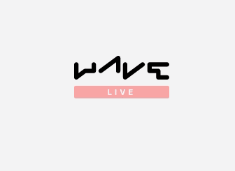

import Tabs from '@theme/Tabs';
import TabItem from '@theme/TabItem';


:::important
For v0.20 or later versions, [click here](/docs/installation).
:::

To set up H2O Wave, simply download and extract a release (~10MB). The release ships with a precompiled binary executable, so no explicit installation step is necessary.

## Prerequisites

H2O Wave runs on Linux, macOS, and Windows, having Python 3.6+ for v0.20.0 and 3.7+ onwards.

## Setup

### Step 1: Download

Download the H2O Wave SDK for your platform from [Github](https://github.com/h2oai/wave/releases/latest) or here.

If you are unsure which package to pick, here is a helper table:

| **Your OS** | **Wave server** |  **Python client** |
|:-----------:|:---------------:|:------------------:|
|     Mac     |   darwin-amd64  | macosx_10_9_x86_64 |
|    Mac M1   |   darwin-arm64  |  macosx_11_0_arm64 |
|   Windows   |  windows-amd64  |      win_amd64     |
|    Linux    |   linux-amd64   |  manylinux1_x86_64 |

import { Downloads } from '@site/src/components/downloads'

<Downloads />

### Step 2: Extract

Extract your download.

<Tabs groupId="operating-system">

<TabItem value="lin" label="Linux/MacOS">

```shell
tar -xzf wave-x.y.z-linux-amd64.tar.gz
```
</TabItem>

<TabItem value="win" label="Windows">

```shell
Use Extractors for windows to extract
```
Eg - [7zip](https://www.7-zip.org/download.html)

</TabItem>

</Tabs>

### Step 3: Move

Move it to a convenient location, say `$HOME/wave/`.

<Tabs groupId="operating-system">

<TabItem value="lin" label="Linux/MacOS">

```shell
 mv wave-x.y.z-linux-amd64 $HOME/wave
```
</TabItem>

<TabItem value="win" label="Windows">

```shell
Use The windows file explorer to move to a convinient location, say desktop
```

</TabItem>

</Tabs>
:::note
If you have a previous version of Wave installed, be sure to remove it before installing another. To remove it, simply delete the previous directory.
:::

Inspect your `$HOME/wave (desktop/wave for windows)` directory. You should see the following content:

```
.
├── examples/       ... Examples
├── test/           ... Browser testing framework
├── www/            ... Wave server web root (do not modify!)
└── waved           ... Wave server executable
```

### Step 4: Run

Go to your Wave directory.

```shell
cd $HOME/wave
```

Start the Wave server.

```shell
./waved
```

```
2020/10/27 16:16:34 # 
2020/10/27 16:16:34 # ┌─────────────────────────┐
2020/10/27 16:16:34 # │  ┌    ┌ ┌──┐ ┌  ┌ ┌──┐  │ H2O Wave
2020/10/27 16:16:34 # │  │ ┌──┘ │──│ │  │ └┐    │ (version) (build)
2020/10/27 16:16:34 # │  └─┘    ┘  ┘ └──┘  └─┘  │ © 2020 H2O.ai, Inc.
2020/10/27 16:16:34 # └─────────────────────────┘
2020/10/27 16:16:34 # 
2020/10/27 16:16:34 # {"address":":10101","t":"listen","webroot":"/home/elp/wave/www"}
```

:::info
On Windows, run `waved.exe` to start the server.
:::

### Step 5: Verify

Finally, point your web browser to [http://localhost:10101/](http://localhost:10101/). You should see an empty page with a blinker that looks like this:



Congratulations! Wave is now running, but doesn't have any content yet (hence the spinner).

In the next few sections, we'll add some content and see what the fuss is all about.

## Run the tour

import StartQ from './_start_q.md'

Your Wave release download ships with over 200 examples.

You can play around with these examples in your browser using `tour.py`, a Python script (itself a Wave app) located in `examples/`:

```none title="Contents of $HOME/wave"
wave/
├── examples/       <-- Examples live here.
|   └── tour.py     <-- The Wave Tour.
├── test/           
├── www/            
└── waved
```

To run the tour, as with any Wave app, we need to start both the Wave server (`waved`) and the tour (`tour.py`). Let's go ahead and do that.

### Step 1: Start the Wave server

<StartQ/>

### Step 2: Run the tour

First, create a [virtual environment](https://docs.python.org/3/tutorial/venv.html), install the tour's dependencies.

:::important
Do this from a new terminal window!
:::

```shell
cd $HOME/wave
python3 -m venv venv
source venv/bin/activate
pip install -r examples/requirements.txt
```

On Windows:

```shell
cd $HOME\wave
python3 -m venv venv
venv\Scripts\activate
pip install -r examples\requirements.txt
```

Finally, run the tour:

```shell
wave run --no-reload examples.tour
```

### Step 3: Enjoy the tour

Go to [http://localhost:10101/tour](http://localhost:10101/tour) to access the tour.


`tour.py` is an ordinary Wave app that runs other apps. The tour itself runs at the route `/tour`, and each of the examples runs at `/demo`.

:::tip
To play with the tour's active example in isolation, simply open a new browser tab and head to [http://localhost:10101/demo](http://localhost:10101/demo).
:::

## Smoother dev experience

For Wave-specific IDE autocomplete and additional snippets that will make your life way easier, we recommend installing [VSCode extension](https://marketplace.visualstudio.com/items?itemName=h2oai.h2o-wave) or [Jetbrains Plugin](https://plugins.jetbrains.com/plugin/18530-h2o-wave) depending on the IDE of your choice.
Feel free to read more at [this](/blog/h2o-wave-vscode-extension) and [this](/blog/h2o-wave-pycharm-plugin) blog posts.

## Wrapping up

In this section, we started the Wave server and then launched `tour.py` to experience the tour. In general, this is how you'd typically launch any app, including your own. There is nothing special about `tour.py`. In fact, to run any example, all you need to do is repeat the steps above in a new terminal window. For example, to run `todo.py`, simply run:

```shell
wave run examples.todo
```

You can now access the example at [http://localhost:10101/demo](http://localhost:10101/demo). Simple!
