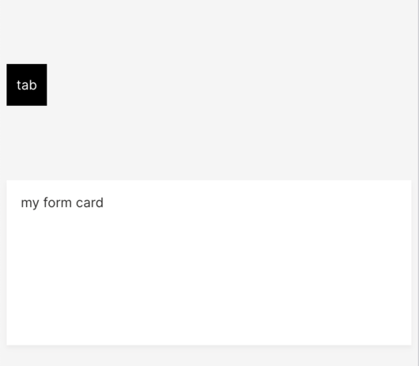
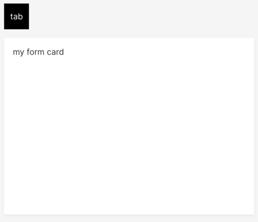
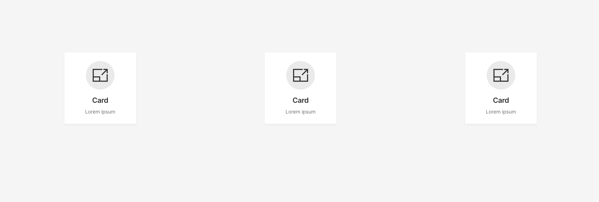

This section illustrates how to lay out cards on a page.

Wave supports two layout systems out of the box: a grid layout and a flex (flexible) layout.

By default, pages use the grid-based system. The grid-based system is simpler to use and ensures that your page layout looks exactly the same on every display, without surprises.

To switch to a flex layout, simply define a page layout using the `ui.layout()` API, as shown below.

## Flex Layout

The flex layout system allows you to build user interfaces and dashboards that adapt to various device and screen sizes ("responsive layout").

:::info
To view examples of flex and responsive layouts in actions, see <https://github.com/h2oai/wave/tree/main/py/demo>
:::

To define a layout for your page, attach a layout to your page's meta card using `ui.layout()`.

The following example defines a simple layout consisting of a header, a body and a footer. The body, in turn, is split horizontally into a content area and a sidebar.

```py
q.page['meta'] = ui.meta_card(box='', layouts=[
    ui.layout(
        breakpoint='xl',
        width='1200px',
        zones=[
            ui.zone('header'),
            ui.zone('body', direction=ui.ZoneDirection.ROW, zones=[
                ui.zone('content', size='75%'),
                ui.zone('sidebar', size='25%'),
            ]),
            ui.zone('footer'),
        ]
    )
])
```

A layout, at a minimum, consists of a `breakpoint` and a set of `zones`.

### Breakpoints

The `breakpoint` is the minimum viewport (browser) width at which the layout will be applied to the page. Values must be pixel widths (e.g. `0px`, `576px`, `768px`) or a named preset. The named presets are:

- `xs`: `0px` for extra small devices (portrait phones)
- `s`: `576px` for small devices (landscape phones)
- `m`: `768px` for medium devices (tablets)
- `l`: `992px` for large devices (desktops)
- `xl`: `1200px` for extra large devices (large desktops).

A breakpoint value of `xs` matches all viewport widths, unless other breakpoints are set.

### Zones

A *zone* is a named area inside the layout where cards can be placed. A zone is defined using `ui.zone()`.

Zones have a `direction`, either `ui.ZoneDirection.COLUMN` (with children laid out top to bottom) or `ui.ZoneDirection.ROW` (with children laid out left to right).

Zone can define a `size`, which translates to the zone's width in case the zone is laid out horizontally, or the zone's height in case the zone is laid out vertically.

Zones can have other zones nested inside them.

In the above example, the `content` and `sidebar` zones are laid out horizontally inside the `body`, with the `content` zone taking up 75% of the available width, and the sidebar taking up 25%.

Cards will take up an equal amount of space inside the zone, not shrinking to fit their content. To prevent a card from expanding provide a `ui.box` with `size='0'`.

```py
q.page['meta'] = ui.meta_card(box='', layouts=[
    ui.layout(
        breakpoint='xs',
        zones=[ui.zone(name='zone1', direction=ui.ZoneDirection.COLUMN, size='100%')]
    )
])

q.page['tab_card'] = ui.tab_card(
    box=ui.box(zone='zone1'),
    items=[ui.tab(name='tab1', label='tab')]
)

q.page['form_card'] = ui.form_card(box='zone1', items=[
    ui.text(content='my form card')
])
```

Default behavior:



Using `size='0'`:

```py
q.page['tab_card'] = ui.tab_card(
    box=ui.box(zone='zone1', size='0'),
    items=[ui.tab(name='tab1', label='tab')]
)
```



### Responsive Layout

To make your page adapt to multiple viewport sizes, define multiple layouts using `ui.layout()`.

```py
q.page['meta'] = ui.meta_card(box='', layouts=[
    ui.layout(
        breakpoint='xs',
        zones=[
            # Add zones here.
        ],
    ),
    ui.layout(
        breakpoint='m',
        zones=[
            # Add zones here.
        ],
    ),
    ui.layout(
        breakpoint='xl',
        width='1200px',
        zones=[
            # Add zones here.
        ]
    )
])
```

### Placing cards

To place a card inside a zone in your layout, use the card's `box` attribute.

The simplest way to assign a card to a zone is to set the `box` to the name of zone:

```py
q.page['shopping_cart'] = ui.markdown_card(box='sidebar', ...)
```

For more control over how the card is placed, use `ui.box()`:

```py
# Same as box='sidebar'
q.page['shopping_cart'] = ui.markdown_card(box=ui.box('sidebar'), ...)
```

Make the card the third item in the sidebar:

```py
q.page['shopping_cart'] = ui.markdown_card(box=ui.box('sidebar', order=3), ...)
```

Make the card take up two parts of available space:

```py
q.page['shopping_cart'] = ui.markdown_card(box=ui.box('sidebar', size=2), ...)
```

Make cards take up available space in a 10:5:4 ratio:

```py
q.page['shopping_cart'] = ui.markdown_card(box=ui.box('sidebar', order=1, size=10), ...)
q.page['bill'] = ui.markdown_card(box=ui.box('sidebar', order=2, size=5), ...)
q.page['discounts'] = ui.markdown_card(box=ui.box('sidebar', order=3, size=4), ...)
```

Make the card 200px wide:

```py
q.page['shopping_cart'] = ui.markdown_card(box=ui.box('sidebar', width='200px'), ...)
```

Make the card 300px high:

```py
q.page['shopping_cart'] = ui.markdown_card(box=ui.box('sidebar', height='300px'), ...)
```

Make the card 200px wide and 300px high:

```py
q.page['shopping_cart'] = ui.markdown_card(box=ui.box('sidebar', width='200px', height='300px'), ...)
```

For responsive layouts, specify multiple boxes using `ui.boxes()`. Each `ui.box()` in `ui.boxes()` refers to the corresponding `ui.layout()` specified at the page level.

```py
q.page['meta'] = ui.meta_card(box='', layouts=[
    ui.layout(breakpoint='xs', zones=[...]),
    ui.layout(breakpoint='m', zones=[...]),
    ui.layout(breakpoint='xl', zones=[...]),
])
q.page['shopping_cart'] = ui.markdown_card(box=ui.boxes(
    ui.box('bottom', height='300px'), # for breakpoint xs, place in the bottom zone.
    ui.box('middle', height='200px'), # for breakpoint m, place in the middle zone.
    ui.box('sidebar', height='2'), # for breakpoint xl, place in the sidebar zone.
), ... )
```

### Aligning cards

Wave cards take all available space by default to avoid unnecessary whitespace. If the extra whitespace is desirable though, one may need to use `align` and `justify` zone attributes.



```py
q.page['meta'] = ui.meta_card(box='', layouts=[ui.layout(breakpoint='xs', zones=[
    ui.zone(
        name='content',
        direction=ui.ZoneDirection.ROW,
        # Specify a zone size, otherwise will be adapted to the biggest card in the zone.
        size='500px', 
        # Align cards on the cross-axis (vertical direction for ROW and horizontal for COLUMN).
        align='center', 
        # Align cards on the main-axis (vertical direction for COLUMN and horizontal for ROW).
        justify='around' 
    )
])])
q.page['card1'] = ui.tall_info_card(box=ui.box('content', width='200px', height='200px'), name='', 
                                    title='Card', caption='Lorem ipsum')
q.page['card2'] = ui.tall_info_card(box=ui.box('content', width='200px', height='200px'), name='',
                                    title='Card', caption='Lorem ipsum')
q.page['card3'] = ui.tall_info_card(box=ui.box('content', width='200px', height='200px'), name='',
                                    title='Card', caption='Lorem ipsum')
```

To see the full alignment effect it's important to note that card sizes have to either be explicitly set (like in the example code) or the `size` attribute has to be set to `'0'` (since it defaults to `'1'`).

## Grid Layout

By default, every page has a grid system in place, designed to fit HD displays (1920 x 1080 pixels). The grid has 12 columns and 10 rows. A column is 134 pixels wide. A row is 76 pixels high. The gap between rows and columns is set to 15 pixels.

## Placing cards

Every card has a `box` attribute that specifies how to position the card on the page, a string of the form `'column row width height'`, for example `'1 1 2 4'` or `'8 7 3 6'`.

```py {2}
page['quote'] = ui.markdown_card(
    box='1 1 2 2',
    title='Hello World',
    content='"The Internet? Is that thing still around?" - *Homer Simpson*',
)
```

The `column` and `row` indicate which column and row to position the top-left corner of the card. The `width` and `height` indicate the width and height of the cards, respectively. The `column` and `row` are 1-based. The `width` and `height` are in spans (units) of columns or rows.

| Attribute | Value | Interpreted as |
|---|---|---|
| column | N | Nth column |
| row | N | Nth row |
| width | N | N columns wide |
| height | N | N rows high |

For example, a `box` of `1 2 3 4` is interpreted as:

| Attribute | Value | Interpreted as |
|---|---|---|
| column | 1 | 1st column |
| row | 2 | 2nd row |
| width | 3 | 3 columns wide |
| height | 4 | 4 rows high |

:::tip
The default grid is designed to fit HD displays (1920 x 1080 pixels), so if you want your page to fit smaller displays, don't use up the entire grid. Instead, use up less columns and rows, like 8 columns x 6 rows.
:::

## See also

`layout.py` and `layout-size.py` in Tour app.
