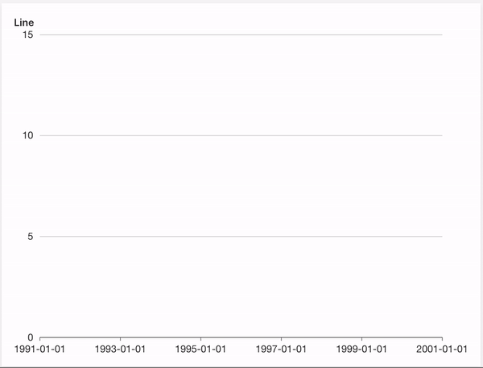

Wave provides a versatile plotting API based on [Leland Wilkinson's](https://en.wikipedia.org/wiki/Leland_Wilkinson) [Grammar of Graphics](http://www.springer.com/gp/book/9780387245447).

A *plot* is a layered graphic, created using `ui.plot()`. Each layer displays *marks*, described by `ui.mark()`. The layers are rendered on top of each other to produce the final plot.

`ui.mark()` describes a collection of marks, not one mark. Since each `ui.mark()` describes one layer in the plot, it follows that all the marks on a layer are of the same `type` (its *geometry*). A mark's `type` can be one of `point`, `interval`, `line`, `path`, `area`, `polygon`, `schema`, `edge`.

There are two ways to add plots to a page:

- Use a plot card (`ui.plot_card()`) and set its `plot` attribute using `ui.plot()`.
- Use a form card (`ui.form_card()`), insert a visualization (`ui.visualization()`) and set its `plot` attribute using `ui.plot()`. See [form visualization](/docs/widgets/form/visualization) for more info.

Here's a short example that renders a scatterplot of values between [0, 1].

```py
from h2o_wave import data

q.page['example'] = ui.plot_card(
    box='1 1 4 5',
    title='Point',
    data=data('height weight', 10, rows=[
        (170, 59),
        (159.1, 47.6),
        (166, 69.8),
        (176.2, 66.8),
        (160.2, 75.2),
        (180.3, 76.4),
        (164.5, 63.2),
        (173, 60.9),
        (183.5, 74.8),
        (175.5, 70),
    ]),
    plot=ui.plot([ui.mark(type='point', x='=weight', y='=height')])
)
```

## Annotation layers

Wave plots are rendered in layers, one upon each other. This mechanism allows mixing multiple plots
and annotations into a single canvas.

`ui.plot()` accepts a list of marks. The following example renders annotations on top of a scatterplot.

```py
from h2o_wave import data

q.page['example'] = ui.plot_card(
    box='1 1 4 5',
    title='Numeric-Numeric',
    data=data('height weight', 10, rows=[
        (170, 59),
        (159.1, 47.6),
        (166, 69.8),
        (176.2, 66.8),
        (160.2, 75.2),
        (180.3, 76.4),
        (164.5, 63.2),
        (173, 60.9),
        (183.5, 74.8),
        (175.5, 70),
    ]),
    plot=ui.plot([
        ui.mark(type='point', x='=weight', y='=height', x_min=0, x_max=100, y_min=0, y_max=100),  # the plot
        ui.mark(x=50, y=50, label='point'),  # A single reference point
        ui.mark(x=40, label='vertical line'),
        ui.mark(y=40, label='horizontal line'),
        ui.mark(x=70, x0=60, label='vertical region'),
        ui.mark(y=70, y0=60, label='horizontal region'),
        ui.mark(x=30, x0=20, y=30, y0=20, label='rectangular region')
    ])
)
```

## Events

In order to be able to handle wave events, simply register them via `events` attribute of the
plot. Depending on the event type registered, when the event fires, it fills
`q.events.<card-name>.<event-name>` within python serve function.

Wave currently supports one plot selection event called `select_marks`. Registering and firing
this event will thus result in `q.events.example.select_marks` filled.

You can also visit [handling events section](/docs/routing#handling-events) to learn more about
advanced techniques.

```py
from h2o_wave import data

q.page['example'] = ui.plot_card(
    box='1 1 4 5',
    title='Interval, range',
    data=data('profession salary', 5, rows=[
        ('medicine', 33000),
        ('fire fighting', 18000),
        ('pedagogy', 24000),
        ('psychology', 22500),
        ('computer science', 36000),
    ]),
    events=['select_marks'],
    plot=ui.plot([ui.mark(type='interval', x='=salary', y='=profession', y_min=0)])
)
```

### Disable events

If you do not wish to raise wave events on interaction with a specific mark, simply specify the `interactive=False` attribute.

```py
from h2o_wave import data

q.page['example'] = ui.plot_card(
        box='1 1 4 5',
        title='Interval, range',
        data=data('year value', 8, rows=[
            ('1991', 3),
            ('1992', 4),
            ('1993', 3.5),
            ('1994', 5),
            ('1995', 4.9),
            ('1996', 6),
            ('1997', 7),
            ('1998', 9),
            ('1999', 13),
        ]),
        events=['select_marks'],
        plot=ui.plot([
            ui.mark(type='line', x_scale='time', x='=year', y='=value', y_min=0, interactive=False), 
            ui.mark(type='point', x='=year', y='=value', size=8, fill_color='red')
        ]),
)
```

## Custom axis title

If you are not happy with the defaults provided, simply use either `x_title` or `y_title` attribute.

```py
from h2o_wave import data

q.page['example'] = ui.plot_card(
    box='1 1 4 5',
    title='Line title',
    data=data('month price', 12, rows=[
        ('Jan', 51),
        ('Feb', 91),
        ('Mar', 34),
        ('Apr', 47),
        ('May', 63),
        ('June', 58),
        ('July', 56),
        ('Aug', 77),
        ('Sep', 99),
        ('Oct', 106),
        ('Nov', 88),
        ('Dec', 56),
    ]),
    plot=ui.plot([
        ui.mark(type='line', x='=month', y='=price', y_min=0, x_title='Month', y_title='Price')
    ])
)
```

## Custom scales

You can format your scales any way you want basically since `x` and `y` can be [expressions](/docs/expressions). The following example displays a way to show date and time from timestamp data.

```py
from h2o_wave import data

q.page['example'] = ui.plot_card(
    box='1 1 4 5',
    title='Line',
    data=data('year value', 9, rows=[
        ('2020-05-04T10:22:21', 3),
        ('2020-05-04T11:22:21', 4),
        ('2020-05-04T12:22:21', 3.5),
        ('2020-05-04T13:22:21', 5),
        ('2020-05-04T14:22:21', 4.9),
        ('2020-05-04T15:22:21', 6),
        ('2020-05-04T16:22:21', 7),
        ('2020-05-04T17:22:21', 9),
        ('2020-05-04T18:22:21', 13),
    ]),
    plot=ui.plot([
        ui.mark(
            type='line',
            x_scale='time',
            x='={{intl year type="time" month="numeric" day="numeric" hour="numeric" minute="numeric" hourCycle="h24" }}',
            y='=value',
            y_min=0
        )
    ])
)
```

See [formatting options](/docs/expressions#functions) for more info.

## Horizontal

By default, all the plot cards are rendered vertically. However, there might be cases when you also want to provide a plot caption and conserve the space.

```py
from h2o_wave import data

q.page['example'] = ui.wide_plot_card(
    box='1 1 5 4',
    title='Wide Plot Card',
    caption='''
    Lorem ipsum dolor sit amet, consectetur adipisicing elit. Quia aliquam maxime quos facere
    necessitatibus tempore eum odio, qui illum. Repellat modi dolor facilis odio ex possimus
    ''',
    data=data('profession salary', 5, rows=[
        ('medicine', 23000),
        ('fire fighting', 18000),
        ('pedagogy', 24000),
        ('psychology', 22500),
        ('computer science', 36000),
    ]),
    plot=ui.plot([ui.mark(type='interval', x='=profession', y='=salary', y_min=0)])
)
```

## Animations (experimental)

Plots support basic animations when `animate=True`.

:::warning
An animation is considered fluid when it is able to reach `60fps` (frames per second). To achieve such fps, one needs to make sure the browser has enough resources to paint the animation at such rate. Loading too many data or doing too much browser work may result in janky animations so use at your own risk.
:::



```py {6}
from h2o_wave import data

q.page['example'] = ui.plot_card(
    box='1 1 4 5',
    title='Line',
    animate=True,
    data=data('year value', 8, rows=[
        ('1991', 3),
        ('1992', 4),
        ('1993', 3.5),
        ('1994', 5),
        ('1995', 4.9),
        ('1996', 6),
        ('1997', 7),
        ('1998', 9),
        ('1999', 13),
    ]),
    plot=ui.plot([ui.mark(type='line', x_scale='time', x='=year', y='=value', y_min=0)])
)
```

## Point

- [Basic](/docs/examples/plot-point): Make a scatterplot.
- [Shapes](/docs/examples/plot-point-shapes): Make a scatterplot with categories encoded as mark shapes.
- [Sizes](/docs/examples/plot-point-sizes): Make a scatterplot with mark sizes mapped to a continuous variable (a "bubble plot").
- [Map](/docs/examples/plot-point-map): Make a plot to compare quantities across categories. Similar to a heatmap, but using size-encoding instead of color-encoding.
- [Groups](/docs/examples/plot-point-groups): Make a scatterplot with categories encoded as colors.
- [Annotation](/docs/examples/plot-point-annotation): Add annotations (points, lines and regions) to a plot.
- [Custom](/docs/examples/plot-point-custom): Customize a plot's fill/stroke color, size and opacity.

## Interval

### Columns

- [Basic](/docs/examples/plot-interval): Make a column plot.
- [Groups](/docs/examples/plot-interval-groups): Make a grouped column plot.
- [Range](/docs/examples/plot-interval-range): Make a column plot with each bar representing high/low (or start/end) values. Transposing this produces a gantt plot.
- [Labels](/docs/examples/plot-interval-labels): Make a column plot with labels on each bar.
- [Stacked](/docs/examples/plot-interval-stacked): Make a stacked column plot.
- [Stacked, Grouped](/docs/examples/plot-interval-stacked-grouped): Make a column plot with both stacked and grouped bars.
- [Annotation](/docs/examples/plot-interval-annotation): Add annotations to a column plot.
- [Theta](/docs/examples/plot-interval-theta): Make a "racetrack" plot (a column plot in polar coordinates).
- [Theta, Stacked](/docs/examples/plot-interval-theta-stacked): Make a stacked "racetrack" plot.

### Bars

- [Basic](/docs/examples/plot-interval-transpose): Make a bar plot.
- [Groups](/docs/examples/plot-interval-groups-transpose): Make a grouped bar plot.
- [Range](/docs/examples/plot-interval-range-transpose): Make a bar plot with each bar representing high/low (or start/end) values. Transposing this produces a gantt plot.
- [Stacked](/docs/examples/plot-interval-stacked-transpose): Make a stacked bar plot.
- [Stacked, Grouped](/docs/examples/plot-interval-stacked-grouped-transpose): Make a bar plot with both stacked and grouped bars.
- [Annotation](/docs/examples/plot-interval-annotation-transpose): Add annotations to a bar plot.
- [Polar](/docs/examples/plot-interval-polar): Make a rose plot (a bar plot in polar coordinates).
- [Polar, Stacked](/docs/examples/plot-interval-polar-stacked): Make a stacked rose plot (a stacked bar plot in polar coordinates).
- [Helix](/docs/examples/plot-interval-helix): Make a bar plot in helical coordinates.

## Line

- [Basic](/docs/examples/plot-line): Make a line plot.
- [Groups](/docs/examples/plot-line-groups): Make a multi-series line plot.
- [Smooth](/docs/examples/plot-line-smooth): Make a line plot using a smooth curve.
- [Step](/docs/examples/plot-step): Make a line plot with a step curve.
- [Step, After](/docs/examples/plot-step-after): Make a line plot with a step-after curve.
- [Step, Before](/docs/examples/plot-step-before): Make a line plot with a step-before curve.
- [Labels](/docs/examples/plot-line-labels): Add labels to a line plot.
- [Labels, Custom](/docs/examples/plot-line-labels-custom): Add customized labels to a line plot.
- [Labels, Stroked](/docs/examples/plot-line-labels-stroked): Customize label rendering: add a subtle outline to labels to improve readability.
- [Labels, Occlusion](/docs/examples/plot-line-labels-no-overlap): Make a line plot with non-overlapping labels.
- [Annotation](/docs/examples/plot-line-annotation): Add annotations to a line plot.

## Path

- [Basic](/docs/examples/plot-path): Make a path plot.
- [Point](/docs/examples/plot-path-point): Make a path plot with an additional layer of points.
- [Smooth](/docs/examples/plot-path-smooth): Make a path plot with a smooth curve.

## Area

- [Basic](/docs/examples/plot-area): Make an area plot.
- [Groups](/docs/examples/plot-area-groups): Make an area plot showing multiple categories.
- [Negative](/docs/examples/plot-area-negative): Make an area plot showing positive and negative values.
- [Range](/docs/examples/plot-area-range): Make an area plot representing a range (band) of values.
- [Smooth](/docs/examples/plot-area-smooth): Make an area plot with a smooth curve.
- [Stacked](/docs/examples/plot-area-stacked): Make a stacked area plot.

## Area + Line

- [Area + Line](/docs/examples/plot-area-line): Make an area plot with an additional line layer on top.
- [Area + Smooth](/docs/examples/plot-area-line-smooth): Make a combined area + line plot using a smooth curve.
- [Area + Groups](/docs/examples/plot-area-line-groups): Make an combined area + line plot showing multiple categories.

## Polygon

- [Basic](/docs/examples/plot-polygon): Make a heatmap.

## Schema

- [Histogram](/docs/examples/plot-histogram): Make a histogram.

## Other

- [Axis Titles](/docs/examples/plot-axis-title): Display custom axis titles on a plot.
- [Form](/docs/examples/plot-form): Display a plot inside a form.
