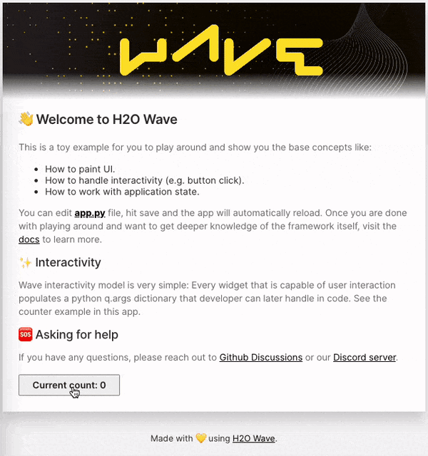
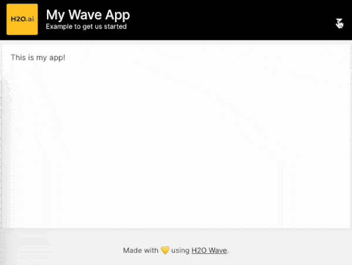
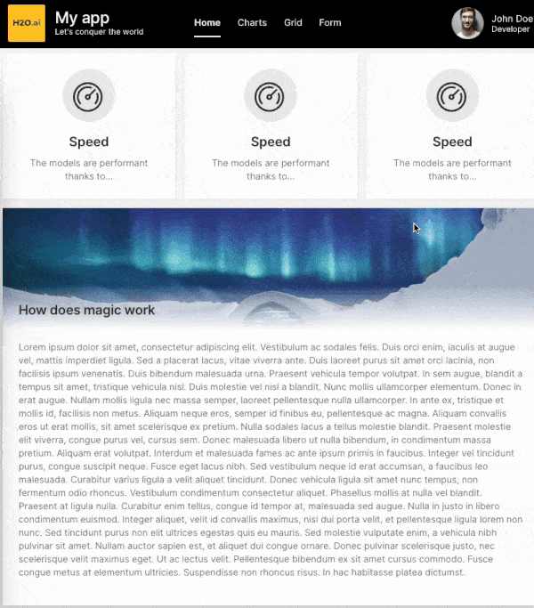
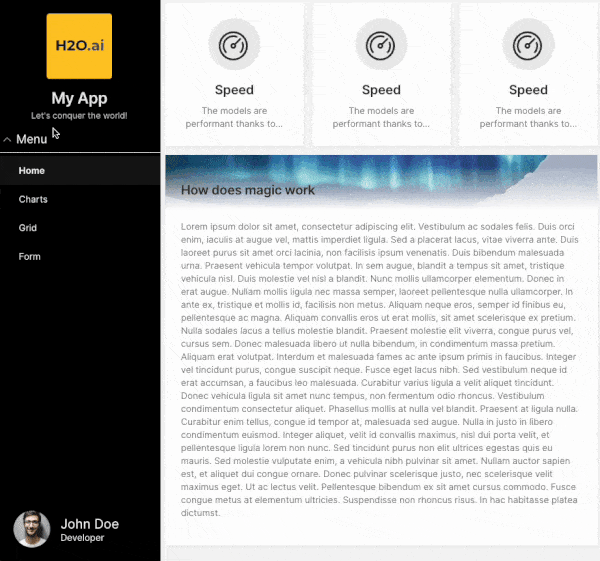
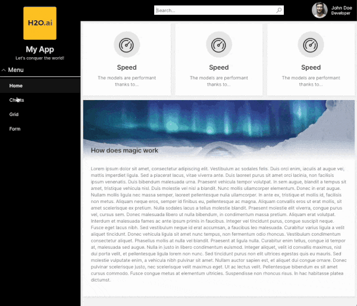

Wave comes with useful app templates to boost the app development startup time. Use `wave init` CLI command and pick the one you like or use `w_app_<template-name>` code snippet coming with the [IDE plugins](https://wave.h2o.ai/docs/development/#using-pycharm).

## Hello World app

## App with header

## App with header and navigation

## App with sidebar and navigation

## App with header, sidebar and navigation

