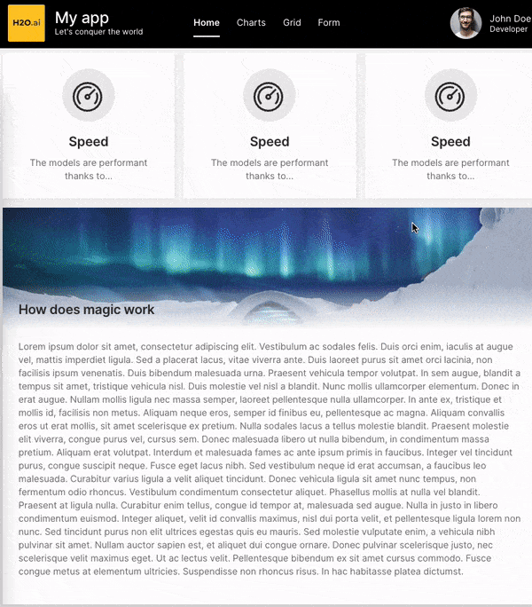

Once the installation part is complete, you can use `wave init` command to pick a predefined app templates that will bootstrap your first app and give you a head start when building your Wave apps.

## Hello World app (for beginners)

## App with header

## App with header + navigation

## App with sidebar + navigation

## App with header & sidebar + navigation

