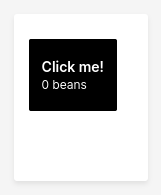

In the previous tutorials, we've been authoring [Wave scripts](scripts.md). A Wave script is a perfectly fine and dandy way to modify pages in Wave and build dashboards. However, to build *interactive applications* in Wave - user interfaces that can dynamically respond to *events* (the user's actions) -  [Wave apps](apps.md) are the way to go.

In the fine tradition of keeping tutorials succinct and useful, we'll author a little app that counts beans of the virtual kind, or, a bean counter, not to be confused with dubiously intentioned financial officers.

<video autoPlay='autoplay' loop='loop' muted='muted'><source src={require('./assets/tutorial-counter__demo.mp4').default} type='video/mp4'/></video>

This tutorial outlines the basics of how to handle events, update the UI, manage state and easily add realtime sync capabilities to your app. It's probably the most important tutorial to wrap your head around if you're interested in authoring interactive applications.

## Prerequisites

This tutorial assumes your Wave server is up and running, and you have a working directory for authoring programs. If not, head over to the [Hello World tutorial](tutorial-hello.mdx) and complete steps 1 and 2.

## Step 1: Start listening

The first step towards listening to events from the UI is to define an `@app` function:

```py title="$HOME/wave-apps/counter.py"
from h2o_wave import Q, main, app

@app('/counter')
async def serve(q: Q):
    pass
```

`@app` is a decorator that takes one required argument - the route to listen to, in this case `/counter` (which translates to `localhost:10101/counter` or `www.example.com/counter`).

The `@app` decorator is applied to a function called `serve()`, which is called every single time the user interacts with the UI (access the page, reload it, click a button, access a menu, enter text, and so on).

We named the function `serve()`, but you can call it anything you please, like `shoe_strings()`.

Lastly, note that we've imported the symbol `main` into our `.py` file. You don't have to do anything with `main` except import it.

To run your app, use `wave run`:

```shell
cd $HOME/wave-apps
source venv/bin/activate
wave run counter
```

The `wave run` command runs your app in *development mode*, and the app is automatically reloaded when edited.

At this point, your app will be up and running, but it doesn't do anything yet. Let's change that in a second.

## Step 2: Display a button

Let's add a button to our app. Our goal is to increment and display the bean count each time the button is clicked.

To do this, we declare a variable called `bean_count`, and use `form_card()` to add a [form](https://en.wikipedia.org/wiki/Form_(document)) to our page. A form card is a special type of card that displays a vertical stack of [components](/docs/widgets/form/overview) (also called *widgets*). In this case, our form contains a solitary button named `increment`, with a caption showing the current `bean_count`. The button is marked as `primary`, which serves no other purpose than to make it look tall, dark, and handsome.

```py {5-18} title="$HOME/wave-apps/counter.py"
from h2o_wave import Q, main, app, ui

@app('/counter')
async def serve(q: Q):
    bean_count = 0

    q.page['beans'] = ui.form_card(
        box='1 1 1 2',
        items=[
            ui.button(
                name='increment',
                label='Click me!',
                caption=f'{bean_count} beans',
                primary=True,
            ),
        ],
    )
    await q.page.save()
```

Notice how the technique to modify and save pages in a Wave app is different from that of a Wave script.

| Task | Wave Script | Wave App |
|---|---|---|
| Access page at route `/foo` | `page = site['/foo']` | `page = q.page` |
| Access card named `foo` | `card = page['foo']` | `card = q.page['foo']` |
| Save page | `page.save()` | `await q.page.save()` |

In a Wave app, we always access the page using the *query context* `q`. The query context carries useful information about the active UI event, including who issued the event, what information was entered, which buttons were clicked, and so on; and `q.page` always refers to the page located at the route you passed to `@app()` (in this case).

Point your browser to [http://localhost:10101/counter](http://localhost:10101/counter). You should see a nice big button, waiting to be clicked on:



If you click on the button, you'll notice that it doesn't do anything. This is because we haven't handled button clicks yet. Instead, when you click the button, the events are sent to your `serve()` function, but the `serve()` function blindly adds the form (with the button) to the page all over again and saves it, causing the page to display the same form all over again. Let's fix this next.

## Step 3: Handle button clicks

Add a condition to check if the button is clicked, and if so, increment the bean count.

```py {5-7} title="$HOME/wave-apps/counter.py"
from h2o_wave import Q, main, app, ui

@app('/counter')
async def serve(q: Q):
    bean_count = q.client.bean_count or 0
    if q.args.increment:
        q.client.bean_count = bean_count = bean_count + 1

    q.page['beans'] = ui.form_card(
        box='1 1 1 2',
        items=[
            ui.button(
                name='increment',
                label='Click me!',
                caption=f'{bean_count} beans',
                primary=True,
            ),
        ],
    )
    await q.page.save()
```

The above edit introduces two important concepts: `q.client` and `q.args`.

- `q.client` is a dictionary-like object for storing and retrieving arbitrary information related to the active *client* (a browser tab or browser session). Anything you put into `q.client` while handling an event can be read back while handling a subsequent event, provided the subsequent event originates from the same client. In our case, we read `q.client.bean_count` to get the bean count. If it's unavailable (which means this is a new client), we default the bean count to `0`.
- `q.args`, also a dictionary-like object, carries *event arguments*, which contains information about what the user did. In our case, if the user clicked on our button (named `increment`), `q.args.increment` will be `True`. If not, `q.args.increment` will be `None`. Therefore, if `q.args.increment` is `True`, we increment the client's `bean_count`. If not, we do nothing.

:::note
From now on, any time you see the term 'client', recall that it's a technical term for 'browser tab' or 'browser session'. In other words, any time you open a new browser tab to access your app, you're accessing your app from a new client.
:::

:::info
Each component in the Wave component library populates `q.args` with its own value. For more information, see [Components](/docs/widgets/form/overview).
:::

Your button should now count beans when clicked:

<video autoPlay='autoplay' loop='loop' muted='muted'><source src={require('./assets/tutorial-counter__demo.mp4').default} type='video/mp4'/></video>

## Step 4: Make it more efficient

Our program is accurate, but not necessarily efficient. On every button-click, it is recreating the form card and the button over and over again instead of updating the existing button's caption with the current bean count. You can observe how chatty the app is by gaping in abject horror at the Wave server's log.

:::info
To view the Wave server's log, switch to the terminal window running the Wave server.
:::

Let's wrinkle our noses in disgust and fix this gross inefficiency right away to make our little bean counter web-scale for great good.

```py {9-10,22-23} title="$HOME/wave-apps/counter.py"
from h2o_wave import Q, main, app, ui

@app('/counter')
async def serve(q: Q):
    bean_count = q.client.bean_count or 0
    if q.args.increment:
        q.client.bean_count = bean_count = bean_count + 1

    if not q.client.initialized:
        q.client.initialized = True
        q.page['beans'] = ui.form_card(
            box='1 1 1 2',
            items=[
                ui.button(
                    name='increment',
                    label='Click me!',
                    caption=f'{bean_count} beans',
                    primary=True,
                ),
            ],
        )
    else:
        q.page['beans'].items[0].button.caption = f'{bean_count} beans'
    await q.page.save()
```

In the above edit, we check for an arbitrary flag in `q.client` called `initialized`.

- If the flag is not set, we assume that the request is originating from a new, empty client. If so, we set `initialized` to `True` (to make a note to ourselves that the client is not empty anymore), then add our form card to the page.
- If the flag is already set, we assume that the form card (and the button inside it) are already on the page, and simply update the button's caption with the new bean count.

## Intermission: Understanding state

In the above steps, we learned about `q.args` (request arguments submitted from the browser) and `q.client` (arbitrary information associated with the client). Let's expand on these and introduce two new concepts: `q.user` and `q.app`.

Before we do that, try accessing [http://localhost:10101/counter](http://localhost:10101/counter) from two different browser tabs and playing with them. You'll notice that each browser tab (or, each client) maintains separate bean counts.

<video autoPlay='autoplay' loop='loop' muted='muted'><source src={require('./assets/tutorial-counter__client.mp4').default} type='video/mp4'/></video>

Maintaining separate bean counts per client is one way to count beans. You can also maintain bean counts at the user level and the app level.

In real world apps, the decision on whether to store information at the client, user, or app level depends on the problem you're trying to solve. For example, if you were building an online store, you'd probably want to store product inventory at the app level and shopping carts at the user level. Most other kinds of information - search results, past orders, or product details - are best stored at the client-level (searching for products in one tab and having search results appear in another tab would drive even your most loyal customers up the wall).

Similar to how `q.client` stores arbitrary information associated with the client, `q.user` and `q.app` store arbitrary information associated with the user and the app, respectively.

In most apps, you'll end up using a mix of `q.client`, `q.user` and `q.app` to correctly handle requests originating from:

1. Different users.
2. Different browser tabs belonging to the same user (possibly from different devices).
3. The same browser tab.

In other words, your Wave app is multi-user by default, but how the app manages data at the app-level, at the user-level and at the client-level is up to you.

## Step 5: User-level realtime sync

To maintain bean counts at the user level, all we have to do is store `bean_count` in `q.user` instead of `q.client`.

```py {5,7} title="$HOME/wave-apps/counter.py"
from h2o_wave import Q, main, app, ui

@app('/counter')
async def serve(q: Q):
    bean_count = q.user.bean_count or 0
    if q.args.increment:
        q.user.bean_count = bean_count = bean_count + 1

    if not q.client.initialized:
        q.client.initialized = True
        q.page['beans'] = ui.form_card(
            box='1 1 1 2',
            items=[
                ui.button(
                    name='increment',
                    label='Click me!',
                    caption=f'{bean_count} beans',
                    primary=True,
                ),
            ],
        )
    else:
        q.page['beans'].items[0].button.caption = f'{bean_count} beans'
    await q.page.save()
```

Now when you play with your app, you'll see that the counts are being maintained across browser tabs, but the updated counts don't show up immediately across all tabs. Instead, they show up only when you interact with the other tabs, or reload them.

<video autoPlay='autoplay' loop='loop' muted='muted'><source src={require('./assets/tutorial-counter__user-nosync.mp4').default} type='video/mp4'/></video>

This would be considered normal behavior for a typical web application, and most users familiar with the interwebs are also familiar with the reload button, but we can do better, because having to hit the reload button to get updates is about as exciting as waiting for paint to dry.

This is easier done than said - simply change the app mode to `multicast` to enable realtime sync across clients:

```py {27} title="$HOME/wave-apps/counter.py"
from h2o_wave import Q, main, app, ui

@app('/counter', mode='multicast')
async def serve(q: Q):
    bean_count = q.user.bean_count or 0
    if q.args.increment:
        q.user.bean_count = bean_count = bean_count + 1

    if not q.client.initialized:
        q.client.initialized = True
        q.page['beans'] = ui.form_card(
            box='1 1 1 2',
            items=[
                ui.button(
                    name='increment',
                    label='Click me!',
                    caption=f'{bean_count} beans',
                    primary=True,
                ),
            ],
        )
    else:
        q.page['beans'].items[0].button.caption = f'{bean_count} beans'
    await q.page.save()
```

:::info
The default app mode is `unicast`, which means "don't sync across clients". On the other hand, `multicast` means "sync across clients". There's also a third mode, `broadcast`, which means "sync across users", which we'll see in the next step.
:::

If you play with your app now, you'll see that the user-level bean count indeed syncs across tabs:

<video autoPlay='autoplay' loop='loop' muted='muted'><source src={require('./assets/tutorial-counter__user-sync.mp4').default} type='video/mp4'/></video>

## Step 6: App-level realtime sync

Going from user-level bean counting to app-level bean counting is easy: simply store `bean_count` on `q.app` instead of `q.user`, and switch the app mode to `broadcast`:

```py {5,7,27} title="$HOME/wave-apps/counter.py"
from h2o_wave import Q, main, app, ui

@app('/counter', mode='broadcast')
async def serve(q: Q):
    bean_count = q.app.bean_count or 0
    if q.args.increment:
        q.app.bean_count = bean_count = bean_count + 1

    if not q.client.initialized:
        q.client.initialized = True
        q.page['beans'] = ui.form_card(
            box='1 1 1 2',
            items=[
                ui.button(
                    name='increment',
                    label='Click me!',
                    caption=f'{bean_count} beans',
                    primary=True,
                ),
            ],
        )
    else:
        q.page['beans'].items[0].button.caption = f'{bean_count} beans'
    await q.page.save()
```

:::tip
The `broadcast` mode can be used to build collaborative apps that need to synchronize state across all users, like group chat or multiplayer games.
:::

## Summary

In this tutorial, we learned how to author interactive applications, or *apps*, and easily add realtime sync capabilities to our apps. More importantly, we learned how to deal with events and manage state using four dictionary-like objects:

| Attribute | Type | Use |
|---|---|---|
| `q.args` | Read-only | Stores command arguments |
| `q.client` | Read/Write | Stores client-level state |
| `q.user` | Read/Write | Stores user-level state |
| `q.app` | Read/Write | Stores app-level state|

Also, we built ourselves a little app that counts beans, and you can now put that knowledge to good use, like build an online voting app for the upcoming elections in the banana republic you're running on your private island (a smidgen of democracy can't hurt).

In the next section, we'll build something a bit more substantial and useful: a to-do list with realtime sync.
