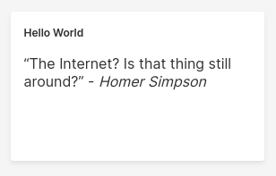
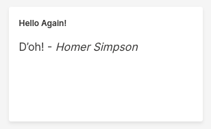

import Tabs from '@theme/Tabs';
import TabItem from '@theme/TabItem';

---
title: "Tutorial: Hello World"
---

import StartQ from './_start_q.md'

In this section, we'll learn how to author our first Wave program from scratch, and understand the basics of how to display content in a web browser.

:::note
These tutorials assume that you have some familiarity with the Python programming language. You don't have to be an expert, but it might be harder to learn both Wave and Python at the same time.
:::

## Step 1: Start the Wave server

:::important
You can skip this step if you're running Wave 0.20.0 or later.
:::

<StartQ/>

## Step 2: Set up a working directory

Next, let's set up a working directory to author our program.

### Create a directory
```shell
mkdir $HOME/wave-apps
cd $HOME/wave-apps
```

### Set up a virtual environment
A [virtual environment](https://docs.python.org/3/tutorial/venv.html) helps us manage our program's dependencies without interfering with system-wide packages.

<Tabs groupId="operating-systems">

<TabItem value="lin" label="Linux">

```shell
python3 -m venv venv
source venv/bin/activate
```
</TabItem>

<TabItem value="win" label="Windows">

```shell
python -m venv venv
cd venv/Scripts/
./activate.bat(CMD) or ./Activate.ps1(poweshell)
```
</TabItem>

<TabItem value="con" label="conda">

If you are using Conda as your package manager,

```shell
conda create -n venv
conda activate venv
```
</TabItem>

</Tabs>

### Install the Wave Python driver

<Tabs groupId="operating-systems">

<TabItem value="lin" label="Linux">

```shell
pip install h2o-wave
```

</TabItem>

<TabItem value="win" label="Windows">

```shell
pip install h2o-wave
```

</TabItem>

<TabItem value="con" label="conda">

If you are using Conda as your package manager,

```shell
conda config --append channels conda-forge
conda install -c h2oai h2o-wave
```
</TabItem>

</Tabs>

## Step 3: Write your program

Next, open your preferred text editor, create a Python script called `hello_world.py` in the `$HOME/wave-apps` directory, and copy-paste the following.

For now, don't worry too much about what this program is doing. We'll get to that shortly.

```py title="$HOME/wave-apps/hello_world.py"
from h2o_wave import site, ui

# Grab a reference to the page at route '/hello'
page = site['/hello']

# Add a markdown card to the page.
page['quote'] = ui.markdown_card(
    box='1 1 2 2',
    title='Hello World',
    content='"The Internet? Is that thing still around?" - *Homer Simpson*',
)

# Finally, save the page.
page.save()
```


## Step 4: Run your program

```shell
cd $HOME/wave-apps
./venv/bin/python hello_world.py
```

## Step 5: Admire your creation

Point your browser to [http://localhost:10101/hello](http://localhost:10101/hello), and pause to reflect on a particularly pithy quote from the venerable Homer Simpson.



## Step 6: Understand your program

Let's walk through this program step by step.

This program (technically a [script](scripts.md)), illustrates the core of Wave's programming model, or, "How to think in Wave."

1. Your Wave server instance holds a collection of pages.
2. To change a page, simply grab a reference to a page, change it, and save it.

That's it. Your changes are now visible to everyone.

Let's understand this principle in practice using the little program we just created.

### Grab a reference to a page

A `site` represents a dictionary of all the pages on the Wave server. To get a reference to a page hosted at the route `/hello` (which translates to `http://localhost:10101/hello`), simply grab the value at key `/hello`.

```py
page = site['/hello']
```

### Change the page

Similar to how a `site` represents a collection of pages, a `page` represents a collection of *cards*. A card represents a block of content: text, graphics, widgets, or some combination of those.

```py
page['quote'] = ui.markdown_card(
    box='1 1 2 2',
    title='Hello World',
    content='"The Internet? Is that thing still around?" - *Homer Simpson*',
)
```

Pages support different kinds of cards. In this case, we add a card named `quote` that displays markdown content (`markdown_card()`). The position and size of the card on the page is specified by the `box` attribute. In this case, the card is placed at column `1`, row `1`, sized `2 x 2` units. The `content` attribute supports [Github Flavored Markdown](https://guides.github.com/features/mastering-markdown/).

### Save the page

Finally, we call `save()` on the `page`, which broadcasts our changes to all connected web browsers.

```py
page.save()
```


So far, so good.

## Step 7: Edit your page from a REPL

Finally, just for kicks, let's make some changes to our hello world page using a Python REPL and watch our page reflect those changes in realtime.

### Start a Python REPL

```shell
cd $HOME/wave-apps
./venv/bin/python
```

### Grab a reference to our page

```py title=">>>"
from h2o_wave import site
page = site['/hello']
```

### Grab a reference to our card

```py title=">>>"
quote = page['quote']
```

### Change the title
```py title=">>>"
quote.title = 'Hello Again!'
page.save()
```


### Change the content

```py title=">>>"
quote.content = "D'oh! - *Homer Simpson*"
page.save()
```



### Quit your REPL

```py title=">>>"
quit()
```

## Summary

What we just did - add content from one program and make edits to it from another - illustrates another important aspect of Wave's programming model: *The Wave server retains content*. Your `hello_world.py` program did its thing and exited. So did your REPL. But your content was retained for the viewing pleasure of future visitors to `/hello`.

Next, we'll take the principles we learned from this tutorial and apply it towards a supposedly spirited folk song involving arithmetic progressions.