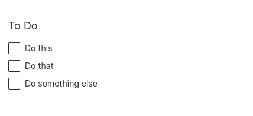

In this tutorial, we'll build something a bit more substantial and useful: a to-do list with realtime sync, in under 75 lines of (well-formatted, well-commented) code.

More importantly, this tutorial will not introduce any new concepts. Everything you need to know about authoring interactive apps using Wave is already covered in the [previous tutorial](tutorial-counter.md). From this point on, it's mostly a matter of [abstraction](https://htdp.org/2020-8-1/Book/part_three.html), which is a fancy term for how you solve the problem at hand using short, simple, clear, elegant, modular functions that [do one thing and do it well](https://en.wikipedia.org/wiki/Unix_philosophy).

Above all, prefer brevity and clarity. [The best code is no code at all](https://blog.codinghorror.com/the-best-code-is-no-code-at-all/).

## Step 1: Listen

We'll start with a basic skeleton and then work our way up from there.

The first step is to define an `@app` function. Also, we want the landing page to show a list of to-dos, so we'll throw in an empty `show_todos()` function for now, and call it from `serve()`.

```py {6,10-11} title="todo.py"
from h2o_wave import Q, main, app, ui


@app('/todo')
async def serve(q: Q):
    show_todos(q)
    await q.page.save()


def show_todos(q: Q):
    pass
```

## Step 2: What's in a to-do?

A to-do item has some basic attributes: an ID, some text content, and whether it's completed or not. Let's define a `class` for that, with a global one-up `id`.

```py {3-13} title="todo.py"
from h2o_wave import Q, main, app, ui

_id = 0


# A simple class that represents a to-do item.
class TodoItem:
    def __init__(self, text):
        global _id
        _id += 1
        self.id = f'todo_{_id}'
        self.text = text
        self.done = False


@app('/todo')
async def serve(q: Q):
    show_todos(q)
    await q.page.save()


def show_todos(q: Q):
    pass
```

## Step 3: Make a to-do list

Since we want each user to have a separate to-do list, it's appropriate to keep the to-do list in `q.user`.

Here, we attempt to fetch the list from `q.user` and create one if it doesn't exist. We also throw in some sample to-do items for good measure.

```py {1,23-28} title="todo.py"
from typing import List
from h2o_wave import Q, main, app, ui

_id = 0

# A simple class that represents a to-do item.
class TodoItem:
    def __init__(self, text):
        global _id
        _id += 1
        self.id = f'todo_{_id}'
        self.text = text
        self.done = False


@app('/todo')
async def serve(q: Q):
    show_todos(q)
    await q.page.save()


def show_todos(q: Q):
    # Get items for this user.
    todos: List[TodoItem] = q.user.todos

    # Create a sample list if we don't have any.
    if todos is None:
        q.user.todos = todos = [TodoItem('Do this'), TodoItem('Do that'), TodoItem('Do something else')]
```

## Step 4: Show the to-do list

Next, we turn each incomplete to-do item into a checkbox (using `ui.checkbox()`), and display it in a form card (using `ui.form_card()`).
Also, we want each checkbox to raise an event immediately when checked, so we set its `trigger` attribute to `True`.

:::tip
Several [components](/docs/widgets/form/overview) have a `trigger` attribute. Normally, an event is triggered only when a command-like component (a button, menu, or tab) is clicked. If you want a component to immediately trigger an event when changed, set `trigger` to `True`.
:::

```py {1,30-37} title="todo.py"
from typing import List
from h2o_wave import Q, main, app, ui

_id = 0

# A simple class that represents a to-do item.
class TodoItem:
    def __init__(self, text):
        global _id
        _id += 1
        self.id = f'todo_{_id}'
        self.text = text
        self.done = False


@app('/todo')
async def serve(q: Q):
    show_todos(q)
    await q.page.save()


def show_todos(q: Q):
    # Get items for this user.
    todos: List[TodoItem] = q.user.todos

    # Create a sample list if we don't have any.
    if todos is None:
        q.user.todos = todos = [TodoItem('Do this'), TodoItem('Do that'), TodoItem('Do something else')]

    # Create checkboxes.
    not_done = [ui.checkbox(name=todo.id, label=todo.text, trigger=True) for todo in todos if not todo.done]

    # Display list
    q.page['form'] = ui.form_card(box='1 1 3 10', items=[
        ui.text_l('To Do'),
        *not_done,
    ])
```

## Step 5: Show the 'done' list

We also turn each completed to-do item into another list of checkboxes, checked by default (using its `value` attribute). We append this to the form card and put a separator in between (using `ui.separator()`) to distinguish the completed items from the incomplete ones.

```py {31,38-39} title="todo.py"
from typing import List
from h2o_wave import Q, main, app, ui

_id = 0

# A simple class that represents a to-do item.
class TodoItem:
    def __init__(self, text):
        global _id
        _id += 1
        self.id = f'todo_{_id}'
        self.text = text
        self.done = False


@app('/todo')
async def serve(q: Q):
    show_todos(q)
    await q.page.save()


def show_todos(q: Q):
    # Get items for this user.
    todos: List[TodoItem] = q.user.todos

    # Create a sample list if we don't have any.
    if todos is None:
        q.user.todos = todos = [TodoItem('Do this'), TodoItem('Do that'), TodoItem('Do something else')]

    # Create done/not-done checkboxes.
    done = [ui.checkbox(name=todo.id, label=todo.text, value=True, trigger=True) for todo in todos if todo.done]
    not_done = [ui.checkbox(name=todo.id, label=todo.text, trigger=True) for todo in todos if not todo.done]

    # Display list
    q.page['form'] = ui.form_card(box='1 1 3 10', items=[
        ui.text_l('To Do'),
        *not_done,
        *([ui.separator('Done')] if len(done) else []),
        *done,
    ])
```

At this point, try running your app.

```shell
cd $HOME/wave-apps
source venv/bin/activate
wave run todo
```

Point your browser to [http://localhost:10101/todo](http://localhost:10101/todo).



You should be able to see your todo list in all its glory. Unfortunately, checking any of the items seems to have no effect. Let's fix that next.

## Step 6: Handle checkboxes

Each time a checkbox is checked or unchecked, our `serve()` function is called, which in turn calls `show_todos()`.

- If a checkbox is checked, `q.args` will contain a `True` for that checkbox.
- If a checkbox is unchecked, `q.args` will contain a `False` for that checkbox.

So, we iterate through all the to-do items and set their `done` attribute based on the value of their corresponding checkbox.

```py {30-33} title="todo.py"
from typing import List
from h2o_wave import Q, main, app, ui

_id = 0

# A simple class that represents a to-do item.
class TodoItem:
    def __init__(self, text):
        global _id
        _id += 1
        self.id = f'todo_{_id}'
        self.text = text
        self.done = False


@app('/todo')
async def serve(q: Q):
    show_todos(q)
    await q.page.save()


def show_todos(q: Q):
    # Get items for this user.
    todos: List[TodoItem] = q.user.todos

    # Create a sample list if we don't have any.
    if todos is None:
        q.user.todos = todos = [TodoItem('Do this'), TodoItem('Do that'), TodoItem('Do something else')]

    # If the user checked/unchecked an item, update our list.
    for todo in todos:
        if todo.id in q.args:
            todo.done = q.args[todo.id]

    # Create done/not-done checkboxes.
    done = [ui.checkbox(name=todo.id, label=todo.text, value=True, trigger=True) for todo in todos if todo.done]
    not_done = [ui.checkbox(name=todo.id, label=todo.text, trigger=True) for todo in todos if not todo.done]

    # Display list
    q.page['form'] = ui.form_card(box='1 1 3 10', items=[
        ui.text_l('To Do'),
        *not_done,
        *([ui.separator('Done')] if len(done) else []),
        *done,
    ])
```

You should now be able to check/uncheck the items in your todo list.

<video autoPlay='autoplay' loop='loop' muted='muted'><source src={require('./assets/tutorial-todo__2.mp4').default} type='video/mp4'/></video>

Next, let's see how to add new items to the list.

## Step 7: The 'new todo' form

Next, let's display a form to add new items to our list. For that, we'll add a new button to our existing form, named `new_todo`, and direct the `serve()` function to the `new_todo()` function if the button is clicked. Recall that when buttons are clicked, `q.args.button_name` will be `True`, so we check if `q.args.new_todo` is `True`.

In the `new_todo()` function, we display a new form containing a textbox (using `ui.textbox()`) and a set of buttons to add the item or return to to-do list (a `ui.buttons()` helps us display buttons side-by-side).

```py {18-21,45,52-61} title="todo.py"
from typing import List
from h2o_wave import Q, main, app, ui

_id = 0

# A simple class that represents a to-do item.
class TodoItem:
    def __init__(self, text):
        global _id
        _id += 1
        self.id = f'todo_{_id}'
        self.text = text
        self.done = False


@app('/todo')
async def serve(q: Q):
    if q.args.new_todo:  # Display an input form.
        new_todo(q)
    else:  # Show all items.
        show_todos(q)
    await q.page.save()


def show_todos(q: Q):
    # Get items for this user.
    todos: List[TodoItem] = q.user.todos

    # Create a sample list if we don't have any.
    if todos is None:
        q.user.todos = todos = [TodoItem('Do this'), TodoItem('Do that'), TodoItem('Do something else')]

    # If the user checked/unchecked an item, update our list.
    for todo in todos:
        if todo.id in q.args:
            todo.done = q.args[todo.id]

    # Create done/not-done checkboxes.
    done = [ui.checkbox(name=todo.id, label=todo.text, value=True, trigger=True) for todo in todos if todo.done]
    not_done = [ui.checkbox(name=todo.id, label=todo.text, trigger=True) for todo in todos if not todo.done]

    # Display list
    q.page['form'] = ui.form_card(box='1 1 3 10', items=[
        ui.text_l('To Do'),
        ui.button(name='new_todo', label='New To Do...', primary=True),
        *not_done,
        *([ui.separator('Done')] if len(done) else []),
        *done,
    ])


def new_todo(q: Q):
    # Display an input form
    q.page['form'] = ui.form_card(box='1 1 3 10', items=[
        ui.text_l('New To Do'),
        ui.textbox(name='text', label='What needs to be done?', multiline=True),
        ui.buttons([
            ui.button(name='add_todo', label='Add', primary=True),
            ui.button(name='show_todos', label='Back'),
        ]),
    ])
```

You should now be able to bring up the new to-do form.

<video autoPlay='autoplay' loop='loop' muted='muted'><source src={require('./assets/tutorial-todo__3.mp4').default} type='video/mp4'/></video>

## Step 8: Add to-do and return

Finally, we handle the `add_todo` button-click, redirecting `serve()` to a new `add_todo()` function, which simply inserts a the new to-do item into our user-level todo list and calls `show_todos()` to redraw the to-do list.

:::note
In this example, for clarity, we named both the buttons and their corresponding functions `new_todo` and `add_todo`, but this is not necessary.
:::

```py {20-21,54-59} title="todo.py"
from typing import List
from h2o_wave import Q, main, app, ui

_id = 0

# A simple class that represents a to-do item.
class TodoItem:
    def __init__(self, text):
        global _id
        _id += 1
        self.id = f'todo_{_id}'
        self.text = text
        self.done = False


@app('/todo')
async def serve(q: Q):
    if q.args.new_todo:  # Display an input form.
        new_todo(q)
    elif q.args.add_todo:  # Add an item.
        add_todo(q)
    else:  # Show all items.
        show_todos(q)
    await q.page.save()


def show_todos(q: Q):
    # Get items for this user.
    todos: List[TodoItem] = q.user.todos

    # Create a sample list if we don't have any.
    if todos is None:
        q.user.todos = todos = [TodoItem('Do this'), TodoItem('Do that'), TodoItem('Do something else')]

    # If the user checked/unchecked an item, update our list.
    for todo in todos:
        if todo.id in q.args:
            todo.done = q.args[todo.id]

    # Create done/not-done checkboxes.
    done = [ui.checkbox(name=todo.id, label=todo.text, value=True, trigger=True) for todo in todos if todo.done]
    not_done = [ui.checkbox(name=todo.id, label=todo.text, trigger=True) for todo in todos if not todo.done]

    # Display list
    q.page['form'] = ui.form_card(box='1 1 3 10', items=[
        ui.text_l('To Do'),
        ui.button(name='new_todo', label='New To Do...', primary=True),
        *not_done,
        *([ui.separator('Done')] if len(done) else []),
        *done,
    ])


def add_todo(q: Q):
    # Insert a new item
    q.user.todos.insert(0, TodoItem(q.args.text or 'Untitled'))

    # Go back to our list.
    show_todos(q)


def new_todo(q: Q):
    # Display an input form
    q.page['form'] = ui.form_card(box='1 1 3 10', items=[
        ui.text_l('New To Do'),
        ui.textbox(name='text', label='What needs to be done?', multiline=True),
        ui.buttons([
            ui.button(name='add_todo', label='Add', primary=True),
            ui.button(name='show_todos', label='Back'),
        ]),
    ])
```

You should now be able to add new to-do items to your list. Congratulations!

<video autoPlay='autoplay' loop='loop' muted='muted'><source src={require('./assets/tutorial-todo__4.mp4').default} type='video/mp4'/></video>

## Step 9: Make it realtime

To make your app realtime, simply pass `mode='multicast'` to `@app()`.

```py title="todo.py"
@app('/todo', mode='multicast')
```

Now try opening [http://localhost:10101/todo](http://localhost:10101/todo) from multiple browser tabs:

<video autoPlay='autoplay' loop='loop' muted='muted'><source src={require('./assets/tutorial-todo__5.mp4').default} type='video/mp4'/></video>

Groovy!

## Exercise

A little housekeeping goes a long way: add a "Clear" button on the main page to clear all completed to-dos.

## Next steps

Congratulations! You've completed all the tutorials (hopefully). There are three paths you can take from here:

- [Widgets](/docs/widgets/overview). Widgets that cover best UX practices and a lot of widgets variations.
- [Gallery](examples). 150+ examples that cover everything that Wave has to offer.
- [Guide](guide). An in-depth look at each of Wave's features.
- [API](/docs/api/index). Reference-level documentation for the Python API.

Happy hacking!
